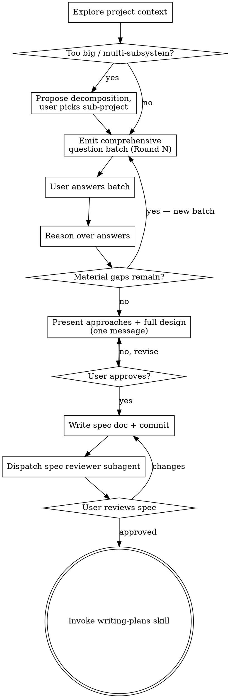

# Brainstorming Ideas Into Designs — Batched (low-token) edition

Help turn ideas into fully formed designs and specs through a small number of dense, batched exchanges.

This skill has the **same destination** as `brainstorming` (a reviewed spec, then `writing-plans`) but a **different rhythm**: instead of one question per message, you front-load many grouped questions into a single message, reason over the answers, and only open another batch if real gaps remain. The reasoning quality must NOT drop — only the number of round-trips.

## Why this exists

One-question-at-a-time means N questions = N round-trips, and every round-trip re-processes the entire growing conversation (~O(N²) token cost). Batching collapses that to 1-3 round-trips total. The savings come from **fewer turns**, never from thinking less.

<HARD-GATE>
Do NOT invoke any implementation skill, write any code, scaffold any project, or take any implementation action until you have presented a design and the user has approved it. This applies to EVERY project regardless of perceived simplicity.
</HARD-GATE>

## Anti-Pattern: "This Is Too Simple To Need A Design"

Every project goes through this process. A todo list, a single-function utility, a config change — all of them. "Simple" projects are where unexamined assumptions cause the most wasted work. For a truly simple project the entire flow can be a single question batch + a short design, but you MUST present a design and get approval.

## The core mechanic: question batches

You work in **rounds**. Each round is exactly one message from you containing a batch of questions, and one reply from the user answering them.

**Round 1 must be comprehensive.** Before writing it, explore the project context, then dump EVERYTHING you would need to know into one structured batch. Do not hold back questions for "later" that you could ask now — every deferred question is a wasted round-trip.

**Writing a question batch — rules:**

1. **Group by theme** with short headers (e.g. `### Scope`, `### Data model`, `### UX`, `### Constraints`).
2. **Number every question** (`1`, `2`, `3`…) across the whole batch so the user can answer tersely: "1. yes, 2. b, 3. skip".
3. **Multiple-choice whenever possible** — offer lettered options (a/b/c). Open-ended only when choices would be artificial.
4. **Provide a default/recommendation inline** for each question (e.g. *"(default: b)"*) so the user can reply "defaults except 4 and 7" and move on.
5. **Tag priority**: mark questions `[critical]` vs `[optional]` so the user can safely skip the optional ones.
6. **Keep it scannable** — terse questions, no padding prose. The batch is a form to fill in, not an essay.
7. Aim for a batch the user can answer in one sitting (roughly 5-15 questions depending on scope). If a project genuinely needs more, that is a decomposition signal — see below.

**Scope check first:** If the request spans multiple independent subsystems (e.g. "a platform with chat, billing, analytics"), do NOT batch-question the whole thing. Flag it, propose a decomposition into sub-projects, and let the user pick which sub-project to spec first. Each sub-project gets its own spec → plan → implementation cycle.

## The recursive loop

**The terminal state is invoking writing-plans.** Do NOT invoke frontend-design, mcp-builder, or any other implementation skill. The ONLY skill you invoke after this one is writing-plans.

### "Material gaps remain?" — the loop guard

After each batch, reason explicitly over the answers and ask yourself: *can I now write a non-ambiguous spec?* Open another batch ONLY for gaps that would otherwise force you to guess on something that changes the design. Do not open a new round for nice-to-have detail or cosmetic preferences — fold reasonable defaults into the design and let the user correct them at approval.

**Budget: aim for 1-2 question rounds, 3 at the absolute most.** If you find yourself wanting a 4th round, you under-prepared Round 1 or the project needs decomposition.

## Checklist

Create a task for each item and complete in order:

1. **Explore project context** — files, docs, recent commits.
2. **Scope check** — decompose if multi-subsystem (see above).
3. **Emit Round 1 batch** — comprehensive, grouped, numbered, multiple-choice, with defaults and priority tags.
4. **Reason + loop** — additional batches only for material gaps. 1-2 rounds target.
5. **Present approaches + full design in ONE message** — 2-3 approaches with trade-offs and your recommendation, immediately followed by the full design (architecture, components, data flow, error handling, testing). Ask for approval / change requests in a single pass — NOT section by section.
6. **Write design doc** — save to `docs/superpowers/specs/YYYY-MM-DD-<topic>-design.md` and commit. (User preferences for spec location override this.)
7. **Dispatch spec reviewer subagent** — see `spec-document-reviewer-prompt.md`. Fix any blocking issues it returns.
8. **User reviews the written spec** — wait for approval; loop back on requested changes.
9. **Transition to implementation** — invoke the writing-plans skill.

## Presenting approaches + design together

To save a round-trip, the original skill's separate "propose approaches" and "present design section-by-section" steps are merged into **one message**:

- **Approaches:** Lead with your recommended option and why, then 1-2 alternatives with trade-offs. Keep it tight.
- **Design:** Present the whole thing at once, sections scaled to complexity (a sentence each when straightforward, up to ~200-300 words when nuanced). Cover architecture, components, data flow, error handling, testing.
- **One approval gate:** Ask the user to approve or list changes in a single reply. Iterate only on what they flag.

Be ready to reopen a question batch if approval feedback reveals a real misunderstanding — but treat that as the exception.

## Design for isolation and clarity

- Break the system into smaller units that each have one clear purpose, communicate through well-defined interfaces, and can be understood and tested independently.
- For each unit, answer: what does it do, how do you use it, what does it depend on?
- Can someone understand a unit without reading its internals? Can you change internals without breaking consumers? If not, the boundaries need work.
- In existing codebases: explore the current structure first and follow existing patterns. Include targeted improvements where existing problems affect the work, but don't propose unrelated refactoring.

## Spec self-review + reviewer subagent

After writing the spec, do a quick inline pass (placeholders/TODO/TBD, internal contradictions, scope, ambiguity) and fix issues inline. Then dispatch the reviewer subagent using the template in `spec-document-reviewer-prompt.md`. Fix any blocking issues it reports; recommendations are advisory.

Then ask the user to review:
> "Spec written and committed to `<path>`. Please review it and let me know if you want any changes before we start the implementation plan."

Only proceed to writing-plans once the user approves.

## Key Principles

- **Batch, don't drip** — many grouped questions per message, never one at a time.
- **Front-load Round 1** — a deferred question is a wasted round-trip.
- **Defaults + priority tags** — let the user answer fast and skip the optional.
- **Reason hard, ask less** — fewer turns, same depth of thinking.
- **One approval gate** — approaches + full design in a single message.
- **YAGNI ruthlessly** — strip unrequested features.
- **Decompose big things** — multi-subsystem requests get split before questioning.
- **Terminal state is writing-plans** — never jump straight to implementation.
