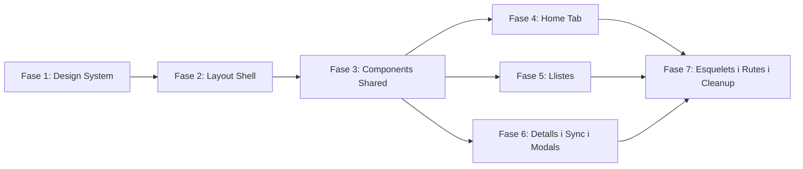

# Pla d'Implementacio: Dashboard Design Refactor

Referencia: [docs/specs/2026-04-20-dashboard-design-refactor-design.md](docs/specs/2026-04-20-dashboard-design-refactor-design.md)

## Estat actual del codi

- **Angular 21.2**, **DaisyUI 4.12**, **Tailwind 3.4**, **Angular CDK 21.2**
- Layout: DaisyUI `drawer` amb `sidebar` + `header` + `user-chip`
- Features: `auth/login`, `persons` (list/detail/sync), `events` (list/detail/sync/form-modal/attendance-modal)
- Services/models/utils: intactes durant tot el refactor
- `tailwind.config.js`: tema `colla-barcelona` amb colors fixos + CSS vars legacy a `styles.scss`

## Diagrama de Fases



Fases 4, 5 i 6 es poden executar en paral-lel despres de la Fase 3.

---

## Fase 1: Design System i Fonamentacio

**Objectiu**: Establir la base visual (tema, fonts, icones) abans de tocar cap component.

### Arxius a modificar

- **[tailwind.config.js](tailwind.config.js)** — Reescriure completament:
  - Crear funcio `generateCollaTheme(primaryHex)` que genera `primary-content`, `secondary`, `accent` automaticament
  - Tokens fixos: `neutral`, `base-100/200/300`, `base-content`, semantic colors
  - Afegir `daisyui.darkTheme: false`
  - Eliminar bloc `colors.colla` amb CSS vars legacy
  - Mantenir `content` paths

- **[apps/dashboard/src/styles.scss](apps/dashboard/src/styles.scss)** — Simplificar:
  - Eliminar bloc `:root` amb CSS vars (`--colla-primary`, etc.)
  - Eliminar reset `* { margin:0 }` (Tailwind preflight ja ho fa)
  - Afegir import de font Inter
  - Mantenir nomes `@tailwind base/components/utilities`

- **[apps/dashboard/src/index.html](apps/dashboard/src/index.html)** — Actualitzar:
  - Afegir `data-theme="colla-barcelona"` a `<html>`
  - Canviar `lang="en"` a `lang="ca"`
  - Afegir link Google Fonts Inter (o `@fontsource/inter` si es prefereix local)

### Dependencies noves

```bash
npm install lucide-angular
```

Font Inter via Google Fonts link (zero dependencia npm) o `npm install @fontsource/inter`.

### Resultat esperat

Compilacio correcta sense canvis visuals (el tema resultant ha de ser equivalent). Validar contrast WCAG del primary generat.

---

## Fase 2: Layout Shell

**Objectiu**: Substituir drawer/sidebar per top bar amb tabs. Crear LayoutService per fullscreen.

### Arxius a crear

- **`apps/dashboard/src/app/core/services/layout.service.ts`** (NOU)
  - Signal `isFullscreen` (default `false`)
  - Metodes `requestFullscreen()`, `exitFullscreen()`
  - Listener `Escape` per sortir de fullscreen
  - Injectable `{ providedIn: 'root' }`

- **`apps/dashboard/src/app/shared/components/layout/tab-nav/tab-nav.component.ts`** (NOU)
  - **`apps/dashboard/src/app/shared/components/layout/tab-nav/tab-nav.component.html`**
  - Tabs: Inici, Persones, Assajos, Actuacions, Pinyes, Configuracio
  - `routerLink` + `routerLinkActive` per cada tab
  - Responsive: icona+text desktop, icona tablet, dropdown mobil
  - DaisyUI `tabs tabs-bordered`

### Arxius a reescriure (template + estils, mantenir logica TS)

- **[apps/dashboard/src/app/app.ts](apps/dashboard/src/app/app.ts)** — Reescriure:
  - Eliminar imports `SidebarComponent`
  - Afegir import `TabNavComponent`, `LayoutService`
  - Mantenir `isAuthRoute` signal
  - Afegir `isFullscreen` des de `LayoutService`
  - Mantenir `mobileMenuOpen` (reusat pel dropdown mobil)

- **[apps/dashboard/src/app/app.html](apps/dashboard/src/app/app.html)** — Reescriure completament:
  - Eliminar `drawer` pattern
  - Estructura: `@if isAuthRoute → outlet`, `@else @if isFullscreen → outlet`, `@else → header + tab-nav + main.content-area`
  - El `main` mante `bg-base-200 p-4 lg:p-6 overflow-y-auto`

- **[apps/dashboard/src/app/shared/components/layout/header/](apps/dashboard/src/app/shared/components/layout/header/)** — Reescriure HTML:
  - Mantenir TS (signal `title`, output `menuClicked`)
  - Nou template: `navbar bg-base-100 border-b border-base-300`
  - Esquerra: logo + "MuixerApp"
  - Dreta: `<ng-content>` per user-chip
  - Mobil: hamburger que obre dropdown (no drawer)

### Arxius a eliminar

- **`apps/dashboard/src/app/shared/components/layout/sidebar/`** — Eliminar tot el directori (3 arxius: `.ts`, `.html`, `.scss`)

### Arxiu a polir

- **[apps/dashboard/src/app/shared/components/layout/user-chip/](apps/dashboard/src/app/shared/components/layout/user-chip/)** — Polir HTML:
  - Eliminar estils inline amb `var(--colla-primary)`, usar tokens DaisyUI
  - Mantenir tota la logica TS (computed, logout)

### Resultat esperat

El dashboard renderitza amb top bar + tabs. Navegacio funcional. Sidebar eliminat.

---

## Fase 3: Llibreria de Components Shared

**Objectiu**: Construir tots els components reutilitzables que les features consumiran.

### Components a crear (tots a `apps/dashboard/src/app/shared/components/`)

Cada component: `.ts` + `.html` (sense `.scss`, estils via Tailwind/DaisyUI). Tots standalone, OnPush, `host: { class: 'block' }`.

**Dades** (`shared/components/data/`):

- **`page-header/`** — Titol + badge comptador + slot per botons. Inputs: `title: string`, `count?: number`. `<ng-content>` per accions.

- **`data-table/`** — Generic `<T>`. El component mes complex. Implementar per fases:
  - Fase 3a: Taula basica amb columnes, sort, skeleton loading
  - Fase 3b: Scroll horizontal, sticky primera columna + thead
  - Fase 3c: `groupSeparator` per separador temporal (events passats)
  - Fase 3d: Columna d'accions amb dropdown
  - Inputs: `items`, `columns`, `visibleColumns`, `sortBy`, `sortOrder`, `loading`, `groupSeparator`
  - Outputs: `rowClick`, `sortChange`
  - **Interficie `ColumnDef<T>`**: Definir a `shared/models/column-def.model.ts`

- **`column-toggle/`** — Collapse DaisyUI amb checkboxes per columnes. Inputs: `columns: ColumnDef[]`, `visibleKeys: string[]`. Output: `toggleColumn: string`.

- **`filter-bar/`** — Flex wrap amb `<ng-content>` per inputs de filtre especifics de cada feature. Inclou boto "Netejar filtres".

- **`active-filters/`** — Badges dismissibles. Input: `filters: { label: string, key: string }[]`. Output: `removeFilter: string`.

- **`pagination/`** — Join buttons + selector limit. Inputs: `page`, `totalPages`, `limit`, `totalItems`. Outputs: `pageChange`, `limitChange`. Limit options: `[25, 50, 100]`.

- **`empty-state/`** — Card amb icona Lucide + missatge + accio opcional. Inputs: `icon: string`, `message: string`, `actionLabel?: string`. Output: `actionClick`.

- **`stat-card/`** — DaisyUI `stat`. Inputs: `label`, `value`, `description?`.

**Feedback** (`shared/components/feedback/`):

- **`skeleton-rows/`** — Input: `rows: number`, `columns: number`. Genera files amb barres animades.

- **`skeleton-cards/`** — Input: `count: number`. Cards amb shimmer.

- **`confirm-dialog/`** — DaisyUI modal. Inputs: `title`, `message`, `confirmLabel`, `confirmClass`. Outputs: `confirmed`, `cancelled`. Usa `<dialog>` nativa.

- **`toast/`** — Component + `ToastService` injectable. Metodes: `success(msg)`, `error(msg)`, `warning(msg)`, `info(msg)`. Auto-dismiss 3-5s. DaisyUI `toast` + `alert`.

**Formulari** (`shared/components/forms/`):

- **`form-field/`** — Wrapper DaisyUI `form-control`. Inputs: `label`, `error?: string`, `helperText?: string`, `required?: boolean`.

### Models shared a crear

- **`apps/dashboard/src/app/shared/models/column-def.model.ts`** — Interficie `ColumnDef<T>` generica (key, label, defaultVisible, sortField, cellTemplate, type)
- **`apps/dashboard/src/app/shared/models/sort.model.ts`** — `SortOrder` type + `SortChange` interface

### Component a polir

- **[apps/dashboard/src/app/shared/components/forms/person-search-input/](apps/dashboard/src/app/shared/components/forms/person-search-input/)** — Actualitzar HTML amb noves classes DaisyUI consistents. Mantenir logica TS.

### Resultat esperat

Tots els components compilen i son importables. El dashboard encara mostra els templates antics a les features (seran reescrits en fases 4-6).

---

## Fase 4: Home Tab

**Objectiu**: Crear la pagina d'inici amb cards de navegacio i preview de dades.

### Arxius a crear

- **`apps/dashboard/src/app/features/home/`** (NOU directori)
  - `home.component.ts` — Injected: `EventService`, `PersonService`, `AuthService`, `Router`. Signals per proxim assaig/actuacio, comptadors.
  - `home.component.html` — 5 zones: salutacio, cards destacades, cards navegacio, sync legacy, config
  - `home.routes.ts` — Ruta simple `{ path: '', component: HomeComponent }`

### Arxiu a modificar

- **[apps/dashboard/src/app/app.routes.ts](apps/dashboard/src/app/app.routes.ts)** — Afegir:
  - Redirect `/` a `/home`
  - Ruta `/home` amb lazy loading
  - Ruta `/sync` (GlobalSyncComponent)
  - Ruta `/pinyes` (placeholder)
  - Ruta `/config` amb sub-rutes
  - Mantenir rutes existents de persons, rehearsals, performances

### Resultat esperat

Tab "Inici" funcional amb dades reals del backend.

---

## Fase 5: Reescriure Llistes

**Objectiu**: Substituir els templates HTML de person-list i event-list usant els components shared.

### Arxius a reescriure (nomes HTML, mantenir TS)

- **[apps/dashboard/src/app/features/persons/components/person-list.component.html](apps/dashboard/src/app/features/persons/components/person-list.component.html)** (421 linies -> ~80-120 linies)
  - `app-page-header` amb boto sync
  - `app-filter-bar` amb search + position select + estat filter
  - `app-active-filters` amb badges
  - `app-column-toggle`
  - `app-data-table` amb columns definits
  - `app-pagination`
  - `app-empty-state` quan no hi ha resultats

- **`person-list.component.ts`** — Ajustos minims:
  - Actualitzar imports (afegir shared components, eliminar DaisyUI inline references)
  - Adaptar `ColumnDef` al nou model generic
  - Mantenir tota la logica de signals/methods

- **`person-list.component.scss`** (62 linies -> buit o eliminat) — Eliminar tots els estils custom

- **[apps/dashboard/src/app/features/events/components/event-list/event-list.component.html](apps/dashboard/src/app/features/events/components/event-list/event-list.component.html)** (394 linies -> ~80-120 linies)
  - Mateixa estructura que person-list
  - Afegir `groupSeparator` per separacio futurs/passats
  - Boto sync a `app-page-header`
  - Default sort: `date ASC`

- **`event-list.component.ts`** — Ajustos minims (mateixos que person-list)

- **`event-list.component.scss`** (77 linies -> buit o eliminat)

### Resultat esperat

Llistes funcionals amb el nou disseny. Filtres, sort, paginacio operatius.

---

## Fase 6: Reescriure Detalls, Sync, Modals i Login

**Objectiu**: Completar la reconstruccio de totes les pagines restants.

### Detalls — Reescriure HTML

- **[apps/dashboard/src/app/features/persons/components/person-detail/person-detail.component.html](apps/dashboard/src/app/features/persons/components/person-detail/person-detail.component.html)** (236 linies -> ~80-100)
  - `app-page-header` amb boto tornar (`routerLink="/persons"`) + titol
  - Grid 2 cols desktop amb cards `bg-base-100 shadow-sm`
  - Camps clau-valor amb labels `text-base-content/60`
  - `person-detail.component.scss` (60 linies -> buit)

- **[apps/dashboard/src/app/features/events/components/event-detail/event-detail.component.html](apps/dashboard/src/app/features/events/components/event-detail/event-detail.component.html)** (410 linies -> ~120-150)
  - Mateixa estructura que person-detail
  - Card assistencia amb badges d'estat
  - Modal editar assistencia (mantenir component, polir HTML)
  - `event-detail.component.scss` (1 linia -> mantenir buit)

### Sync — Reescriure HTML + Crear GlobalSync

- **[apps/dashboard/src/app/features/persons/components/person-sync/person-sync.component.html](apps/dashboard/src/app/features/persons/components/person-sync/person-sync.component.html)** (148 linies -> ~60-80)
  - `app-page-header` amb boto tornar
  - Card warning explicativa
  - Boto accio + progress bar DaisyUI + log
  - `person-sync.component.scss` (60 linies -> buit)

- **[apps/dashboard/src/app/features/events/components/event-sync/event-sync.component.html](apps/dashboard/src/app/features/events/components/event-sync/event-sync.component.html)** (145 linies -> ~60-80)
  - Mateixa estructura

- **`apps/dashboard/src/app/features/sync/`** (NOU directori)
  - `global-sync.component.ts` — Combina person-sync + event-sync. Cards per cada tipus amb botons individuals + "Sincronitzar tot"
  - `global-sync.component.html`
  - `sync.routes.ts`

### Modals — Polir HTML

- **`event-form-modal.component.html`** (164 linies -> ~100-120) — Usar `app-form-field` per inputs
- **`attendance-edit-modal.component.html`** (111 linies -> ~70-90) — Polir amb nous estils DaisyUI

### Login — Reescriure HTML

- **[apps/dashboard/src/app/features/auth/login/login.component.html](apps/dashboard/src/app/features/auth/login/login.component.html)** (76 linies -> ~50-60)
  - Mantenir layout centrat amb card
  - Usar `app-form-field` per email i password
  - Actualitzar estils a nous tokens

### Resultat esperat

Totes les pagines amb el nou disseny. Zero pagines amb estil antic.

---

## Fase 7: Esquelets de Moduls Futurs, Rutes Finals i Cleanup

**Objectiu**: Preparar estructura per Pinyes i Config. Netejar residus.

### Arxius a crear

- **`apps/dashboard/src/app/features/pinyes/`** (NOU)
  - `pinyes-placeholder.component.ts` + `.html` — `app-empty-state` "Modul en desenvolupament"
  - `pinyes.routes.ts`

- **`apps/dashboard/src/app/features/config/`** (NOU)
  - `config.component.ts` + `.html` — Cards de navegacio a sub-seccions
  - `config.routes.ts` — Sub-rutes: users, tags, seasons (tots placeholder)
  - `components/config-placeholder.component.ts` — Placeholder generic reutilitzable

### Arxius a verificar/actualitzar

- **[apps/dashboard/src/app/app.routes.ts](apps/dashboard/src/app/app.routes.ts)** — Verificar que totes les rutes del mapa (Seccio 8 de l'spec) estan configurades

### Cleanup

- Eliminar `apps/dashboard/src/app/app.scss` (esta buit)
- Eliminar `shared/components/layout/sidebar/` (ja fet a Fase 2)
- Verificar que no queden referencies a `SidebarComponent` enlloc
- Eliminar CSS vars legacy de `styles.scss` (ja fet a Fase 1)
- Verificar `data-theme="colla-barcelona"` a `index.html`
- Actualitzar regles `.cursor/rules/dashboard-ux-patterns.mdc` si cal ajustar patrons
- Afegir `.superpowers/` a `.gitignore` si no hi es

### Resultat esperat

Dashboard complet amb el nou disseny. Totes les rutes operatives. Esquelets preparats per Pinyes i Config. Zero residus del disseny antic.

---

## Resum de Fitxers

### A crear (~25 arxius nous)

- `core/services/layout.service.ts`
- `shared/components/layout/tab-nav/` (2 arxius)
- `shared/components/data/` — page-header, data-table, column-toggle, filter-bar, active-filters, pagination, empty-state, stat-card (16 arxius)
- `shared/components/feedback/` — skeleton-rows, skeleton-cards, confirm-dialog, toast + ToastService (9 arxius)
- `shared/components/forms/form-field/` (2 arxius)
- `shared/models/` — column-def.model.ts, sort.model.ts
- `features/home/` (3 arxius)
- `features/sync/` (3 arxius)
- `features/pinyes/` (3 arxius)
- `features/config/` (4 arxius)

### A reescriure HTML (mantenir TS)

- `app.html`, `app.ts` (adaptar imports)
- `header.component.html`
- `user-chip.component.html`
- `person-list.component.html` + `.scss`
- `person-detail.component.html` + `.scss`
- `person-sync.component.html` + `.scss`
- `event-list.component.html` + `.scss`
- `event-detail.component.html`
- `event-sync.component.html`
- `event-form-modal.component.html`
- `attendance-edit-modal.component.html`
- `login.component.html`
- `person-search-input.component.html`

### A eliminar

- `shared/components/layout/sidebar/` (3 arxius)
- `app.scss` (buit)
- Blocs de codi legacy a `tailwind.config.js` i `styles.scss`

### A modificar (config)

- `tailwind.config.js`
- `styles.scss`
- `index.html`
- `app.routes.ts`
- `package.json` (nova dependencia lucide-angular)
