# P3.0: Seasons, Events & Attendance — Implementation Plan

Based on the [approved spec](docs/specs/2026-03-31-p3-seasons-events-attendance-sync-design.md) and the [design conversation](1a675624-4c04-4d9b-af5e-6706ba72c78e).

---

## Architecture Overview

```mermaid
flowchart TB
    subgraph phase1["Phase 1: Shared Library"]
        ET["EventType enum"]
        AS["AttendanceStatus enum"]
        DTOs["Shared interfaces"]
    end
    subgraph phase2["Phase 2: Backend Entities"]
        SE["Season entity"]
        EE["Event entity"]
        AE["Attendance entity"]
    end
    subgraph phase3["Phase 3: Backend Services + API"]
        SS["SeasonService + Controller"]
        ES["EventService + Controller"]
        ATS["AttendanceService"]
    end
    subgraph phase4["Phase 4: Sync Strategies"]
        LAC["LegacyApiClient extensions"]
        ESS["EventSyncStrategy"]
        ASS["AttendanceSyncStrategy"]
        SC["SyncController extensions"]
    end
    subgraph phase5["Phase 5: Backend Tests"]
        UT["Unit tests for all new services"]
        ST["Strategy tests with mocks"]
    end
    subgraph phase6["Phase 6: Dashboard"]
        EL["EventListComponent"]
        ED["EventDetailComponent"]
        ESYNC["EventSyncComponent"]
        FES["Frontend services + models"]
    end
    subgraph phase7["Phase 7: Frontend Tests + Docs"]
        FT["Vitest component + service tests"]
        DOC["Update NEXT_STEPS, ROADMAP, CURRENT_STATUS"]
    end
    phase1 --> phase2 --> phase3 --> phase4 --> phase5 --> phase6 --> phase7
```




---

## Phase 1: Shared Library — Enums and Interfaces

New files in `libs/shared/src/`:

- `**enums/event-type.enum.ts**` — `EventType { ASSAIG, ACTUACIO }`
- `**enums/attendance-status.enum.ts**` — `AttendanceStatus { PENDING, COMMITTED, DECLINED, ATTENDED, NO_SHOW }`
- `**interfaces/attendance-summary.interface.ts**` — `AttendanceSummary` (confirmed, declined, pending, attended, noShow, children, total)
- `**interfaces/event-metadata.interface.ts**` — `RehearsalMetadata`, `PerformanceMetadata`

Update [libs/shared/src/index.ts](libs/shared/src/index.ts) barrel to export all new types.

---

## Phase 2: Backend Entities

### 2.1 Season Entity

New file: `apps/api/src/modules/season/season.entity.ts`

- UUID PK, `name` (unique), `startDate`/`endDate` (date), `description` (nullable), `legacyId` (nullable varchar)
- `@OneToMany(() => Event, event => event.season)`
- Timestamps

### 2.2 Event Entity

New file: `apps/api/src/modules/event/event.entity.ts`

- UUID PK, `eventType` (enum), `title`, `description` (nullable), `date`, `startTime` (nullable varchar), `location`/`locationUrl` (nullable), `information` (nullable text)
- `countsForStatistics` (default true), `metadata` (JSONB), `attendanceSummary` (JSONB with default)
- `@ManyToOne(() => Season)` + `@OneToMany(() => Attendance)`
- `legacyId` (unique, nullable), `legacyType` (nullable), `lastSyncedAt`

### 2.3 Attendance Entity

New file: `apps/api/src/modules/event/attendance.entity.ts`

- UUID PK, `status` (enum `AttendanceStatus`), `respondedAt` (nullable timestamp), `notes` (nullable)
- `@ManyToOne(() => Person)` + `@ManyToOne(() => Event)`
- `@Unique(['person', 'event'])` constraint
- `legacyId` (nullable), `lastSyncedAt`

### 2.4 Register in TypeORM

Update [apps/api/src/app.module.ts](apps/api/src/app.module.ts) — add `Season`, `Event`, `Attendance` to `TypeOrmModule.forRoot({ entities: [...] })`.

---

## Phase 3: Backend Services and API

### 3.1 SeasonModule

New files under `apps/api/src/modules/season/`:

- `**season.module.ts**` — imports `TypeOrmModule.forFeature([Season])`, exports `SeasonService`
- `**season.service.ts**` — `findAll()` with event count, `findOne(id)`
- `**season.controller.ts**` — `GET /seasons`, `GET /seasons/:id`

### 3.2 EventModule

New files under `apps/api/src/modules/event/`:

- `**event.module.ts**` — imports `TypeOrmModule.forFeature([Event, Attendance])`, imports `PersonModule`, exports `EventService`, `AttendanceService`
- `**event.service.ts**` — `findAll(filters)` with pagination/sort/search, `findOne(id)`, `update(id, dto)`
- `**attendance.service.ts**` — `findByEvent(eventId, filters)` with pagination, `recalculateSummary(eventId)`
- `**event.controller.ts**` — `GET /events` (with all filters from spec section 6.2), `GET /events/:id`, `PATCH /events/:id`, `GET /events/:id/attendance`
- `**dto/event-filter.dto.ts**` — `seasonId`, `eventType`, `dateFrom`, `dateTo`, `search`, `countsForStatistics`, `sortBy` (whitelist: date/eventType/title), `sortOrder`, `page`, `limit`
- `**dto/update-event.dto.ts**` — `countsForStatistics?` (boolean), `seasonId?` (UUID)

Key API behaviors:

- **No `legacyId`** in any response DTO — strip from all responses
- **Sort whitelist** mirroring the pattern from `PersonFilterDto` (`PERSON_SORT_COLUMN_MAP`)
- `**attendanceSummary`** included in list and detail responses
- **Season** embedded as `{ id, name }` in event responses

### 3.3 Register in AppModule

Import `SeasonModule` and `EventModule` in `app.module.ts`.

---

## Phase 4: Sync Strategies

### 4.1 Extend LegacyApiClient

Add methods to [apps/api/src/modules/sync/legacy-api.client.ts](apps/api/src/modules/sync/legacy-api.client.ts):

- `getAssajos(): Promise<LegacyAssaig[]>` — `GET /api/assajos`
- `getAssaigDetail(id: string): Promise<LegacyAssaigDetail>` — `GET /api/assajos/{id}`
- `getActuacions(): Promise<LegacyActuacio[]>` — `GET /api/actuacions`
- `getActuacioDetail(id: string): Promise<LegacyActuacioDetail>` — `GET /api/actuacions/{id}`
- `getAssistencies(eventId: string): Promise<LegacyAttendance[]>` — `GET /api/assistencies/{id}`

Add legacy interfaces (spec section 5.1) in a new `interfaces/legacy-event.interface.ts`.

### 4.2 EventSyncStrategy

New file: `apps/api/src/modules/sync/strategies/event-sync.strategy.ts`

Flow (follows `PersonSyncStrategy` Observable pattern):

1. Login via `LegacyApiClient`
2. Create static seasons (idempotent upsert on `legacyId`)
3. Fetch + upsert rehearsals (list + individual detail per event)
4. Fetch + upsert performances (same pattern)
5. Trigger `AttendanceSyncStrategy` for all legacy events
6. Emit SSE progress throughout

Merge rules per spec section 5.8:

- `countsForStatistics` and `season` are **NEVER overwritten** on re-sync
- `legacyId` is immutable upsert key
- HTML stripped from `title`, `information`

### 4.3 AttendanceSyncStrategy

New file: `apps/api/src/modules/sync/strategies/attendance-sync.strategy.ts`

- For each event: fetch attendance from legacy, match persons by alias (fallback: legacyId from HTML), context-aware status mapping (spec section 5.6), upsert on `(person, event)`, recalculate `attendanceSummary`
- Person matching: alias (unique, uppercase) > legacyId from HTML > skip + log
- Status mapping function with 4-way branch: past/future x assaig/actuacio

### 4.4 Extend SyncController

Update [apps/api/src/modules/sync/sync.controller.ts](apps/api/src/modules/sync/sync.controller.ts):

- `GET /sync/events` — SSE stream (events + attendance)
- `GET /sync/all` — SSE stream (persons first, then events + attendance sequentially)
- Inject `EventSyncStrategy` and (optionally) `AttendanceSyncStrategy`

### 4.5 Extend SyncModule

Update [apps/api/src/modules/sync/sync.module.ts](apps/api/src/modules/sync/sync.module.ts):

- Add `Event`, `Attendance`, `Season` to `TypeOrmModule.forFeature()`
- Add `EventSyncStrategy`, `AttendanceSyncStrategy` to providers
- Import `SeasonModule` and `EventModule` if needed for services

---

## Phase 5: Backend Tests (Jest)

Following the existing patterns in `person-sync.strategy.spec.ts`:

- `**event-sync.strategy.spec.ts`** — Map assaig/actuacio to Event, static season creation, merge rules (countsForStatistics preserved), HTML stripping, event ID extraction
- `**attendance-sync.strategy.spec.ts`** — Context-aware mapping (all 8 combinations: past/future x assaig/actuacio x each legacy status), alias matching, summary recalculation including children count, unmatched person handling
- `**event.service.spec.ts`** — CRUD, all filters (seasonId, eventType, dateRange, search, countsForStatistics), pagination, sort whitelist
- `**attendance.service.spec.ts`** — List by event, status filter, recalculate summary
- `**season.service.spec.ts`** — List with event count
- `**event.controller.spec.ts`** — Endpoint responses, DTO validation, legacyId exclusion
- `**event-filter.dto.spec.ts`** — Validation of all filter params, sortBy whitelist

---

## Phase 6: Dashboard (Angular)

### 6.1 Shared Library Enums (already done in Phase 1)

Frontend models will import `EventType`, `AttendanceStatus`, `AttendanceSummary` from `@muixer/shared`.

### 6.2 Feature Structure

New directory: `apps/dashboard/src/app/features/events/`

```
events/
  components/
    event-list/
      event-list.component.ts
      event-list.component.html
      event-list.component.scss
    event-detail/
      event-detail.component.ts
      event-detail.component.html
      event-detail.component.scss
    event-sync/
      event-sync.component.ts
      event-sync.component.html
      event-sync.component.scss
  services/
    event.service.ts
    attendance.service.ts
    season.service.ts
  models/
    event.model.ts
    attendance.model.ts
  events.routes.ts
```

### 6.3 Models

- `**event.model.ts**` — `Event`, `EventFilterParams`, `PaginatedResponse` (reuse from person), `SyncEvent` (reuse)
- `**attendance.model.ts**` — `Attendance`, `AttendanceFilterParams`

### 6.4 Services

- `**EventService**` extends `ApiService` — `getAll(filters)`, `getOne(id)`, `update(id, dto)`
- `**AttendanceService**` extends `ApiService` — `getByEvent(eventId, filters)`
- `**SeasonService**` extends `ApiService` — `getAll()`

### 6.5 EventListComponent

Follows `PersonListComponent` patterns (signals, OnPush, DaisyUI):

- **Tabs**: Assajos / Actuacions (filter by `eventType`)
- **Season filter**: Dropdown populated from `SeasonService`
- **Statistics filter**: Tots / Comptabilitzen / No comptabilitzen
- **Search**: 300ms debounce on title/location
- **Sort**: Date (default DESC), clickable column headers with whitelist
- **Pagination**: 25/50/100 per page
- **Attendance columns**: Adapt labels for past vs future events (icons + counts from `attendanceSummary`)
- **Row click**: Navigate to `/events/:id`
- **Sync button**: Navigate to `/events/sync`

### 6.6 EventDetailComponent

Two-column layout (info + attendance summary):

- Left: Type, date (with weekday derived), time, location, season, countsForStatistics, metadata per type (actuacio: isHome, colles, hasBus)
- Right: `AttendanceSummary` counts with badges + progress bar
- Bottom: Attendance list (paginated, filterable by status, searchable by alias/name)
- **Edit button**: Toggle `countsForStatistics`, reassign season (inline)

### 6.7 EventSyncComponent

Mirror `PersonSyncComponent` pattern:

- `EventSource` to `/sync/events`
- Progress bar, log, cancel
- After complete: navigate back to event list + reload

### 6.8 Routing

Update [apps/dashboard/src/app/app.routes.ts](apps/dashboard/src/app/app.routes.ts):

```typescript
{
  path: 'events',
  loadChildren: () => import('./features/events/events.routes').then(m => m.eventsRoutes),
},
```

`events.routes.ts`:

- `''` → `EventListComponent`
- `'sync'` → `EventSyncComponent` (before `:id`)
- `':id'` → `EventDetailComponent`

### 6.9 Sidebar Navigation

Update [apps/dashboard/src/app/shared/components/layout/sidebar/sidebar.component.html](apps/dashboard/src/app/shared/components/layout/sidebar/sidebar.component.html):

Convert the disabled "Esdeveniments" div to an active `<a routerLink="/events">` with `routerLinkActive`.

---

## Phase 7: Frontend Tests + Documentation

### 7.1 Vitest Tests

- `**event-list.component.spec.ts**` — Tab switching, season filter, sort, pagination, attendance columns adapt to past/future
- `**event-detail.component.spec.ts**` — Info + metadata per type, attendance list, status filter
- `**event-sync.component.spec.ts**` — SSE connection, progress, cancel
- `**event.service.spec.ts**` — HTTP calls with correct params
- `**attendance.service.spec.ts**` — HTTP calls with status filter

### 7.2 Manual Validation

Run full event sync against legacy API. Verify 15-point checklist from spec section 10.3.

### 7.3 Documentation Updates

- [docs/NEXT_STEPS.md](docs/NEXT_STEPS.md) — Mark P3 as complete, add P3.1 items
- [docs/PROJECT_ROADMAP.md](docs/PROJECT_ROADMAP.md) — Update P3 status
- [docs/CURRENT_STATUS.md](docs/CURRENT_STATUS.md) — Add event module info, new test counts
- [docs/DATA_MODEL.md](docs/DATA_MODEL.md) — Add Season, Event, Attendance entities

---

## Key Patterns to Follow (from P0-P2)

- **Strategy + Observable** for sync — `SyncStrategy.execute(): Observable<SyncEvent>` with `subscriber.next()` inside async
- `**isSyncing` concurrency guard** — extend to cover event sync
- `**buildHttpParams`** for Angular services
- **Sort whitelist** (`EVENT_SORT_COLUMN_MAP`) like `PERSON_SORT_COLUMN_MAP`
- **Three-file components** (TS + HTML + SCSS), standalone, OnPush, signals
- **Catalan UI labels**, English code
- `**legacyId` never in DTOs** — strip from all API responses

## Estimated Effort


| Phase                           | Est. time |
| ------------------------------- | --------- |
| Phase 1 (Shared)                | 30 min    |
| Phase 2 (Entities)              | 1h        |
| Phase 3 (Services/API)          | 3h        |
| Phase 4 (Sync)                  | 4h        |
| Phase 5 (Backend tests)         | 3h        |
| Phase 6 (Dashboard)             | 5h        |
| Phase 7 (Frontend tests + docs) | 2h        |
| **Total**                       | **~18h**  |


