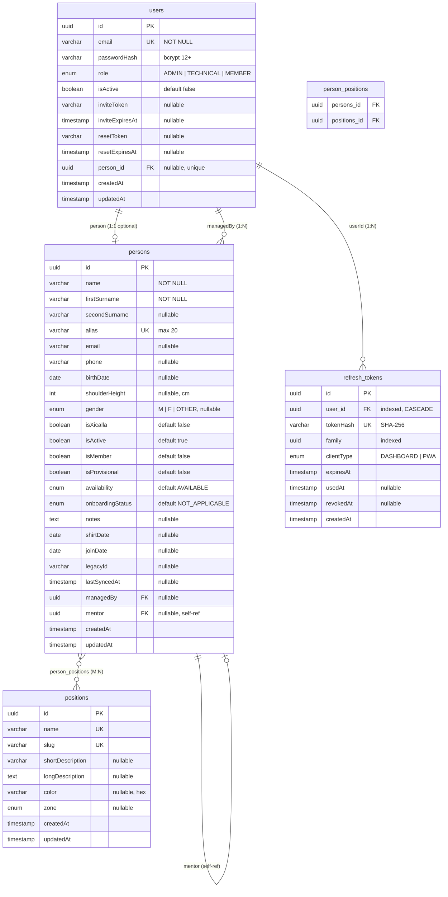

# Model de Dades — MuixerApp

> Última actualització: 12 d'abril de 2026  
> Estat: P0–P3 implementat. P4.1 Auth Layer + P4.2 Events CRUD + Attendance complets.

---

## Entitats Actuals

### `persons`

Membre de la colla (qualsevol persona registrada al sistema, independentment del rol muixeranguer).

| Camp | Tipus DB | TypeScript | Nullable | Notes |
|------|----------|------------|----------|-------|
| `id` | `uuid` | `string` | No | PK, auto-generat |
| `name` | `varchar` | `string` | No | Nom de pila |
| `firstSurname` | `varchar` | `string` | No | Primer cognom |
| `secondSurname` | `varchar` | `string \| null` | Sí | |
| `alias` | `varchar(20)` | `string` | No | Únic a la taula |
| `email` | `varchar` | `string \| null` | Sí | |
| `phone` | `varchar` | `string \| null` | Sí | |
| `birthDate` | `date` | `Date \| null` | Sí | |
| `shoulderHeight` | `int` | `number \| null` | Sí | Alçada espatlla en cm |
| `gender` | `enum` | `Gender \| null` | Sí | `MALE \| FEMALE \| OTHER` |
| `isXicalla` | `boolean` | `boolean` | No | Default `false`. Xicalla = < 16 anys |
| `isActive` | `boolean` | `boolean` | No | Default `true`. Soft delete |
| `isMember` | `boolean` | `boolean` | No | Default `false`. Soci de la colla |
| `isProvisional` | `boolean` | `boolean` | No | Default `false`. Persona provisional (àlies amb prefix `~`) |
| `availability` | `enum` | `AvailabilityStatus` | No | Default `AVAILABLE` |
| `onboardingStatus` | `enum` | `OnboardingStatus` | No | Default `NOT_APPLICABLE` |
| `notes` | `text` | `string \| null` | Sí | Notes internes (no sincronitza) |
| `shirtDate` | `date` | `Date \| null` | Sí | Data d'entrega de samarreta |
| `joinDate` | `date` | `Date \| null` | Sí | Data d'incorporació |
| `legacyId` | `varchar` | `string \| null` | Sí | ID a l'API legacy (migració) |
| `lastSyncedAt` | `timestamp` | `Date \| null` | Sí | Última sincronització |
| `managedBy` | FK → `users` | `User \| null` | Sí | ManyToOne |
| `user` | OneToOne → `users` | `User \| null` | Sí | Back-ref: compte vinculat (afegit a P4.1) |
| `mentor` | FK → `persons` | `Person \| null` | Sí | Self-referencing ManyToOne |
| `positions` | JT `person_positions` | `Position[]` | — | ManyToMany |
| `createdAt` | `timestamp` | `Date` | No | Auto |
| `updatedAt` | `timestamp` | `Date` | No | Auto |

> **Canvi P4.1**: Camp `isMainAccount` eliminat. La relació User↔Person ara és un `OneToOne` explícit via `user.person_id`.
> **Canvi P4.2**: Afegit `isProvisional`. Les persones provisionals tenen àlies prefixat amb `~` (ex: `~Joan`). Promoció a regular valida que `name`, `firstSurname` no estiguin buits i l'àlies no comenci amb `~`.

---

### `positions`

Posicions muixerangueres (pinya, tronc, caps de colla...). Gestionades internament, no sincronitzen amb legacy.

| Camp | Tipus DB | TypeScript | Nullable | Notes |
|------|----------|------------|----------|-------|
| `id` | `uuid` | `string` | No | PK |
| `name` | `varchar` | `string` | No | Únic. Ex: `"Baix"` |
| `slug` | `varchar` | `string` | No | Únic. Ex: `"baix"` |
| `shortDescription` | `varchar` | `string \| null` | Sí | |
| `longDescription` | `text` | `string \| null` | Sí | |
| `color` | `varchar` | `string \| null` | Sí | Hex, ex: `"#FF5733"` |
| `zone` | `enum` | `FigureZone \| null` | Sí | `PINYA \| TRONC \| FIGURE_DIRECTION \| XICALLA_DIRECTION` |
| `createdAt` | `timestamp` | `Date` | No | Auto |
| `updatedAt` | `timestamp` | `Date` | No | Auto |

---

### `users`

Compte d'accés a l'aplicació. Desacoblat de `Person` (una persona pot no tenir compte, un compte pot gestionar múltiples persones).

| Camp | Tipus DB | TypeScript | Nullable | Notes |
|------|----------|------------|----------|-------|
| `id` | `uuid` | `string` | No | PK |
| `email` | `varchar` | `string` | No | Únic. Credencial de login (afegit a P4.1) |
| `passwordHash` | `varchar` | `string` | No | bcrypt cost 12+ |
| `role` | `enum` | `UserRole` | No | Default `MEMBER`. `ADMIN \| TECHNICAL \| MEMBER` |
| `isActive` | `boolean` | `boolean` | No | Default `false` |
| `inviteToken` | `varchar` | `string \| null` | Sí | Token d'invitació per email |
| `inviteExpiresAt` | `timestamp` | `Date \| null` | Sí | |
| `resetToken` | `varchar` | `string \| null` | Sí | Token de reset de password |
| `resetExpiresAt` | `timestamp` | `Date \| null` | Sí | |
| `person` | OneToOne → `persons` | `Person \| null` | Sí | FK `person_id`. Person vinculat (afegit a P4.1) |
| `createdAt` | `timestamp` | `Date` | No | Auto |
| `updatedAt` | `timestamp` | `Date` | No | Auto |

> **Canvi P4.1**: Afegits `email` (unique, NOT NULL) i `person` (OneToOne nullable amb FK `person_id`). Eliminat import `OneToMany` no usat.

---

### `refresh_tokens`

Tokens de refresc per a la rotació segura de sessions JWT. Afegit a P4.1.

| Camp | Tipus DB | TypeScript | Nullable | Notes |
|------|----------|------------|----------|-------|
| `id` | `uuid` | `string` | No | PK, auto-generat |
| `userId` | `uuid` | `string` | No | FK → `users.id`, indexat. `ON DELETE CASCADE` |
| `tokenHash` | `varchar` | `string` | No | SHA-256 del raw token. Únic |
| `family` | `uuid` | `string` | No | Família de rotació. Indexat |
| `clientType` | `enum` | `ClientType` | No | `DASHBOARD \| PWA` |
| `expiresAt` | `timestamp` | `Date` | No | Data d'expiració |
| `usedAt` | `timestamp` | `Date \| null` | Sí | Quan s'ha usat per rotar |
| `revokedAt` | `timestamp` | `Date \| null` | Sí | Quan s'ha revocat |
| `createdAt` | `timestamp` | `Date` | No | Auto |

> **Detecció de reutilització**: si un token amb `usedAt != null` es presenta, tota la família (`family`) es revoca immediatament.

---

### `person_positions` (Join Table)

Taula de creuament M:N entre `persons` i `positions`. Gestionada per TypeORM via `@JoinTable`.

| Camp | Notes |
|------|-------|
| `persons_id` | FK → `persons.id` |
| `positions_id` | FK → `positions.id` |

---

## Enums (`libs/shared`)

### `Gender`
```typescript
MALE | FEMALE | OTHER
```

### `AvailabilityStatus`
```typescript
AVAILABLE | TEMPORARILY_UNAVAILABLE | LONG_TERM_UNAVAILABLE
```

### `OnboardingStatus`
```typescript
COMPLETED | IN_PROGRESS | LOST | NOT_APPLICABLE
```

### `UserRole`
```typescript
ADMIN | TECHNICAL | MEMBER
```

### `FigureZone`
```typescript
PINYA | TRONC | FIGURE_DIRECTION | XICALLA_DIRECTION
```

### `ClientType` (afegit a P4.1)
```typescript
DASHBOARD | PWA
```

---

## Interfaces compartides (`libs/shared`)

### `JwtPayload`
```typescript
{ sub: string; email: string; role: UserRole }
```

### `PersonSummary`
```typescript
{ id: string; name: string; firstSurname: string; alias: string; email: string | null }
```

### `UserProfile`
```typescript
{ id: string; email: string; role: UserRole; isActive: boolean; person: PersonSummary | null }
```

---

## Diagrama ER



## Relacions

```
User ──1:1──? Person (user.person_id) : un User pot tenir 0 o 1 Person linked
Person ──1:1──? User (back-ref)       : un Person pot tenir 0 o 1 User linked
User ──< Person (managedBy)           : un User pot gestionar N persones
Person ──< Person (mentor)            : auto-referència (mentor/aprenent)
Person >──< Position                  : via person_positions (M:N)
User ──< RefreshToken (userId)        : un User pot tenir N refresh tokens actius
```

---

## Entitats Pendents (P4.2+)

Entitats a dissenyar i implementar en fases futures:

| Entitat | Fase | Descripció |
|---------|------|------------|
| `Season` | P3 ✅ | Temporada (ex: 2025-2026) |
| `Event` | P3 ✅ | Assaig, actuació, assemblea... |
| `Attendance` | P3 ✅ | Assistència d'una `Person` a un `Event` |
| `FigureTemplate` | P5 | Plantilla de figura muixeranguera |
| `FigureInstance` | P5 | Instància concreta d'una figura en un `Event` |
| `FigurePosition` | P5 | Assignació `Person` → posició en una figura |
| `Notification` | P7 | Notificacions push/email |

---

## Notes de Disseny

- **Soft delete**: `isActive: boolean` a `Person`. No s'usa `@DeleteDateColumn` de TypeORM.
- **Sync**: `legacyId` + `lastSyncedAt` a `Person` per traçabilitat amb l'API legacy. Vegeu `SYNC_ARCHITECTURE.md`.
- **Auth (P4.1)**: `User` amb `email` (login credential), OneToOne a `Person`. Refresh tokens amb rotació + detecció de reutilització. Vegeu `AUTH_FLOW.md`.
- **Multi-tenant**: Arquitectura preparada per afegir `Colla` com a arrel de tot el model (P futur).
- **GDPR**: Camps sensibles (`email`, `phone`, `birthDate`) requeriran encriptació en repòs (pendent).
