# Model de Dades — MuixerApp

> Última actualització: 19 de maig de 2026  
> Estat: P0–P4.4 completat. P5.1–P5.5 Mòdul de Pinyes implementat (Templates, Composicions, Segments, Assignacions, Famílies + Snapshot Redesign).

---

## Entitats Actuals

### `persons`

Membre de la colla (qualsevol persona registrada al sistema, independentment del rol muixeranguer).

| Camp | Tipus DB | TypeScript | Nullable | Notes |
|------|----------|------------|----------|-------|
| `id` | `uuid` | `string` | No | PK, auto-generat |
| `name` | `varchar` | `string` | No | Nom de pila |
| `firstSurname` | `varchar` | `string` | No | Primer cognom |
| `secondSurname` | `varchar` | `string \| null` | Sí | |
| `alias` | `varchar(20)` | `string` | No | Únic a la taula |
| `email` | `varchar` | `string \| null` | Sí | |
| `phone` | `varchar` | `string \| null` | Sí | |
| `birthDate` | `date` | `Date \| null` | Sí | |
| `shoulderHeight` | `int` | `number \| null` | Sí | Alçada espatlla en cm |
| `gender` | `enum` | `Gender \| null` | Sí | `MALE \| FEMALE \| OTHER` |
| `isXicalla` | `boolean` | `boolean` | No | Default `false`. Xicalla = < 16 anys |
| `isActive` | `boolean` | `boolean` | No | Default `true`. Soft delete |
| `isMember` | `boolean` | `boolean` | No | Default `false`. Soci de la colla |
| `isProvisional` | `boolean` | `boolean` | No | Default `false`. Persona provisional (àlies amb prefix `~`) |
| `availability` | `enum` | `AvailabilityStatus` | No | Default `AVAILABLE` |
| `onboardingStatus` | `enum` | `OnboardingStatus` | No | Default `NOT_APPLICABLE` |
| `notes` | `text` | `string \| null` | Sí | Notes internes (no sincronitza) |
| `shirtDate` | `date` | `Date \| null` | Sí | Data d'entrega de samarreta |
| `joinDate` | `date` | `Date \| null` | Sí | Data d'incorporació |
| `legacyId` | `varchar` | `string \| null` | Sí | ID a l'API legacy (migració) |
| `lastSyncedAt` | `timestamp` | `Date \| null` | Sí | Última sincronització |
| `managedBy` | FK → `users` | `User \| null` | Sí | ManyToOne |
| `user` | OneToOne → `users` | `User \| null` | Sí | Back-ref: compte vinculat (afegit a P4.1) |
| `mentor` | FK → `persons` | `Person \| null` | Sí | Self-referencing ManyToOne |
| `positions` | JT `person_positions` | `Position[]` | — | ManyToMany |
| `createdAt` | `timestamp` | `Date` | No | Auto |
| `updatedAt` | `timestamp` | `Date` | No | Auto |

> **Canvi P4.1**: Camp `isMainAccount` eliminat. La relació User↔Person ara és un `OneToOne` explícit via `user.person_id`.
> **Canvi P4.2**: Afegit `isProvisional`. Les persones provisionals tenen àlies prefixat amb `~` (ex: `~Joan`). Promoció a regular valida que `name`, `firstSurname` no estiguin buits i l'àlies no comenci amb `~`.

---

### `positions`

Posicions muixerangueres (pinya, tronc, caps de colla...). Gestionades internament, no sincronitzen amb legacy.

| Camp | Tipus DB | TypeScript | Nullable | Notes |
|------|----------|------------|----------|-------|
| `id` | `uuid` | `string` | No | PK |
| `name` | `varchar` | `string` | No | Únic. Ex: `"Base"` |
| `slug` | `varchar` | `string` | No | Únic. Ex: `"base"` |
| `shortDescription` | `varchar` | `string \| null` | Sí | |
| `longDescription` | `text` | `string \| null` | Sí | |
| `color` | `varchar` | `string \| null` | Sí | Hex, ex: `"#FF5733"` |
| `zone` | `enum` | `FigureZone \| null` | Sí | `PINYA \| TRONC \| FIGURE_DIRECTION \| XICALLA_DIRECTION` |
| `createdAt` | `timestamp` | `Date` | No | Auto |
| `updatedAt` | `timestamp` | `Date` | No | Auto |

---

### `users`

Compte d'accés a l'aplicació. Desacoblat de `Person` (una persona pot no tenir compte, un compte pot gestionar múltiples persones).

| Camp | Tipus DB | TypeScript | Nullable | Notes |
|------|----------|------------|----------|-------|
| `id` | `uuid` | `string` | No | PK |
| `email` | `varchar` | `string` | No | Únic. Credencial de login (afegit a P4.1) |
| `passwordHash` | `varchar` | `string` | No | bcrypt cost 12+ |
| `role` | `enum` | `UserRole` | No | Default `MEMBER`. `ADMIN \| TECHNICAL \| MEMBER` |
| `isActive` | `boolean` | `boolean` | No | Default `false` |
| `inviteToken` | `varchar` | `string \| null` | Sí | Token d'invitació per email |
| `inviteExpiresAt` | `timestamp` | `Date \| null` | Sí | |
| `resetToken` | `varchar` | `string \| null` | Sí | Token de reset de password |
| `resetExpiresAt` | `timestamp` | `Date \| null` | Sí | |
| `person` | OneToOne → `persons` | `Person \| null` | Sí | FK `person_id`. Person vinculat (afegit a P4.1) |
| `createdAt` | `timestamp` | `Date` | No | Auto |
| `updatedAt` | `timestamp` | `Date` | No | Auto |

> **Canvi P4.1**: Afegits `email` (unique, NOT NULL) i `person` (OneToOne nullable amb FK `person_id`). Eliminat import `OneToMany` no usat.

---

### `refresh_tokens`

Tokens de refresc per a la rotació segura de sessions JWT. Afegit a P4.1.

| Camp | Tipus DB | TypeScript | Nullable | Notes |
|------|----------|------------|----------|-------|
| `id` | `uuid` | `string` | No | PK, auto-generat |
| `userId` | `uuid` | `string` | No | FK → `users.id`, indexat. `ON DELETE CASCADE` |
| `tokenHash` | `varchar` | `string` | No | SHA-256 del raw token. Únic |
| `family` | `uuid` | `string` | No | Família de rotació. Indexat |
| `clientType` | `enum` | `ClientType` | No | `DASHBOARD \| PWA` |
| `expiresAt` | `timestamp` | `Date` | No | Data d'expiració |
| `usedAt` | `timestamp` | `Date \| null` | Sí | Quan s'ha usat per rotar |
| `revokedAt` | `timestamp` | `Date \| null` | Sí | Quan s'ha revocat |
| `createdAt` | `timestamp` | `Date` | No | Auto |

> **Detecció de reutilització**: si un token amb `usedAt != null` es presenta, tota la família (`family`) es revoca immediatament.

---

### `figure_templates`

Plantilla reutilitzable d'una figura individual. Afegit a P5.1.

> **Canvi P5.13 (Remove FigureFamily)**: eliminats els camps `familyId` i `variantOrder`. Tots els nodes (PINYA, TRONC, BASE) es guarden directament a `figure_nodes`. La taula `figure_families` i `figure_family_nodes` han estat eliminades.

| Camp | Tipus DB | TypeScript | Nullable | Notes |
|------|----------|------------|----------|-------|
| `id` | `uuid` | `string` | No | PK, auto-generat |
| `name` | `varchar` | `string` | No | Únic. Ex: "Pinet Doble de 4" |
| `slug` | `varchar` | `string` | No | Únic. Ex: "pd4" |
| `description` | `text` | `string \| null` | Sí | Notes del tècnic |
| `hasPinya` | `boolean` | `boolean` | No | Default `true`. `false` per figures netes/remats |
| `direction` | `float` | `number` | No | Default `0`. Angle en graus (0-360) |
| `metadata` | `jsonb` | `Record<string, unknown>` | No | Default `{}`. Extensible |
| `createdAt` | `timestamp` | `Date` | No | Auto |
| `updatedAt` | `timestamp` | `Date` | No | Auto |

---

### `figure_nodes`

Cada posició dins d'un template de figura. Afegit a P5.1. Ampliat a P5.5 amb camps de cordó i llinatge.

| Camp | Tipus DB | TypeScript | Nullable | Notes |
|------|----------|------------|----------|-------|
| `id` | `uuid` | `string` | No | PK, auto-generat. **Estable** entre saves (upsert, no delete+recreate) |
| `template` | FK → `figure_templates` | `FigureTemplate` | No | ManyToOne, CASCADE delete |
| `label` | `varchar` | `string` | No | Ex: "Baix 1", "Cross esquerra" |
| `zone` | `enum` | `FigureZone` | No | `BASE`, `PINYA`, `TRONC`, `FIGURE_DIRECTION`, `XICALLA_DIRECTION` |
| `positionType` | `varchar` | `string \| null` | Sí | Lliure: "base", "segon", "cross", "agulla", "primeres_mans"... |
| `x` | `float` | `number` | No | Coordenada X al canvas |
| `y` | `float` | `number` | No | Coordenada Y al canvas |
| `z` | `int` | `number` | No | Default `0`. Pis (0=terra/pinya, 1=segons, 2=terços...) |
| `width` | `float` | `number` | No | Amplada del node (rectangle) o rx (el·lipse) |
| `height` | `float` | `number` | No | Alçada del node (rectangle) o ry (el·lipse) |
| `rotation` | `float` | `number` | No | Default `0`. Rotació en graus |
| `color` | `varchar` | `string \| null` | Sí | Hex. Per diferenciar tipus de posicions |
| `shape` | `enum` | `NodeShape` | No | `ELLIPSE`, `RECTANGLE` |
| `sortOrder` | `int` | `number` | No | Ordre dins del pis/zona |
| `climbPath` | `varchar` | `string \| null` | Sí | Markers "(X)", "(A)" per indicar per on puja |
| `ringLevel` | `int` | `number \| null` | Sí | Anell concèntric al qual pertany (1 = primer cordó). `null` per zones no-pinya i `cordo-obert` |
| `originNodeId` | `uuid` | `string \| null` | Sí | ID de l'ancestre arrel dins la família. Informat; no FK. Traça el llinatge entre variants |
| `metadata` | `jsonb` | `Record<string, unknown>` | No | Default `{}` |
| `createdAt` | `timestamp` | `Date` | No | Auto |
| `updatedAt` | `timestamp` | `Date` | No | Auto |

> **Zona BASE**: Els nodes amb `zone = BASE` representen les bases de la figura. Apareixen tant a la vista de pinya (z=0) com al tronc-widget (secció "Bases · P1").
> **Canvi P5.5**: Afegits `ringLevel` (int nullable) i `originNodeId` (uuid nullable, no FK). El `PUT` de nodes ara fa **upsert** per ID en lloc de delete-all + recreate, garantint estabilitat dels IDs entre saves.

---

### `composition_templates`

Plantilla que agrupa múltiples figures amb posicions relatives. Afegit a P5.2.

| Camp | Tipus DB | TypeScript | Nullable | Notes |
|------|----------|------------|----------|-------|
| `id` | `uuid` | `string` | No | PK, auto-generat |
| `name` | `varchar` | `string` | No | Únic. Ex: "Altar", "5 de Oros" |
| `slug` | `varchar` | `string` | No | Únic |
| `description` | `text` | `string \| null` | Sí | |
| `createdAt` | `timestamp` | `Date` | No | Auto |
| `updatedAt` | `timestamp` | `Date` | No | Auto |

---

### `composition_slots`

Slot dins d'una composició que referencia una figura. Afegit a P5.2.

| Camp | Tipus DB | TypeScript | Nullable | Notes |
|------|----------|------------|----------|-------|
| `id` | `uuid` | `string` | No | PK, auto-generat |
| `composition` | FK → `composition_templates` | `CompositionTemplate` | No | ManyToOne, CASCADE |
| `figureTemplate` | FK → `figure_templates` | `FigureTemplate` | No | ManyToOne |
| `label` | `varchar` | `string \| null` | Sí | Ex: "pd4 central", "pd3 esquerra" |
| `offsetX` | `float` | `number` | No | Posició relativa X |
| `offsetY` | `float` | `number` | No | Posició relativa Y |
| `sortOrder` | `int` | `number` | No | Ordre visual i z-order |

> **Protecció referencial**: No es pot eliminar una `FigureTemplate` si té `CompositionSlot`s que la referencien (409 Conflict).

---

### `event_segments`

Segment temporal seqüencial dins d'un esdeveniment. Afegit a P5.3.

| Camp | Tipus DB | TypeScript | Nullable | Notes |
|------|----------|------------|----------|-------|
| `id` | `uuid` | `string` | No | PK, auto-generat |
| `event` | FK → `events` | `Event` | No | ManyToOne, CASCADE |
| `name` | `varchar` | `string` | No | Ex: "Escalfament", "Bloc 1" |
| `sortOrder` | `int` | `number` | No | Ordre seqüencial, reordenable |
| `startTime` | `varchar` | `string \| null` | Sí | Opcional, informatiu. Ex: "19:30" |
| `endTime` | `varchar` | `string \| null` | Sí | Opcional, informatiu |
| `notes` | `text` | `string \| null` | Sí | |
| `isVisible` | `boolean` | `boolean` | No | Default `true`. Visibilitat cap als membres (PWA) |
| `createdAt` | `timestamp` | `Date` | No | Auto |
| `updatedAt` | `timestamp` | `Date` | No | Auto |

---

### `figure_instances`

Materialització d'un template o composició en un segment concret. Afegit a P5.3. Ampliat a P5.5 amb el cicle de vida de snapshot.

| Camp | Tipus DB | TypeScript | Nullable | Notes |
|------|----------|------------|----------|-------|
| `id` | `uuid` | `string` | No | PK, auto-generat |
| `segment` | FK → `event_segments` | `EventSegment` | No | ManyToOne, CASCADE |
| `figureTemplate` | FK → `figure_templates` | `FigureTemplate \| null` | Sí | ManyToOne, RESTRICT. XOR amb `compositionTemplate` |
| `compositionTemplate` | FK → `composition_templates` | `CompositionTemplate \| null` | Sí | Si ve d'una composició |
| `label` | `varchar` | `string \| null` | Sí | Ex: "Morera central (5 de Oros)" |
| `sortOrder` | `int` | `number` | No | Ordre dins del segment |
| `snapshotted` | `boolean` | `boolean` | No | Default `false`. `true` quan s'han copiat els nodes a `InstanceNode` (primera assignació) |
| `sourceVariantOrder` | `int` | `number \| null` | Sí | Dada histórica (P5.5). Sempre `null` per instàncies creades des de P5.13 |
| `createdAt` | `timestamp` | `Date` | No | Auto |
| `updatedAt` | `timestamp` | `Date` | No | Auto |

> **Canvi P5.5**: Eliminats `offsetX`, `offsetY`, `direction` (no s'usaven). Afegits `snapshotted` i `sourceVariantOrder`. La instància és lleugera fins a la primera assignació; en aquell moment es dispara el **lazy snapshot**.
> **Canvi P5.13**: `sourceVariantOrder` es manté com a dada histórica però sempre és `null` en noves instàncies (el concepte de variant ha desaparegut).

---

### `instance_nodes`

Còpia snapshot d'un `FigureNode` propietat d'una `FigureInstance`. Afegit a P5.5.

| Camp | Tipus DB | TypeScript | Nullable | Notes |
|------|----------|------------|----------|-------|
| `id` | `uuid` | `string` | No | PK, auto-generat |
| `figureInstance` | FK → `figure_instances` | `FigureInstance` | No | ManyToOne, CASCADE delete |
| `sourceNodeId` | `uuid` | `string \| null` | Sí | ID del `FigureNode` original en el moment del snapshot. No FK (sobreviu a esborrats de template) |
| `originNodeId` | `uuid` | `string \| null` | Sí | Copiat de `FigureNode.originNodeId`. ID ancestre arrel per a l'upgrade matching |
| `label` | `varchar` | `string` | No | |
| `zone` | `enum` | `FigureZone` | No | |
| `positionType` | `varchar` | `string \| null` | Sí | |
| `x` | `float` | `number` | No | |
| `y` | `float` | `number` | No | |
| `z` | `int` | `number` | No | Default `0` |
| `width` | `float` | `number` | No | |
| `height` | `float` | `number` | No | |
| `rotation` | `float` | `number` | No | Default `0` |
| `color` | `varchar` | `string \| null` | Sí | |
| `shape` | `enum` | `NodeShape` | No | |
| `sortOrder` | `int` | `number` | No | Default `0` |
| `climbPath` | `varchar` | `string \| null` | Sí | |
| `ringLevel` | `int` | `number \| null` | Sí | Copiat de `FigureNode.ringLevel` |
| `metadata` | `jsonb` | `Record<string, unknown>` | No | Default `{}` |
| `createdAt` | `timestamp` | `Date` | No | Auto |

> **Immutabilitat del snapshot**: Un cop `snapshotted = true`, els `InstanceNode` d'una instància **NO s'eliminen ni modifiquen** per canvis al template font. L'única operació que afegeix nodes és l'**upgrade de cordó** (`upgradeInstance`).

---

### `node_assignments`

Assignació d'una persona a un node dins d'una instància de figura. Afegit a P5.4. Refactoritzat a P5.5: ara apunta a `InstanceNode` en lloc de `FigureNode`.

| Camp | Tipus DB | TypeScript | Nullable | Notes |
|------|----------|------------|----------|-------|
| `id` | `uuid` | `string` | No | PK, auto-generat |
| `figureInstance` | FK → `figure_instances` | `FigureInstance` | No | ManyToOne, CASCADE |
| `instanceNode` | FK → `instance_nodes` | `InstanceNode` | No | ManyToOne, RESTRICT. **Substitueix `figureNode` (eliminat a P5.5)** |
| `person` | FK → `persons` | `Person` | No | ManyToOne, RESTRICT |
| `compositionSlot` | FK → `composition_slots` | `CompositionSlot \| null` | Sí | Si la figura ve d'una composició, identifica quin slot |
| `createdAt` | `timestamp` | `Date` | No | Auto |
| `updatedAt` | `timestamp` | `Date` | No | Auto |

**Constraints únics**:
- `UNIQUE(figureInstance, instanceNode, compositionSlot)` — un node per instància només pot tenir una persona
- `UNIQUE(figureInstance, person, compositionSlot)` — una persona no pot aparèixer dues vegades al mateix segment

**Validació a nivell de servei**: Una persona no pot aparèixer en dues `NodeAssignment` de `FigureInstance`s del **mateix** `EventSegment`.

> **Canvi P5.5**: FK `figureNode` → `figureNodes` **eliminada**. Substituïda per FK `instanceNode` → `instance_nodes` (RESTRICT). Les assignacions apunten sempre a `InstanceNode`, mai directament a `FigureNode`. Això desacobla completament templates d'instàncies.

---

### `person_positions` (Join Table)

Taula de creuament M:N entre `persons` i `positions`. Gestionada per TypeORM via `@JoinTable`.

| Camp | Notes |
|------|-------|
| `persons_id` | FK → `persons.id` |
| `positions_id` | FK → `positions.id` |

---

## Enums (`libs/shared`)

### `Gender`
```typescript
MALE | FEMALE | OTHER
```

### `AvailabilityStatus`
```typescript
AVAILABLE | TEMPORARILY_UNAVAILABLE | LONG_TERM_UNAVAILABLE
```

### `OnboardingStatus`
```typescript
COMPLETED | IN_PROGRESS | LOST | NOT_APPLICABLE
```

### `UserRole`
```typescript
ADMIN | TECHNICAL | MEMBER
```

### `FigureZone`
```typescript
PINYA | TRONC | BASE | FIGURE_DIRECTION | XICALLA_DIRECTION
```

### `NodeShape` (afegit a P5.1)
```typescript
ELLIPSE | RECTANGLE
```

### `ClientType` (afegit a P4.1)
```typescript
DASHBOARD | PWA
```

---

## Interfaces compartides (`libs/shared`)

### `JwtPayload`
```typescript
{ sub: string; email: string; role: UserRole }
```

### `PersonSummary`
```typescript
{ id: string; name: string; firstSurname: string; alias: string; email: string | null }
```

### `UserProfile`
```typescript
{ id: string; email: string; role: UserRole; isActive: boolean; person: PersonSummary | null }
```

---

## Diagrama ER

```mermaid
erDiagram
    users {
        uuid id PK
        varchar email UK "NOT NULL"
        varchar passwordHash "bcrypt 12+"
        enum role "ADMIN | TECHNICAL | MEMBER"
        boolean isActive "default false"
        varchar inviteToken "nullable"
        timestamp inviteExpiresAt "nullable"
        varchar resetToken "nullable"
        timestamp resetExpiresAt "nullable"
        uuid person_id FK "nullable, unique"
        timestamp createdAt
        timestamp updatedAt
    }

    persons {
        uuid id PK
        varchar name "NOT NULL"
        varchar firstSurname "NOT NULL"
        varchar secondSurname "nullable"
        varchar alias UK "max 20"
        varchar email "nullable"
        varchar phone "nullable"
        date birthDate "nullable"
        int shoulderHeight "nullable, cm"
        enum gender "M | F | OTHER, nullable"
        boolean isXicalla "default false"
        boolean isActive "default true"
        boolean isMember "default false"
        boolean isProvisional "default false"
        enum availability "default AVAILABLE"
        enum onboardingStatus "default NOT_APPLICABLE"
        text notes "nullable"
        date shirtDate "nullable"
        date joinDate "nullable"
        varchar legacyId "nullable"
        timestamp lastSyncedAt "nullable"
        uuid managedBy FK "nullable"
        uuid mentor FK "nullable, self-ref"
        timestamp createdAt
        timestamp updatedAt
    }

    positions {
        uuid id PK
        varchar name UK
        varchar slug UK
        varchar shortDescription "nullable"
        text longDescription "nullable"
        varchar color "nullable, hex"
        enum zone "nullable"
        timestamp createdAt
        timestamp updatedAt
    }

    person_positions {
        uuid persons_id FK
        uuid positions_id FK
    }

    refresh_tokens {
        uuid id PK
        uuid user_id FK "indexed, CASCADE"
        varchar tokenHash UK "SHA-256"
        uuid family "indexed"
        enum clientType "DASHBOARD | PWA"
        timestamp expiresAt
        timestamp usedAt "nullable"
        timestamp revokedAt "nullable"
        timestamp createdAt
    }

    figure_templates {
        uuid id PK
        varchar name UK
        varchar slug UK
        text description "nullable"
        boolean hasPinya "default true"
        float direction "default 0"
        jsonb metadata "default {}"
        timestamp createdAt
        timestamp updatedAt
    }

    figure_nodes {
        uuid id PK
        uuid template_id FK "CASCADE"
        varchar label
        enum zone "BASE | PINYA | TRONC | FIGURE_DIRECTION | XICALLA_DIRECTION"
        varchar positionType "nullable"
        float x
        float y
        int z "default 0"
        float width
        float height
        float rotation "default 0"
        varchar color "nullable, hex"
        enum shape "ELLIPSE | RECTANGLE"
        int sortOrder
        varchar climbPath "nullable"
        int ringLevel "nullable"
        uuid originNodeId "nullable, no FK"
        jsonb metadata "default {}"
        timestamp createdAt
        timestamp updatedAt
    }

    composition_templates {
        uuid id PK
        varchar name UK
        varchar slug UK
        text description "nullable"
        timestamp createdAt
        timestamp updatedAt
    }

    composition_slots {
        uuid id PK
        uuid composition_id FK "CASCADE"
        uuid figure_template_id FK
        varchar label "nullable"
        float offsetX
        float offsetY
        int sortOrder
    }

    events {
        uuid id PK
        varchar name
        enum type
        date date
        varchar location "nullable"
        timestamp createdAt
        timestamp updatedAt
    }

    event_segments {
        uuid id PK
        uuid event_id FK "CASCADE"
        varchar name
        int sortOrder
        varchar startTime "nullable"
        varchar endTime "nullable"
        text notes "nullable"
        boolean isVisible "default true"
        timestamp createdAt
        timestamp updatedAt
    }

    figure_instances {
        uuid id PK
        uuid segment_id FK "CASCADE"
        uuid figure_template_id FK "nullable, RESTRICT"
        uuid composition_template_id FK "nullable, RESTRICT"
        varchar label "nullable"
        int sortOrder
        boolean snapshotted "default false"
        int sourceVariantOrder "nullable"
        timestamp createdAt
        timestamp updatedAt
    }

    instance_nodes {
        uuid id PK
        uuid figure_instance_id FK "CASCADE"
        uuid sourceNodeId "nullable, no FK"
        uuid originNodeId "nullable, no FK"
        varchar label
        enum zone
        varchar positionType "nullable"
        float x
        float y
        int z "default 0"
        float width
        float height
        float rotation "default 0"
        varchar color "nullable"
        enum shape
        int sortOrder "default 0"
        varchar climbPath "nullable"
        int ringLevel "nullable"
        jsonb metadata "default {}"
        timestamp createdAt
    }

    node_assignments {
        uuid id PK
        uuid figure_instance_id FK "CASCADE"
        uuid instance_node_id FK "RESTRICT"
        uuid person_id FK "RESTRICT"
        uuid composition_slot_id FK "nullable, RESTRICT"
        timestamp createdAt
        timestamp updatedAt
    }

    users ||--o| persons : "person (1:1 optional)"
    users ||--o{ persons : "managedBy (1:N)"
    persons ||--o| persons : "mentor (self-ref)"
    persons }o--o{ positions : "person_positions (M:N)"
    users ||--o{ refresh_tokens : "userId (1:N)"
    
    figure_families ||--o{ figure_templates : "templates (1:N RESTRICT)"
    figure_templates ||--o{ figure_nodes : "nodes (1:N CASCADE)"
    composition_templates ||--o{ composition_slots : "slots (1:N CASCADE)"
    composition_slots }o--|| figure_templates : "figureTemplate (M:1)"
    
    events ||--o{ event_segments : "segments (1:N CASCADE)"
    event_segments ||--o{ figure_instances : "instances (1:N CASCADE)"
    figure_instances }o--o| figure_templates : "figureTemplate (M:1 optional)"
    figure_instances }o--o| composition_templates : "compositionTemplate (M:1 optional)"
    
    figure_instances ||--o{ instance_nodes : "instanceNodes (1:N CASCADE)"
    figure_instances ||--o{ node_assignments : "assignments (1:N CASCADE)"
    node_assignments }o--|| instance_nodes : "instanceNode (M:1 RESTRICT)"
    node_assignments }o--|| persons : "person (M:1)"
    node_assignments }o--o| composition_slots : "compositionSlot (M:1 optional)"
```



## Relacions

**Usuaris i Persones:**
```
User ──1:1──? Person (user.person_id) : un User pot tenir 0 o 1 Person linked
Person ──1:1──? User (back-ref)       : un Person pot tenir 0 o 1 User linked
User ──< Person (managedBy)           : un User pot gestionar N persones
Person ──< Person (mentor)            : auto-referència (mentor/aprenent)
Person >──< Position                  : via person_positions (M:N)
User ──< RefreshToken (userId)        : un User pot tenir N refresh tokens actius
```

**Mòdul de Pinyes (P5.1–P5.13):**
```
FigureTemplate ──< FigureNode                      : CASCADE (1:N) — totes les zones (PINYA/TRONC/BASE)
CompositionTemplate ──< CompositionSlot            : CASCADE (1:N)
CompositionSlot >── FigureTemplate                 : M:1 (protecció 409)

Event ──< EventSegment                             : CASCADE (1:N)
EventSegment ──< FigureInstance                    : CASCADE (1:N)
FigureInstance >──? FigureTemplate                 : M:1 opcional — P5.5 (XOR)
FigureInstance >──? CompositionTemplate            : M:1 opcional (XOR)

FigureInstance ──< InstanceNode                    : CASCADE (1:N) — P5.5
FigureInstance ──< NodeAssignment                  : CASCADE (1:N)
NodeAssignment >── InstanceNode                    : M:1 RESTRICT — P5.5 (substitueix FigureNode)
NodeAssignment >── Person                          : M:1 RESTRICT
NodeAssignment >──? CompositionSlot                : M:1 opcional
```

---

## Entitats Implementades per Fase

| Entitat | Fase | Descripció |
|---------|------|------------|
| `Season` | P3 ✅ | Temporada (ex: 2025-2026) |
| `Event` | P3 ✅ | Assaig, actuació, assemblea... |
| `Attendance` | P3 ✅ | Assistència d'una `Person` a un `Event` |
| `FigureTemplate` | P5.1 ✅ | Plantilla de figura muixeranguera |
| `FigureNode` | P5.1 ✅ | Posicions dins d'una figura |
| `CompositionTemplate` | P5.2 ✅ | Composició de múltiples figures |
| `CompositionSlot` | P5.2 ✅ | Slot dins d'una composició |
| `EventSegment` | P5.3 ✅ | Segment temporal dins d'un event |
| `FigureInstance` | P5.3 ✅ | Instància concreta d'una figura en un `EventSegment` |
| `NodeAssignment` | P5.4 ✅ | Assignació `Person` → posició en una figura |
| `InstanceNode` | P5.5 ✅ | Snapshot de `FigureNode` propietat d'una `FigureInstance` |

> **Canvis de model a P5.5**: `FigureNode` + `ringLevel`/`originNodeId`, `FigureInstance` + `snapshotted`/`sourceVariantOrder`, `NodeAssignment.figureNode` → `NodeAssignment.instanceNode`.
> **Canvis de model a P5.13**: Eliminades `FigureFamily` (P5.5) i `FigureFamilyNode` (P5.7). `FigureTemplate` perd `familyId`/`variantOrder`. Tots els nodes van directament a `figure_nodes`.

## Entitats Pendents (P6+)

| Entitat | Fase | Descripció |
|---------|------|------------|
| `Notification` | P7 | Notificacions push/email |
| `Colla` | Multi-tenant | Entitat arrel per multi-tenant (futur) |

---

## Notes de Disseny

- **Soft delete**: `isActive: boolean` a `Person`. No s'usa `@DeleteDateColumn` de TypeORM.
- **Sync**: `legacyId` + `lastSyncedAt` a `Person` per traçabilitat amb l'API legacy. Vegeu `SYNC_ARCHITECTURE.md`.
- **Auth (P4.1)**: `User` amb `email` (login credential), OneToOne a `Person`. Refresh tokens amb rotació + detecció de reutilització. Vegeu `AUTH_FLOW.md`.
- **Multi-tenant**: Arquitectura preparada per afegir `Colla` com a arrel de tot el model (P futur).
- **GDPR**: Camps sensibles (`email`, `phone`, `birthDate`) requeriran encriptació en repòs (pendent).
- **Mòdul Pinyes (P5.1-P5.13)**:
  - **Templates reutilitzables (P5.1)**: `FigureTemplate` amb `FigureNode`s per totes les zones (PINYA, TRONC, BASE). Sync inline via `PUT` (upsert per ID). IDs de nodes estables entre saves.
  - **Composicions (P5.2)**: `CompositionTemplate` agrupa múltiples `FigureTemplate`s amb offsets. No recursives.
  - **Segments seqüencials (P5.3)**: `EventSegment` amb `sortOrder`, horari opcional.
  - **Instàncies amb lazy snapshot (P5.5)**: `FigureInstance` és lleugera fins a la primera assignació. En aquell moment, tots els nodes del template es copien a `InstanceNode`s propis de la instància (`snapshotted = true`). A partir d'aquí, els canvis al template no afecten la instància.
  - **Assignacions amb validació (P5.4/P5.5)**: `NodeAssignment` apunta a `InstanceNode` (no a `FigureNode`). Constraints únics: un node una persona, una persona no duplicada al segment.
  - **Zona BASE**: Els nodes amb `zone = BASE` (z=0) representen les bases. Apareixen tant a la vista de pinya com al tronc.
  - **Protecció referencial**: No es pot eliminar `FigureTemplate` si té `CompositionSlot`s (409) o `FigureInstance`s (409).
  - **Eliminació de FigureFamily (P5.13)**: Taules `figure_families` i `figure_family_nodes` eliminades. Tots els nodes van directament a `figure_nodes`. Interfície aplanada: una llista de `Figures` + `Composicions`.
  - **Canvas Konva**: API imperativa directa (no `ng2-konva`). Pinya (65-70% ample) + tronc (30-35% lateral). Zoom, pan, drag, snap-to-grid.
  - **Auto-save**: Debounce 2s amb indicador d'estat (Guardat/Guardant/Error).
  - **Alçada relativa**: Al tronc, si la persona té `shoulderHeight`, es mostra "+3" o "-5" (cm vs baseline 140 cm).
