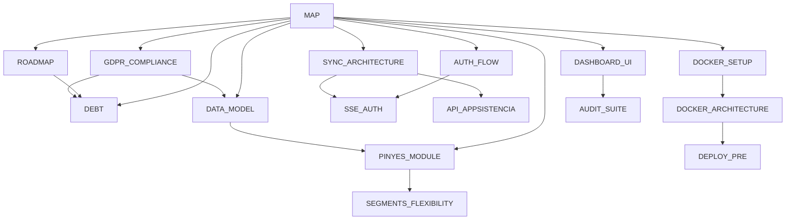

# Mapa del projecte

Hub de navegació de MuixerApp. Els enllaços `[[...]]` són **wikilinks**: obre la carpeta `docs/` com a vault
d'Obsidian i tindràs la vista de graf; a GitHub es llegeixen com a text i les taules de codi porten enllaços
relatius que sí que funcionen.

- **Instruccions per a agents** → [`CLAUDE.md`](../CLAUDE.md) (arquitectura, convencions, comandes)
- **Setup per a humans** → [`README.md`](../README.md)
- **Endpoints exactes** → Swagger a `/api/docs` (mai una llista escrita a mà)

Seccions generades des del codi (no editar a mà):

| Comanda | Què regenera |
|---------|--------------|
| `pnpm run docs:map` | *Mapa del codi* d'aquest document |
| `pnpm run docs:model` | Secció *Entitats* de [[DATA_MODEL]] (des de les entitats TypeORM) |
| `pnpm run lint:dead` | Res: informa de fitxers, exports i deps sense consumidors (knip) |

---

## Els documents

### Estat i planificació

| Document | Què hi trobaràs |
|----------|-----------------|
| [[ROADMAP]] | Estat de les fases, següent increment, decisions estructurals |
| [[DEBT]] | Deute tècnic i troballes obertes, verificades contra el codi |

### Domini i dades

| Document | Què hi trobaràs |
|----------|-----------------|
| [[DATA_MODEL]] | Entitats, camps, relacions i enums |
| [[PINYES_MODULE]] | Figures, rengles, instàncies, snapshot lazy, assignacions |
| [[SEGMENTS_FLEXIBILITY]] | Pla pendent: permetre una persona dues vegades al mateix segment |

### Autenticació

| Document | Què hi trobaràs |
|----------|-----------------|
| [[AUTH_FLOW]] | Login, refresh amb rotació, logout, guards, variables d'entorn |
| [[SSE_AUTH]] | Autenticació dels streams SSE (sync) |

### Sincronització amb el legacy

| Document | Què hi trobaràs |
|----------|-----------------|
| [[SYNC_ARCHITECTURE]] | Sincronització unidireccional, patró Strategy, SSE |
| [[API_APPSISTENCIA]] | API PHP del legacy APPsistència (endpoints descoberts) |

### Frontend i QA

| Document | Què hi trobaràs |
|----------|-----------------|
| [[DASHBOARD_UI]] | Patrons d'UI, DaisyUI, composició de pàgines de llista |
| [[AUDIT_SUITE]] | Com executar les auditories responsive/a11y i els e2e de Playwright |
| [[GDPR_COMPLIANCE]] | Informe tècnic i pla d'implementació del compliment LOPDGDD/RGPD |

### Infraestructura

| Document | Què hi trobaràs |
|----------|-----------------|
| [[DOCKER_SETUP]] | PostgreSQL en Docker per a desenvolupament local |
| [[DOCKER_ARCHITECTURE]] | Arquitectura multi-entorn: dev, pre, prod, backups |
| [[DEPLOY_PRE]] | Desplegament a PRE (Hetzner VPS) |

### Guies d'ús

| Document | Què hi trobaràs |
|----------|-----------------|
| [[ad-hoc-nodes-user-guide]] | Nodes extra: què són i com fer-los servir (`internal/`) |

---

## Mapa del codi

<!-- BEGIN:AUTO — generat per scripts/generate-doc-map.mjs, no editar a mà -->

> Generat el 2026-08-10 amb `pnpm run docs:map`.

### Mòduls de l'API (`apps/api/src/modules`)

| Element | Fitxers | Línies | Docs |
|---------|--------:|-------:|------|
| [`audit`](../apps/api/src/modules/audit) | 3 | 99 | [[GDPR_COMPLIANCE]] |
| [`auth`](../apps/api/src/modules/auth) | 22 | 1052 | [[AUTH_FLOW]] · [[SSE_AUTH]] |
| [`composition`](../apps/api/src/modules/composition) | 8 | 630 | [[PINYES_MODULE]] |
| [`database`](../apps/api/src/modules/database) | 5 | 211 | [[DATA_MODEL]] |
| [`event`](../apps/api/src/modules/event) | 13 | 1190 | [[DATA_MODEL]] |
| [`event-segment`](../apps/api/src/modules/event-segment) | 19 | 1850 | [[PINYES_MODULE]] |
| [`figure`](../apps/api/src/modules/figure) | 12 | 1308 | [[PINYES_MODULE]] · [[DATA_MODEL]] |
| [`legal`](../apps/api/src/modules/legal) | 5 | 222 | [[GDPR_COMPLIANCE]] |
| [`me`](../apps/api/src/modules/me) | 5 | 357 | — |
| [`node-assignment`](../apps/api/src/modules/node-assignment) | 14 | 2752 | [[PINYES_MODULE]] |
| [`person`](../apps/api/src/modules/person) | 10 | 956 | [[DATA_MODEL]] |
| [`person-delegate`](../apps/api/src/modules/person-delegate) | 7 | 408 | [[DATA_MODEL]] |
| [`season`](../apps/api/src/modules/season) | 6 | 388 | [[DATA_MODEL]] |
| [`sync`](../apps/api/src/modules/sync) | 10 | 1874 | [[SYNC_ARCHITECTURE]] · [[API_APPSISTENCIA]] |
| [`tag`](../apps/api/src/modules/tag) | 6 | 225 | [[DATA_MODEL]] |
| [`user`](../apps/api/src/modules/user) | 11 | 849 | [[DATA_MODEL]] |

Migracions TypeORM: **36** a [`apps/api/src/migrations`](../apps/api/src/migrations).

### Features del dashboard (`apps/dashboard/src/app/features`)

| Element | Fitxers | Línies | Docs |
|---------|--------:|-------:|------|
| [`auth`](../apps/dashboard/src/app/features/auth) | 1 | 49 | [[AUTH_FLOW]] · [[SSE_AUTH]] |
| [`config`](../apps/dashboard/src/app/features/config) | 13 | 1864 | [[DASHBOARD_UI]] |
| [`events`](../apps/dashboard/src/app/features/events) | 18 | 3506 | [[DASHBOARD_UI]] |
| [`home`](../apps/dashboard/src/app/features/home) | 2 | 119 | [[DASHBOARD_UI]] |
| [`persons`](../apps/dashboard/src/app/features/persons) | 11 | 1539 | [[DASHBOARD_UI]] |
| [`pinyes`](../apps/dashboard/src/app/features/pinyes) | 64 | 14664 | [[PINYES_MODULE]] · [[DASHBOARD_UI]] |
| [`sync`](../apps/dashboard/src/app/features/sync) | 2 | 102 | [[SYNC_ARCHITECTURE]] · [[API_APPSISTENCIA]] |

### Features de la PWA (`apps/pwa/src/app/features`)

| Element | Fitxers | Línies | Docs |
|---------|--------:|-------:|------|
| [`auth`](../apps/pwa/src/app/features/auth) | 1 | 61 | [[AUTH_FLOW]] · [[SSE_AUTH]] |
| [`events`](../apps/pwa/src/app/features/events) | 6 | 834 | [[DASHBOARD_UI]] |
| [`home`](../apps/pwa/src/app/features/home) | 2 | 129 | [[DASHBOARD_UI]] |
| [`profile`](../apps/pwa/src/app/features/profile) | 1 | 21 | — |

### Codi compartit (`libs/shared/src`)

| Element | Fitxers | Línies | Docs |
|---------|--------:|-------:|------|
| [`constants`](../libs/shared/src/constants) | 1 | 81 | — |
| [`enums`](../libs/shared/src/enums) | 14 | 109 | — |
| [`interfaces`](../libs/shared/src/interfaces) | 14 | 573 | — |

### Fitxers més grans (candidats a dividir)

| Fitxer | Línies |
|--------|-------:|
| [`apps/dashboard/src/app/features/pinyes/components/figure-canvas/figure-canvas.component.ts`](../apps/dashboard/src/app/features/pinyes/components/figure-canvas/figure-canvas.component.ts) | 2859 |
| [`apps/api/src/modules/node-assignment/node-assignment.service.ts`](../apps/api/src/modules/node-assignment/node-assignment.service.ts) | 1613 |
| [`apps/dashboard/src/app/features/pinyes/components/template-editor/template-editor.component.ts`](../apps/dashboard/src/app/features/pinyes/components/template-editor/template-editor.component.ts) | 1112 |
| [`apps/dashboard/src/app/features/pinyes/components/segment-workspace/tabs/pinyes-tab/pinyes-tab.component.ts`](../apps/dashboard/src/app/features/pinyes/components/segment-workspace/tabs/pinyes-tab/pinyes-tab.component.ts) | 975 |
| [`apps/dashboard/src/app/features/pinyes/components/segment-workspace/tabs/troncs-tab/troncs-tab.component.ts`](../apps/dashboard/src/app/features/pinyes/components/segment-workspace/tabs/troncs-tab/troncs-tab.component.ts) | 860 |
| [`apps/dashboard/src/app/features/pinyes/components/template-editor/template-editor.component.html`](../apps/dashboard/src/app/features/pinyes/components/template-editor/template-editor.component.html) | 824 |
| [`apps/dashboard/src/app/features/events/components/segment-manager/segment-manager.component.ts`](../apps/dashboard/src/app/features/events/components/segment-manager/segment-manager.component.ts) | 757 |
| [`apps/api/src/modules/figure/figure-template.service.ts`](../apps/api/src/modules/figure/figure-template.service.ts) | 745 |
| [`apps/dashboard/src/app/features/pinyes/components/tronc-view/tronc-view.component.ts`](../apps/dashboard/src/app/features/pinyes/components/tronc-view/tronc-view.component.ts) | 728 |
| [`apps/dashboard/src/app/features/events/components/segment-manager/segment-manager.component.html`](../apps/dashboard/src/app/features/events/components/segment-manager/segment-manager.component.html) | 653 |

<!-- END:AUTO -->

---

## Convencions d'aquest mapa

- **Un tema, un document.** Si un document nou repeteix el 80% d'un existent, actualitza l'existent.
- **Res d'històric.** Els documents descriuen com és el sistema **ara**. La història és el git log i les PR.
- **Res de taules "✅ Resolt".** Quan un ítem de [[DEBT]] es resol, s'esborra.
- **Sense llistes d'endpoints.** Swagger és la font de veritat i no es desincronitza.
- **Enllaça.** Cada document acaba amb els seus `[[veïns]]` perquè el graf tinga sentit.
