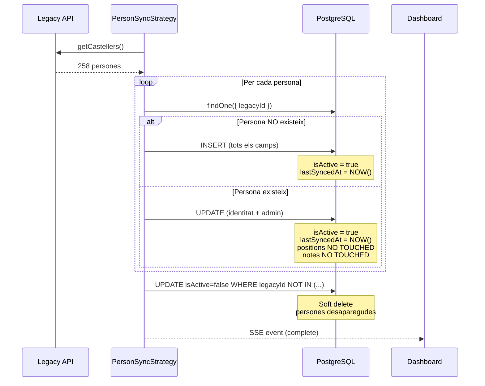

# Resum d'Implementació: Millores de Sincronització

**Data:** 2026-03-30  
**Autor:** Agent AI + Llorenç Vaquer

---

## 🎯 Objectiu

Millorar el sistema de sincronització de persones des del legacy API amb:
1. Tracking de sincronitzacions (`lastSyncedAt`)
2. Soft delete automàtic de persones desaparegudes
3. Merge strategy clara i documentada
4. Gestió manual d'activació/desactivació

---

## ✅ Implementat

### 1. Camp `lastSyncedAt`

**Fitxers modificats:**
- `apps/api/src/modules/person/person.entity.ts`

**Canvis:**
```typescript
@Column({ type: 'timestamp', nullable: true })
lastSyncedAt: Date | null;
```

**Funcionalitat:**
- Timestamp de la última sincronització (CREATE o UPDATE)
- `null` per persones creades manualment
- Actualitzat automàticament durant el sync
- Actualitzat manualment en activate/deactivate

---

### 2. Soft Delete Automàtic

**Fitxers modificats:**
- `apps/api/src/modules/sync/strategies/person-sync.strategy.ts`

**Nou mètode:**
```typescript
private async deactivateMissingPersons(legacyPersons: LegacyPerson[]): Promise<number> {
  const legacyIds = legacyPersons.map((p) => p.id);

  const result = await this.personRepository
    .createQueryBuilder()
    .update(Person)
    .set({ isActive: false, lastSyncedAt: new Date() })
    .where('legacyId NOT IN (:...legacyIds)', { legacyIds })
    .andWhere('legacyId IS NOT NULL')
    .andWhere('isActive = :isActive', { isActive: true })
    .execute();

  return result.affected || 0;
}
```

**Funcionalitat:**
- Detecta persones que ja NO estan al legacy API
- Les marca com `isActive = false`
- Actualitza `lastSyncedAt`
- Només afecta persones amb `legacyId` (importades)
- Retorna el nombre de persones desactivades

**Event SSE:**
```json
{
  "type": "complete",
  "entity": "sync",
  "message": "258 processades: 200 noves, 55 actualitzades, 3 desactivades, 0 errors",
  "detail": {
    "new": 200,
    "updated": 55,
    "deactivated": 3,
    "errors": 0
  }
}
```

---

### 3. Merge Strategy Refinada

**Fitxers modificats:**
- `apps/api/src/modules/sync/strategies/person-sync.strategy.ts`

**Canvis en `updatePerson()`:**
```typescript
private async updatePerson(existing: Person, legacyPerson: LegacyPerson): Promise<boolean> {
  // Update identity fields (always sync from legacy)
  existing.name = legacyPerson.nom;
  existing.firstSurname = legacyPerson.cognom1;
  existing.secondSurname = legacyPerson.cognom2 || null;
  existing.alias = this.deriveAlias(legacyPerson);
  existing.email = legacyPerson.email || null;
  existing.phone = legacyPerson.telefon || null;
  existing.birthDate = this.parseDate(legacyPerson.data_naixement);
  existing.shoulderHeight = this.parseInteger(legacyPerson.alcada_espatlles);

  // Update administrative status (always sync from legacy)
  existing.isMember = legacyPerson.propi === 'Sí';
  existing.availability = this.mapAvailability(legacyPerson.lesionat);
  existing.onboardingStatus = this.mapOnboarding(legacyPerson.estat_acollida);
  existing.shirtDate = this.parseDate(legacyPerson.instant_camisa);

  // Mark as active (present in legacy API)
  existing.isActive = true;
  existing.lastSyncedAt = new Date();

  // NEVER update: positions, isXicalla, notes (MuixerApp owns these)

  await this.personRepository.save(existing);
  return false;
}
```

**Regles:**

| Camp | CREATE | UPDATE | Rationale |
|------|--------|--------|-----------|
| `name`, `firstSurname`, `secondSurname`, `alias` | ✅ | ✅ | Identitat bàsica |
| `email`, `phone` | ✅ | ✅ | Contacte |
| `birthDate`, `shoulderHeight` | ✅ | ✅ | Físic |
| `isMember`, `availability`, `onboardingStatus`, `shirtDate` | ✅ | ✅ | Administratiu |
| `positions[]`, `isXicalla` | ✅ | ❌ | Configuració tècnica (MuixerApp) |
| `notes` | ✅ | ❌ | Notes locals (MuixerApp) |
| `isActive`, `lastSyncedAt` | ✅ | ✅ | Control automàtic |

---

### 4. Endpoints de Gestió Manual

**Fitxers modificats:**
- `apps/api/src/modules/person/person.controller.ts`
- `apps/api/src/modules/person/person.service.ts`

**Nous endpoints:**

#### Desactivar persona
```http
PATCH /api/persons/:id/deactivate
```

**Resposta:**
```json
{
  "id": "uuid",
  "name": "Maria",
  "isActive": false,
  "lastSyncedAt": "2026-03-30T10:00:00Z"
}
```

#### Activar persona
```http
PATCH /api/persons/:id/activate
```

**Resposta:**
```json
{
  "id": "uuid",
  "name": "Maria",
  "isActive": true,
  "lastSyncedAt": "2026-03-30T10:00:00Z"
}
```

**Funcionalitat:**
- Actualitza `isActive` (`true` o `false`)
- Actualitza `lastSyncedAt` (registra modificació manual)
- Retorna la persona actualitzada (DTO complet)
- Llança `NotFoundException` si no existeix

---

### 5. Tests

**Fitxers modificats:**
- `apps/api/src/modules/person/person.service.spec.ts`

**Nous tests:**
- `deactivate()` — verifica desactivació i actualització de `lastSyncedAt`
- `activate()` — verifica activació i actualització de `lastSyncedAt`
- Ambdós llancen `NotFoundException` si la persona no existeix

**Resultat:**
```
Test Suites: 1 passed, 1 total
Tests:       10 passed, 10 total
```

---

### 6. Documentació

**Nous documents:**

1. **`docs/SYNC_MERGE_STRATEGY.md`**
   - Filosofia de sincronització
   - Regles per camp (CREATE vs UPDATE)
   - Soft delete automàtic
   - Gestió manual d'activació/desactivació
   - Exemples pràctics
   - Troubleshooting

2. **`docs/SYNC_IMPROVEMENTS_2026-03-30.md`**
   - Resum de totes les millores
   - Problemes resolts
   - Pendent de fer (bulk upsert, conflict detection, etc.)
   - Guia de testing
   - Migració de base de dades

3. **`docs/API_PERSON_ENDPOINTS.md`**
   - Documentació completa de tots els endpoints
   - Exemples amb curl
   - Enums i tipus
   - Notes importants

4. **`docs/SYNC_IMPLEMENTATION_SUMMARY.md`** (aquest document)
   - Resum executiu de la implementació

**Documents actualitzats:**
- `docs/specs/2026-03-30-vertical-slice-completion-sync-dashboard-design.md`
  - Afegits camps `isActive` i `lastSyncedAt` a la taula de merge rules
  - Actualitzat pseudocodi amb soft delete

---

## 📊 Estadístiques

### Fitxers modificats: 6
- `person.entity.ts` — Afegit camp `lastSyncedAt`
- `person-sync.strategy.ts` — Soft delete + merge strategy
- `person.controller.ts` — Endpoints activate/deactivate
- `person.service.ts` — Mètodes activate/deactivate
- `person.service.spec.ts` — Tests
- `2026-03-30-vertical-slice-completion-sync-dashboard-design.md` — Spec actualitzat

### Nous documents: 4
- `SYNC_MERGE_STRATEGY.md`
- `SYNC_IMPROVEMENTS_2026-03-30.md`
- `API_PERSON_ENDPOINTS.md`
- `SYNC_IMPLEMENTATION_SUMMARY.md`

### Línies de codi:
- **Afegides:** ~350 línies
- **Modificades:** ~50 línies
- **Tests:** +60 línies

---

## 🔄 Flux de Sincronització (Nou)



---

## 🧪 Validació Manual

### Checklist

- [x] Camp `lastSyncedAt` creat a l'entitat
- [x] Soft delete automàtic implementat
- [x] Merge strategy refinada (positions i notes NO es toquen)
- [x] Endpoints activate/deactivate implementats
- [x] Tests unitaris passant (10/10)
- [x] Lint sense errors
- [x] Documentació completa

### Pròxims passos per validar

1. **Reiniciar servidor API** per aplicar canvis d'entitat
2. **Executar sync** des del dashboard
3. **Verificar:**
   - `lastSyncedAt` s'actualitza per totes les persones
   - Persones noves tenen `isActive = true`
   - Persones existents mantenen `isActive = true`
   - Persones que desapareixen del legacy es marquen com `isActive = false`
   - Posicions assignades localment NO es sobreescriuen
   - Notes afegides localment NO es sobreescriuen
4. **Provar endpoints manuals:**
   - `PATCH /persons/:id/deactivate`
   - `PATCH /persons/:id/activate`

---

## 🚀 Millores Futures (No implementades)

### 1. Bulk Upsert (Performance)
- Reduir de N queries a ~10 queries per sync
- Usar TypeORM `upsert()` per processar totes les persones d'un cop
- **Complexitat:** Alta (requereix refactoring del flux SSE)

### 2. Conflict Detection
- Detectar camps modificats localment després de l'última sync
- Mostrar warning o demanar confirmació abans de sobreescriure
- **Complexitat:** Mitjana

### 3. Sync Selectiu de Posicions
- Query param `?syncPositions=true` per forçar actualització de posicions
- **Complexitat:** Baixa

### 4. Dry Run Mode
- Previsualitzar canvis sense aplicar-los
- Endpoint `GET /sync/persons/preview`
- **Complexitat:** Mitjana

### 5. Sync Incremental
- Només sincronitzar persones modificades des de l'última sync
- Requereix `updated_at` al legacy API
- **Complexitat:** Alta

---

## 📚 Referències

- **Merge Strategy:** `docs/SYNC_MERGE_STRATEGY.md`
- **Improvements:** `docs/SYNC_IMPROVEMENTS_2026-03-30.md`
- **API Endpoints:** `docs/API_PERSON_ENDPOINTS.md`
- **Spec Original:** `docs/specs/2026-03-30-vertical-slice-completion-sync-dashboard-design.md`
- **Entity:** `apps/api/src/modules/person/person.entity.ts`
- **Strategy:** `apps/api/src/modules/sync/strategies/person-sync.strategy.ts`
- **Controller:** `apps/api/src/modules/person/person.controller.ts`
- **Service:** `apps/api/src/modules/person/person.service.ts`

---

## 🎉 Conclusió

Implementació completa de les millores de sincronització amb:
- ✅ Tracking de sincronitzacions
- ✅ Soft delete automàtic
- ✅ Merge strategy clara
- ✅ Gestió manual d'estat
- ✅ Tests unitaris
- ✅ Documentació exhaustiva

El sistema ara és més robust, previsible i fàcil de mantenir.
