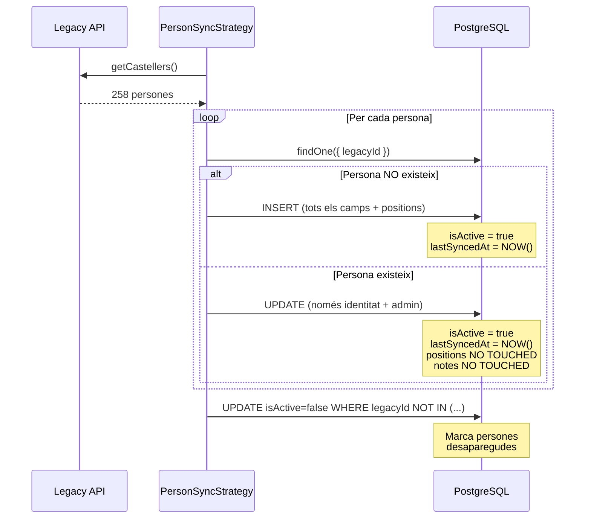

# Sync Merge Strategy

**Última actualització:** 2026-03-30

## Filosofia

> **"Legacy API és la font de veritat per identitat i estat administratiu. MuixerApp és la font de veritat per configuració tècnica i notes locals."**

## Regles per Camp

### ✅ Sempre sincronitzats (CREATE + UPDATE)

Aquests camps **sempre** s'actualitzen des del legacy API:

| Camp | Rationale |
|------|-----------|
| `name`, `firstSurname`, `secondSurname` | Identitat bàsica |
| `alias` | Pot canviar (mote) |
| `email`, `phone` | Contacte actualitzat |
| `birthDate` | Immutable en pràctica |
| `shoulderHeight` | Pot canviar (creixement) |
| `isMember` | Estat administratiu decidit per la colla |
| `availability` | Lesions/disponibilitat actualitzada |
| `onboardingStatus` | Procés d'acollida |
| `shirtDate` | Data administrativa |

### 🔒 Només CREATE (mai UPDATE)

Aquests camps **només** s'assignen durant la primera importació:

| Camp | Rationale |
|------|-----------|
| `positions[]` | MuixerApp gestiona posicions després de la importació inicial |
| `isXicalla` | Derivat de `positions`, que ja no es sincronitza |
| `notes` | MuixerApp afegeix notes locals, no es sobreescriuen |

### 🔄 Camps calculats automàticament

| Camp | Lògica |
|------|--------|
| `isActive` | `true` si la persona està al legacy API, `false` si desapareix |
| `lastSyncedAt` | Timestamp de la última sincronització (CREATE o UPDATE) |

## Soft Delete Automàtic

Al final de cada sync, el sistema:

1. Marca com `isActive = false` totes les persones amb `legacyId` que **NO** estan al legacy API
2. Actualitza `lastSyncedAt` per totes (actives i inactives)

```typescript
// Pseudocodi
const legacyIds = legacyPersons.map(p => p.id);

UPDATE persons
SET isActive = false, lastSyncedAt = NOW()
WHERE legacyId NOT IN (legacyIds)
  AND legacyId IS NOT NULL
  AND isActive = true;
```

### Per què soft delete?

- ✅ Mantén històric (no perds dades)
- ✅ Reversible (si reapareix al legacy, es reactiva automàticament)
- ✅ Permet filtrar persones inactives al dashboard
- ✅ No trenca relacions (events, attendance, etc.)

## Flux de Sincronització



## Exemples

### Exemple 1: Primera importació

**Legacy API:**
```json
{
  "id": "123",
  "nom": "Maria",
  "cognom1": "Garcia",
  "posicio": "PRIMERES + VENTS",
  "observacions": "Molt bona tècnica"
}
```

**Resultat a DB:**
```typescript
{
  legacyId: "123",
  name: "Maria",
  firstSurname: "Garcia",
  positions: [Primeres, Vents],  // ✅ Assignades
  notes: "Molt bona tècnica",    // ✅ Importades
  isActive: true,
  lastSyncedAt: "2026-03-30T10:00:00Z"
}
```

### Exemple 2: Re-sync (persona modificada localment)

**DB abans del sync:**
```typescript
{
  legacyId: "123",
  name: "Maria",
  firstSurname: "Garcia",
  positions: [Primeres, Vents, Laterals],  // ← Afegit localment
  notes: "Molt bona tècnica. Disponible per pinya.",  // ← Afegit localment
  isActive: true,
  lastSyncedAt: "2026-03-29T10:00:00Z"
}
```

**Legacy API (mateix registre):**
```json
{
  "id": "123",
  "nom": "Maria",
  "cognom1": "García",  // ← Canviat (accent)
  "posicio": "PRIMERES + VENTS",
  "observacions": "Molt bona tècnica"
}
```

**DB després del sync:**
```typescript
{
  legacyId: "123",
  name: "Maria",
  firstSurname: "García",  // ✅ Actualitzat
  positions: [Primeres, Vents, Laterals],  // ✅ PRESERVAT
  notes: "Molt bona tècnica. Disponible per pinya.",  // ✅ PRESERVAT
  isActive: true,
  lastSyncedAt: "2026-03-30T10:00:00Z"  // ✅ Actualitzat
}
```

### Exemple 3: Persona desapareguda del legacy

**DB abans del sync:**
```typescript
{
  legacyId: "456",
  name: "Joan",
  isActive: true,
  lastSyncedAt: "2026-03-29T10:00:00Z"
}
```

**Legacy API:** (no conté `id: "456"`)

**DB després del sync:**
```typescript
{
  legacyId: "456",
  name: "Joan",
  isActive: false,  // ✅ Desactivada automàticament
  lastSyncedAt: "2026-03-30T10:00:00Z"  // ✅ Actualitzat
}
```

## Gestió Manual d'Activació/Desactivació

A més del soft delete automàtic durant el sync, existeixen endpoints per gestió manual:

### Desactivar una persona

```http
PATCH /api/persons/:id/deactivate
```

**Resposta:**
```json
{
  "id": "uuid",
  "name": "Maria",
  "isActive": false,
  "lastSyncedAt": "2026-03-30T10:00:00Z"
}
```

**Quan usar:**
- Persona que deixa la colla temporalment
- Persona amb baixa mèdica prolongada
- Correcció manual després d'un sync erroni

### Activar una persona

```http
PATCH /api/persons/:id/activate
```

**Resposta:**
```json
{
  "id": "uuid",
  "name": "Maria",
  "isActive": true,
  "lastSyncedAt": "2026-03-30T10:00:00Z"
}
```

**Quan usar:**
- Reactivar persona desactivada manualment
- Corregir persona desactivada erròniament pel sync
- Persona que torna després d'una baixa

**Nota:** Aquests endpoints actualitzen `lastSyncedAt` per registrar la modificació manual.

## Millores Futures

### Sync selectiu de posicions

Afegir query param `?syncPositions=true` per forçar actualització de posicions:

```typescript
@Get('persons')
@Sse()
syncPersons(@Query('syncPositions') syncPositions?: boolean): Observable<MessageEvent> {
  return this.personSyncStrategy.execute({ syncPositions }).pipe(...);
}
```

### Dry run mode

Previsualitzar canvis sense aplicar-los:

```typescript
@Get('persons/preview')
async previewSync(): Promise<SyncPreview> {
  return this.personSyncStrategy.preview();
}
```

### Conflict detection

Detectar camps modificats localment i mostrar warning:

```typescript
if (existing.email !== legacyEmail && existing.updatedAt > existing.lastSyncedAt) {
  // Email modificat localment després de l'última sync
  // Mostrar warning o demanar confirmació
}
```

## Troubleshooting

### Problema: Persones marcades com inactives erròniament

**Causa:** El legacy API va fallar parcialment i va retornar menys persones del normal.

**Solució:**
1. Verifica que el legacy API retorna totes les persones (`GET /api/castellers`)
2. Re-executa el sync
3. Les persones es reactivaran automàticament (`isActive = true`)

### Problema: Posicions sobreescrites

**Causa:** Bug en el codi (no hauria de passar amb la merge strategy actual).

**Solució:**
1. Restaura des de backup o històric
2. Verifica que `updatePerson()` NO toca `positions`
3. Reporta el bug

### Problema: Alias duplicats

**Causa:** Dues persones amb el mateix `mote` o `nom` al legacy.

**Solució:**
1. El sync fallarà (constraint `UNIQUE` a `alias`)
2. Modifica manualment un dels alias al legacy API
3. Re-executa el sync

## Referències

- **Spec original:** `docs/specs/2026-03-30-vertical-slice-completion-sync-dashboard-design.md`
- **Entity:** `apps/api/src/modules/person/person.entity.ts`
- **Strategy:** `apps/api/src/modules/sync/strategies/person-sync.strategy.ts`
