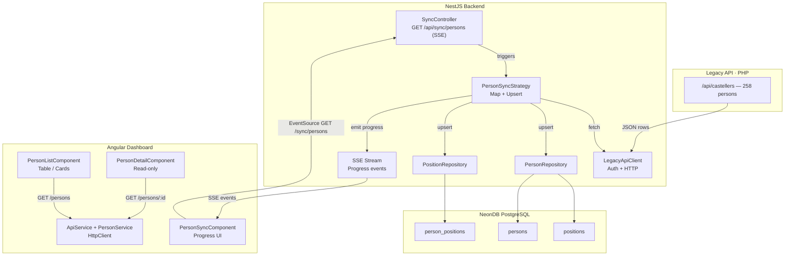
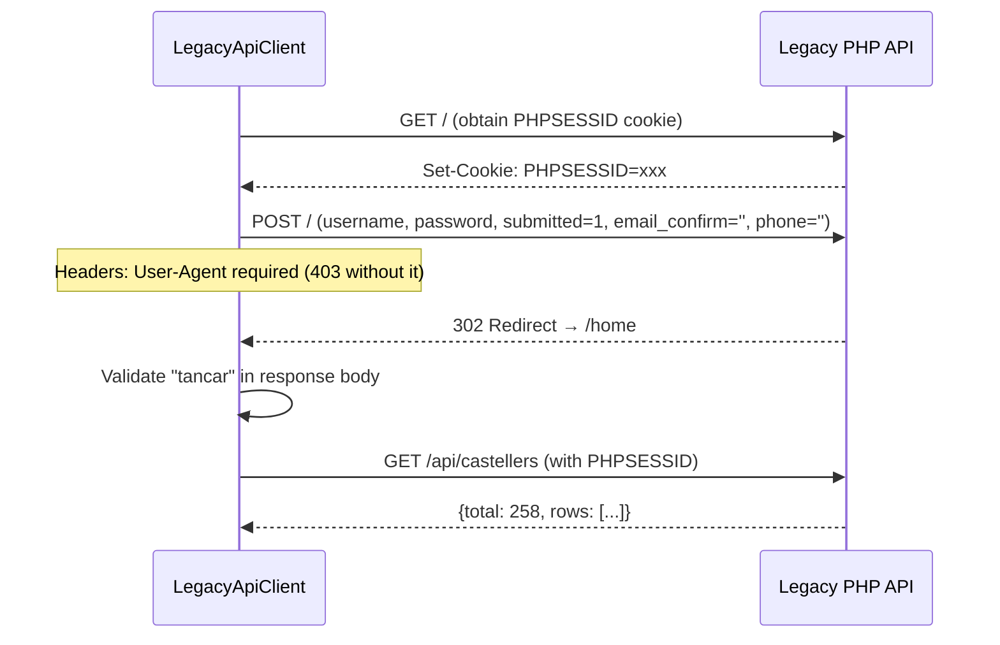
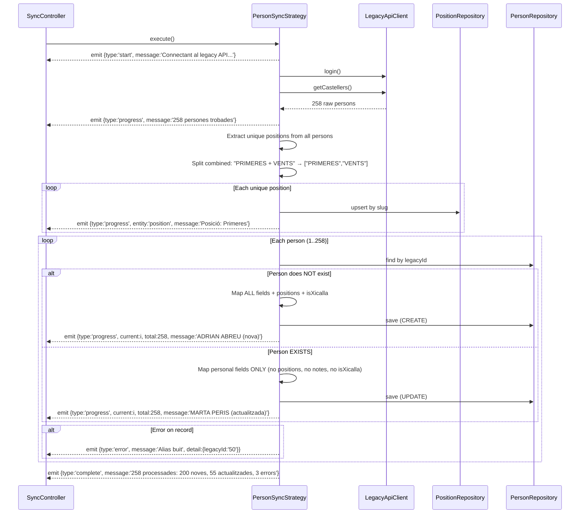
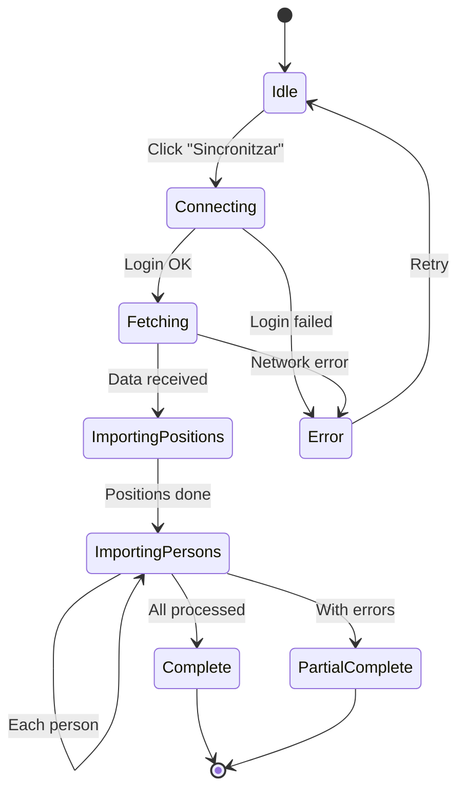
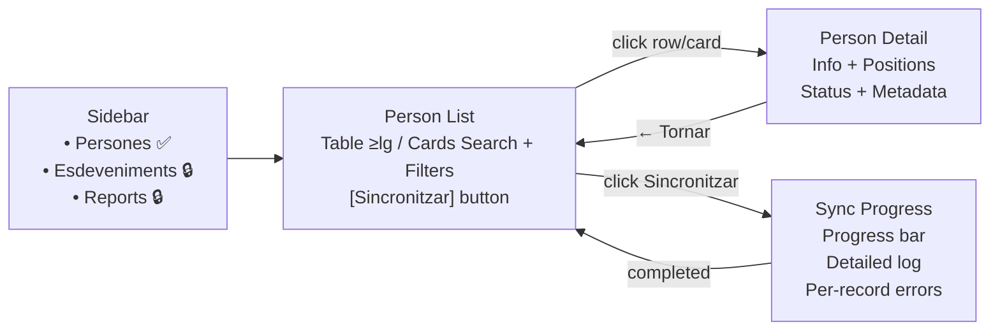

# Vertical Slice Completion: Sync + Dashboard UI

**Date:** 2026-03-30
**Status:** Approved
**Scope:** Complete the P0-P2 vertical slice — Legacy API sync with SSE progress, full dashboard UI (person list + detail + sync), Angular services
**Depends on:** [P0-P1-P2 Spec](2026-03-26-p0-p1-p2-vertical-slice-persons-design.md) (approved & partially implemented)

---

## 1. Context

The P0-P1-P2 vertical slice has a working **backend** (NestJS API with Person/Position/User entities, CRUD endpoints, Swagger, latency interceptor, 11 tests) but two major gaps:

1. **Seed/import is a stub** — reads a JSON file and logs count, does nothing else.
2. **Dashboard UI is placeholder** — layout shell exists but PersonListComponent is static text, no HTTP calls, no DaisyUI components, no detail view.

This spec replaces the seed CLI approach with a **live sync from the legacy API** triggered from the dashboard, and builds the full dashboard UI.

### What changes from the original spec

| Original P0-P2 plan | This spec |
|---|---|
| Python extractor → JSON → CLI seed command | NestJS calls legacy API directly, no Python dependency |
| Seed triggered via `nx run api:seed` | Sync triggered from dashboard UI via SSE endpoint |
| Dashboard person list: stub | Full DaisyUI table/cards with search, filters, pagination |
| Person detail view: not implemented | Full responsive read-only view |

---

## 2. Architecture Overview



---

## 3. Backend: Sync Module

### 3.1 File structure

```
apps/api/src/modules/sync/
├── sync.module.ts
├── sync.controller.ts
├── legacy-api.client.ts
├── interfaces/
│   ├── sync-strategy.interface.ts
│   └── sync-event.interface.ts
└── strategies/
    └── person-sync.strategy.ts
```

### 3.2 Interfaces

```typescript
// sync-event.interface.ts
export interface SyncEvent {
  type: 'start' | 'progress' | 'error' | 'complete';
  entity: string;
  current?: number;
  total?: number;
  message: string;
  detail?: Record<string, unknown>;
}

// sync-strategy.interface.ts
export interface SyncStrategy {
  execute(): Observable<SyncEvent>;
}
```

Each strategy emits an `Observable<SyncEvent>`. The controller converts it to an SSE stream.

**Extensibility:** When P3 adds Events + Attendance, new strategies (`EventSyncStrategy`, `AttendanceSyncStrategy`) implement the same interface.

### 3.3 LegacyApiClient

Handles all communication with the legacy PHP API.

**Responsibilities:**
- Session-based auth (login with cookie, mimicking the Python extractor)
- Credentials from environment: `LEGACY_API_URL`, `LEGACY_API_USERNAME`, `LEGACY_API_PASSWORD`
- HTML stripping for dirty fields
- Rate limiting: 200ms delay between requests

**Methods (current scope):**
- `login(): Promise<void>` — POST to `/` with form data, validates session
- `getCastellers(): Promise<LegacyPerson[]>` — GET `/api/castellers`, clean and return rows

**Methods (future P3):**
- `getAssajos(): Promise<LegacyEvent[]>`
- `getActuacions(): Promise<LegacyEvent[]>`
- `getAssistencies(eventId: string): Promise<LegacyAttendance[]>`

**Environment variables** (added to `.env.example`):

```
LEGACY_API_URL=https://muixerangadebarcelona.appsistencia.cat
LEGACY_API_USERNAME=estadistiques
LEGACY_API_PASSWORD=xxxxxx
```

**Auth flow:**



### 3.4 PersonSyncStrategy

Core import logic. Emits progress events as an Observable.

**Sync flow:**



### 3.5 Create vs Update — Sync Rules

This is the central design decision: **positions and related flags are only assigned during first import**. After that, MuixerApp owns them.

| Field | CREATE (new person) | UPDATE (existing person) | Rationale |
|-------|--------------------|-----------------------|-----------|
| `name` | ✅ From legacy | ✅ Update | Basic identity |
| `firstSurname` | ✅ From legacy | ✅ Update | Basic identity |
| `secondSurname` | ✅ From legacy | ✅ Update | Basic identity |
| `alias` | ✅ From legacy | ✅ Update | Basic identity |
| `email` | ✅ From legacy | ✅ Update | Contact info |
| `phone` | ✅ From legacy | ✅ Update | Contact info |
| `birthDate` | ✅ From legacy | ✅ Update | Immutable in practice |
| `shoulderHeight` | ✅ From legacy | ✅ Update | Can change over time |
| `positions[]` | ✅ From legacy | ❌ **NEVER** | MuixerApp manages positions after import |
| `isXicalla` | ✅ Derived from position | ❌ **NEVER** | Depends on positions, which we don't sync |
| `isMember` | ✅ From legacy (`propi`) | ✅ Update | Administrative status |
| `availability` | ✅ From legacy (`lesionat`) | ✅ Update | Temporal status |
| `onboardingStatus` | ✅ From legacy | ✅ Update | Process status |
| `shirtDate` | ✅ From legacy | ✅ Update | Administrative date |
| `notes` | ✅ From legacy | ❌ **NEVER** | MuixerApp owns notes after import |
| `isActive` | ✅ `true` | ✅ **Calculated** | Auto-deactivate if missing from legacy |
| `lastSyncedAt` | ✅ `NOW()` | ✅ `NOW()` | Track last sync timestamp |
| `legacyId` | ✅ Set once | ❌ Immutable | Upsert key |

**Pseudocode:**

```typescript
if (!existingPerson) {
  // CREATE — all fields including positions
  const person = mapAllFields(legacyRow);
  person.positions = resolvePositions(legacyRow.posicio);
  person.isXicalla = deriveIsXicalla(legacyRow.posicio);
  person.isActive = true;
  person.lastSyncedAt = new Date();
  await personRepo.save(person);
} else {
  // UPDATE — personal fields only, NEVER positions/notes/isXicalla
  existingPerson.name = legacyRow.nom;
  existingPerson.firstSurname = legacyRow.cognom1;
  existingPerson.secondSurname = legacyRow.cognom2 || null;
  existingPerson.alias = deriveAlias(legacyRow);
  existingPerson.email = legacyRow.email || null;
  existingPerson.phone = legacyRow.telefon || null;
  existingPerson.birthDate = parseDate(legacyRow.data_naixement);
  existingPerson.shoulderHeight = parseInt(legacyRow.alcada_espatlles) || null;
  existingPerson.isMember = legacyRow.propi === 'Sí';
  existingPerson.availability = mapAvailability(legacyRow.lesionat);
  existingPerson.onboardingStatus = mapOnboarding(legacyRow.estat_acollida);
  existingPerson.shirtDate = parseDate(legacyRow.instant_camisa);
  existingPerson.isActive = true; // Mark as active (present in legacy)
  existingPerson.lastSyncedAt = new Date();
  // positions → NOT TOUCHED
  // isXicalla → NOT TOUCHED
  // notes → NOT TOUCHED
  await personRepo.save(existingPerson);
}

// After all persons processed: soft delete missing persons
const legacyIds = legacyRows.map(r => r.id);
await personRepo.update(
  { legacyId: Not(In(legacyIds)), isActive: true },
  { isActive: false, lastSyncedAt: new Date() }
);
```

**Future evolution:**
- A `syncPositions: boolean` query param could force position re-sync when needed
- A "dry run" mode could preview changes without applying them
- Once the dashboard has person editing, locally-edited fields could be excluded from sync

### 3.6 Field Mapping Reference

**Person fields:**

| Legacy field | Person entity field | Transform |
|---|---|---|
| `id` | `legacyId` | String, keep for traceability |
| `nom` | `name` | Direct |
| `cognom1` | `firstSurname` | Direct |
| `cognom2` | `secondSurname` | Direct, nullable |
| `mote` | `alias` | Fallback to `nom` if empty, truncate to 20 chars |
| `email` | `email` | Direct |
| `data_naixement` | `birthDate` | Parse DD/MM/YYYY → ISO Date |
| `telefon` | `phone` | Direct |
| `alcada_espatlles` | `shoulderHeight` | Parse string → int, null if invalid |
| `posicio` | `positions[]` | Split by " + " → M:N (CREATE only) |
| `propi` | `isMember` | "Sí" → true, else false. **Note:** Original P0-P2 spec mapped this to `isActive`; corrected here — `propi` ("integrant de la colla") is membership status, not soft-delete. `isActive` defaults to `true` for all imports. |
| `lesionat` | `availability` | "Sí" → LONG_TERM_UNAVAILABLE, else AVAILABLE |
| `estat_acollida` | `onboardingStatus` | Finalitzat→COMPLETED, En seguiment→IN_PROGRESS, Perdut→LOST, No aplica→NOT_APPLICABLE |
| `instant_camisa` | `shirtDate` | Parse DD/MM/YYYY → Date |
| `observacions` | `notes` | Direct (CREATE only) |
| `tecnica` | — | Discarded in this slice (User creation deferred to auth) |
| `te_app` | — | Discarded |
| `revisat` | — | Discarded |
| `import_quota` | — | Discarded |
| `llistes` | — | Discarded (derivable from attendance) |
| `n_assistencies` | — | Discarded (will be computed from events) |

**isXicalla derivation** (CREATE only):

```typescript
isXicalla: ['CANALLA', 'NENS COLLA'].some(p =>
  raw.posicio?.toUpperCase().includes(p)
)
```

**Position mapping:**

| Legacy Value | name | slug | zone | color |
|---|---|---|---|---|
| PRIMERES | Primeres | primeres | TRONC | #E53935 |
| VENTS | Vents | vents | PINYA | #1E88E5 |
| LATERALS | Laterals | laterals | PINYA | #43A047 |
| CONTRAFORTS | Contraforts | contraforts | PINYA | #FB8C00 |
| 2NS LATERALS | Segons Laterals | segons-laterals | PINYA | #8E24AA |
| CROSSES | Crosses | crosses | PINYA | #00897B |
| CANALLA | Xicalla | xicalla | null | #FFB300 |
| NENS COLLA | Nens Colla | nens-colla | null | #FFB300 |
| ACOMPANYANTS | Acompanyants | acompanyants | null | #78909C |
| ALTRES | Altres | altres | null | #9E9E9E |
| NOVATOS | Novatos | novatos | null | #5C6BC0 |
| IMATGE I PARADETA | Imatge i Paradeta | imatge-paradeta | null | #EC407A |

### 3.7 SSE Endpoint

```typescript
@Controller('sync')
export class SyncController {
  @Sse('persons')  // GET /api/sync/persons
  syncPersons(): Observable<MessageEvent> {
    return this.personSyncStrategy.execute().pipe(
      map(event => ({ data: event } as MessageEvent)),
    );
  }
}
```

NestJS `@Sse()` uses GET with `text/event-stream` content type. The client opens an `EventSource` that receives events until `complete`.

**Design note:** Using GET for an operation with side effects (triggering a sync) is not strictly RESTful. The `EventSource` standard only supports GET. The clean alternative would be POST to start + GET to stream, but that adds complexity for no benefit at this stage. When auth is added (future slice), the endpoint will require ADMIN/TECHNICAL role, which mitigates accidental triggers. A concurrency guard (max 1 sync at a time) prevents duplicate runs.

### 3.8 SyncModule wiring

```typescript
@Module({
  imports: [
    TypeOrmModule.forFeature([Person, Position]),
    PersonModule,
    PositionModule,
  ],
  controllers: [SyncController],
  providers: [LegacyApiClient, PersonSyncStrategy],
})
export class SyncModule {}
```

Registered in `AppModule.imports`.

---

## 4. Dashboard: Services Layer

### 4.1 ApiService (base)

```typescript
// core/services/api.service.ts
@Injectable({ providedIn: 'root' })
export class ApiService {
  private readonly baseUrl = environment.apiUrl; // http://localhost:3000/api

  constructor(private readonly http: HttpClient) {}

  get<T>(path: string, params?: HttpParams): Observable<T> {
    return this.http.get<T>(`${this.baseUrl}${path}`, { params });
  }
}
```

### 4.2 PersonService (feature)

```typescript
// features/persons/services/person.service.ts
@Injectable({ providedIn: 'root' })
export class PersonService {
  constructor(private readonly api: ApiService) {}

  getAll(filters: PersonFilterParams): Observable<PaginatedResponse<Person>> {
    const params = buildHttpParams(filters);
    return this.api.get<PaginatedResponse<Person>>('/persons', params);
  }

  getOne(id: string): Observable<Person> {
    return this.api.get<Person>(`/persons/${id}`);
  }

  getPositions(): Observable<Position[]> {
    return this.api.get<{ data: Position[] }>('/positions').pipe(
      map(res => res.data),
    );
  }
}
```

### 4.3 Models (frontend interfaces)

```typescript
// features/persons/models/person.model.ts
export interface Person {
  id: string;
  name: string;
  firstSurname: string;
  secondSurname: string | null;
  alias: string;
  email: string | null;
  phone: string | null;
  birthDate: string | null;
  shoulderHeight: number | null;
  gender: string | null;
  isXicalla: boolean;
  isActive: boolean;
  isMember: boolean;
  availability: string;
  onboardingStatus: string;
  notes: string | null;
  shirtDate: string | null;
  joinDate: string | null;
  // legacyId is NEVER exposed to frontend — internal only
  positions: Position[];
  createdAt: string;
  updatedAt: string;
}

export interface Position {
  id: string;
  name: string;
  slug: string;
  color: string | null;
  zone: string | null;
}

export interface PaginatedResponse<T> {
  data: T[];
  meta: { total: number; page: number; limit: number };
}

export interface PersonFilterParams {
  search?: string;
  positionId?: string;
  availability?: string;
  isActive?: boolean;
  isXicalla?: boolean;
  isMember?: boolean;
  page?: number;
  limit?: number;
}

export interface SyncEvent {
  type: 'start' | 'progress' | 'error' | 'complete';
  entity: string;
  current?: number;
  total?: number;
  message: string;
  detail?: Record<string, unknown>;
}
```

---

## 5. Dashboard: Person List Component

### 5.1 File structure

```
features/persons/components/person-list/
├── person-list.component.ts
└── person-list.component.html
```

### 5.2 Responsive layout

**Desktop (≥lg: 1024px)** — DaisyUI Table:
- Native HTML table with DaisyUI styling classes
- Columns: Alies, Nom complet, Posicions (badges), Disponibilitat, Actiu
- Signal-based sorting logic
- DaisyUI pagination with join buttons at the bottom

**Mobile/Tablet (<lg)** — Card layout:
- Stacked cards instead of table rows
- Each card: alias (bold), full name, position badges, availability indicator
- Switch via `@if` or CSS `hidden lg:block` / `lg:hidden`
- Cards: `rounded-lg border bg-white p-4 shadow-sm`, min touch target 44px

### 5.3 Search and filters

- **Search**: DaisyUI input with 300ms debounce. Signal-based. Searches by alias/name/surname (ILIKE on backend).
- **Position filter**: DaisyUI select dropdown with all positions loaded from backend on init.
- **Toggle filters**: DaisyUI buttons for availability, isActive, isXicalla, isMember.
- **Active filters**: DaisyUI badge chips with dismiss button to clear.
- **Layout**: `flex flex-wrap gap-2` — adapts to any width.

### 5.4 State management (signals)

```typescript
search = signal('');
positionFilter = signal<string | null>(null);
activeFilters = signal<Partial<PersonFilterParams>>({});
page = signal(1);
limit = signal(50);

persons = signal<Person[]>([]);
totalPersons = signal(0);
positions = signal<Position[]>([]);
loading = signal(false);

filters = computed<PersonFilterParams>(() => ({
  search: this.search(),
  positionId: this.positionFilter() ?? undefined,
  ...this.activeFilters(),
  page: this.page(),
  limit: this.limit(),
}));
```

Data loading triggers via `effect()` watching `filters()`.

### 5.5 Position badges

Dynamic background color from `Position.color` with auto-calculated text contrast:

```html
<span
  class="inline-flex items-center rounded-full px-2 py-0.5 text-xs font-medium"
  [style.backgroundColor]="position.color"
  [style.color]="getContrastColor(position.color)"
>
  {{ position.name }}
</span>
```

Contrast helper: luminance-based white/black selection.

### 5.6 Sync button

A "Sincronitzar" button in the page header. Clicking it opens/shows the PersonSyncComponent (inline or as a DaisyUI modal).

All UI labels in Catalan: "Persones", "Cerca per nom o alies...", "Posició", "Disponibilitat", "Actiu", "Membre", "Xicalla", etc.

---

## 6. Dashboard: Person Detail Component

### 6.1 File structure

```
features/persons/components/person-detail/
├── person-detail.component.ts
└── person-detail.component.html
```

### 6.2 Layout

**Desktop (≥lg):** 2-column grid `grid grid-cols-1 lg:grid-cols-2 gap-6`
**Mobile (<lg):** Single column stack

### 6.3 Content sections

Each section in a card container: `rounded-lg border bg-white p-4 shadow-sm`

**Column 1:**
- **Info Personal**: nom, cognoms, alias, email, telèfon, data naixement
- **Físic**: alçada d'espatlles

**Column 2:**
- **Info Colla**: posicions (color badges), disponibilitat, actiu, membre, xicalla, onboardingStatus
- **Dates i Notes**: shirtDate, joinDate, notes

**Footer (collapsable):**
- **Metadata**: createdAt, updatedAt — subtle gray text, collapsed by default. `legacyId` is NOT shown (internal only).

### 6.4 Components used

- DaisyUI divider between sections
- DaisyUI badge for positions and status indicators
- DaisyUI button for back navigation ("← Tornar a la llista")
- DaisyUI label for field names

### 6.5 Routing

Accessed via `/persons/:id`. Loads person by ID from API on init.

---

## 7. Dashboard: Person Sync Component

### 7.1 File structure

```
features/persons/components/person-sync/
├── person-sync.component.ts
└── person-sync.component.html
```

### 7.2 UX states



### 7.3 UI mockup

```
┌─────────────────────────────────────────────────┐
│  🔄 Sincronització de Persones                  │
│                                                 │
│  ████████████░░░░░░░░░░  45/258 (17%)          │
│                                                 │
│  ┌─ Log ──────────────────────────────────────┐ │
│  │ ✅ Connectat al legacy API                 │ │
│  │ ✅ 258 persones trobades                   │ │
│  │ ✅ Posició: Primeres                       │ │
│  │ ✅ Posició: Vents                          │ │
│  │ ...                                        │ │
│  │ ✅ 42/258 ADRIAN ABREU (nova)              │ │
│  │ ✅ 43/258 MARTA PERIS (actualitzada)       │ │
│  │ ⚠️ 44/258 Error: alias buit (id:50)        │ │
│  │ ✅ 45/258 JOAN GARCÍA (nova)               │ │
│  └────────────────────────────────────────────┘ │
│                                                 │
│  [Cancel·lar]                                   │
└─────────────────────────────────────────────────┘
```

On complete:

```
┌─────────────────────────────────────────────────┐
│  ✅ Sincronització completada                   │
│                                                 │
│  ██████████████████████  258/258 (100%)         │
│                                                 │
│  Resum:                                         │
│  • 200 persones noves creades                   │
│  • 55 persones actualitzades                    │
│  • 3 errors (veure detall)                      │
│  • 12 posicions sincronitzades                  │
│                                                 │
│  [Tancar]                          [Veure log]  │
└─────────────────────────────────────────────────┘
```

### 7.4 Implementation

- Opens `EventSource` to `GET /api/sync/persons`
- Each SSE event updates a signal `events: WritableSignal<SyncEvent[]>` (array append)
- Progress bar computed from `current / total`
- Log auto-scrolls to bottom
- On `complete`, shows summary: X new, Y updated, Z errors
- Individual errors shown with ⚠️ icon, expandable for detail
- "Cancel·lar" button closes the `EventSource` (backend detects disconnect and stops)
- After completion, reloads the person list

### 7.5 EventSource integration

```typescript
startSync(): void {
  this.syncState.set('running');
  this.events.set([]);

  const source = new EventSource(`${environment.apiUrl}/sync/persons`);

  source.onmessage = (event) => {
    const syncEvent: SyncEvent = JSON.parse(event.data);
    this.events.update(prev => [...prev, syncEvent]);

    if (syncEvent.type === 'complete' || syncEvent.type === 'error') {
      source.close();
      this.syncState.set(syncEvent.type === 'complete' ? 'complete' : 'error');
    }
  };

  source.onerror = () => {
    source.close();
    this.syncState.set('error');
  };

  this.eventSource = source;
}

cancelSync(): void {
  this.eventSource?.close();
  this.syncState.set('idle');
}
```

---

## 8. Dashboard: Layout Updates

### 8.1 Current app shell (app.ts)

The existing shell has sidebar + header + router-outlet. Updates needed:

- Extract sidebar into `SidebarComponent` (standalone)
- Extract header into `HeaderComponent` (standalone)
- Mobile hamburger menu (DaisyUI drawer) for sidebar on <lg
- "Sincronitzar" link/indicator in sidebar or header

### 8.2 Navigation flow



---

## 9. Environment Configuration

### 9.1 New variables in `.env.example`

```
# Legacy API (sync)
LEGACY_API_URL=https://muixerangadebarcelona.appsistencia.cat
LEGACY_API_USERNAME=estadistiques
LEGACY_API_PASSWORD=xxxxxx
```

### 9.2 Dashboard environment

```typescript
// apps/dashboard/src/environments/environment.ts
export const environment = {
  production: false,
  apiUrl: 'http://localhost:3000/api',
};
```

---

## 10. Testing Strategy

| Component | Test type | Scope |
|---|---|---|
| `LegacyApiClient` | Unit (Jest) | Mock HTTP, verify auth flow, HTML stripping |
| `PersonSyncStrategy` | Unit (Jest) | Mock LegacyApiClient + repos, verify create vs update logic, verify field mapping |
| `SyncController` | Integration | Verify SSE stream format |
| `PersonListComponent` | Component (TestBed) | Mock PersonService, verify table/card rendering, filter signals |
| `PersonDetailComponent` | Component (TestBed) | Mock PersonService, verify data display |
| `PersonSyncComponent` | Component (TestBed) | Mock EventSource, verify progress rendering |
| Responsive layout | Manual | Verify at 375px, 768px, 1024px, 1440px |
| E2E sync | Manual | Run sync against real legacy API, verify data in NeonDB |

---

## 11. Security Considerations

- Legacy API credentials stored in environment variables only, never in code
- Legacy API credentials never exposed to frontend (sync is server-side only)
- **`legacyId` is strictly internal** — it MUST NOT appear in any DTO returned to the dashboard or PWA. It is only used server-side for upsert detection during sync. The `PersonController` response DTOs exclude it. The frontend `Person` interface does not include it. If a future admin debugging view needs it, it would be behind an ADMIN-only endpoint.
- The SSE endpoint should eventually require auth (admin/technical role), but not in this slice (no auth yet)
- Personal data from legacy API is processed server-side; the dashboard only sees data already in NeonDB
- Rate limiting on `/api/sync/persons` to prevent abuse (max 1 concurrent sync). The `PersonSyncStrategy` holds an `isSyncing` flag — if a second request arrives while syncing, it returns a single error event: `{type:'error', message:'Sync already in progress'}`

---

## 12. Post-Implementation Manual Validation

After implementing all components, we will run a manual validation round against the real legacy API and NeonDB to verify the sync works correctly and data integrity is preserved. The goal is to identify any field mapping adjustments needed before considering the slice complete.

### 12.1 Validation checklist

| # | Check | How | Expected |
|---|-------|-----|----------|
| 1 | **Sync completes without fatal errors** | Run sync from dashboard, watch progress log | All 258 persons processed, 12 positions created |
| 2 | **Person count matches** | `GET /api/persons?limit=1` → check `meta.total` | 258 (or close, depending on legacy data changes) |
| 3 | **Position count and zones** | `GET /api/positions` | 12 positions with correct zone assignments |
| 4 | **Alias populated** | Browse person list, check alias column | No empty aliases (fallback to `nom` should cover) |
| 5 | **Position badges correct** | Open a person with "PRIMERES + VENTS" | Two badges: "Primeres" (red) and "Vents" (blue) |
| 6 | **Dates parsed correctly** | Open a person with `data_naixement` | Date displayed correctly, not "Invalid Date" |
| 7 | **shoulderHeight as integer** | Open a person with `alcada_espatlles` | Number displayed (e.g., 163), not string |
| 8 | **Availability mapping** | Find a person with `lesionat=Sí` in legacy | `availability` = LONG_TERM_UNAVAILABLE |
| 9 | **Onboarding mapping** | Check persons with different `estat_acollida` | Correct enum values (COMPLETED, IN_PROGRESS, LOST, NOT_APPLICABLE) |
| 10 | **isMember mapping** | Check persons with `propi=Sí` vs `propi=No` | `isMember` = true/false accordingly |
| 11 | **isXicalla derivation** | Find CANALLA/NENS COLLA persons | `isXicalla` = true |
| 12 | **Notes imported** | Find person with `observacions` | `notes` field populated |
| 13 | **Re-sync idempotent** | Run sync a second time | Persons updated (not duplicated), positions unchanged |
| 14 | **Re-sync preserves positions** | Change a person's positions in DB, re-sync | Positions NOT overwritten |
| 15 | **Re-sync preserves notes** | Add notes to a person in DB, re-sync | Notes NOT overwritten |
| 16 | **legacyId not exposed** | Check `GET /api/persons` response | No `legacyId` field in JSON |
| 17 | **Search works** | Search "ADRI" in dashboard | Finds persons matching alias/name/surname |
| 18 | **Filters work** | Filter by position, availability, isMember | Correct filtered results |
| 19 | **Detail view complete** | Click a person in the list | All fields displayed correctly |
| 20 | **Responsive layout** | Test at 375px, 768px, 1024px | Cards on mobile, table on desktop |

### 12.2 Adjustments

Based on the validation results, we may need to adjust:

- **Field mappings** — if some legacy values don't map cleanly to our enums
- **Alias derivation** — if the fallback to `nom` produces duplicates (alias must be unique)
- **Date parsing** — if some legacy dates are in unexpected formats
- **Position splitting** — if some legacy `posicio` values have separators other than " + "
- **Create vs Update rules** — if we discover fields that should or shouldn't be updated on re-sync

These adjustments are expected and part of the normal process of connecting to a legacy system. The validation round is explicitly planned for this purpose.

---

## 13. What This Spec Does NOT Cover

- **User creation from legacy `tecnica` field** — deferred to auth slice
- **Events, attendance sync** — deferred to P3 (but architecture supports it via Strategy pattern)
- **Person editing in dashboard** — read-only in this slice
- **PWA** — no changes to PWA scaffold
- **Auth/guards on sync endpoint** — deferred to auth slice
