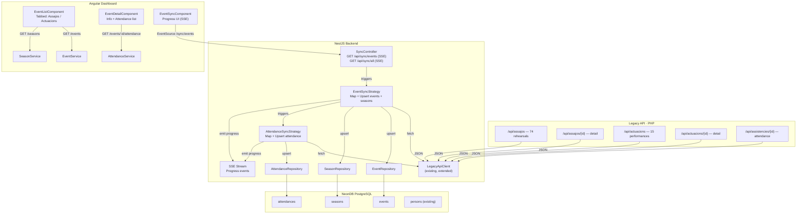

# P3.0: Seasons, Events & Attendance — Sync + Dashboard View

**Date:** 2026-03-31
**Status:** Approved
**Scope:** Import seasons, events (assajos + actuacions) and attendance from legacy API. View and manage them in the dashboard.
**Depends on:** P0-P2.1 vertical slice (complete)

---

## 1. Context

P0-P2.1 delivered a complete vertical slice for **Persons**: sync from legacy, full dashboard with filters/search/sort, and tests. P3 extends the same pattern to **Events and Attendance** — the core of what the colla uses daily.

### What this slice covers

- **Season** entity — two static seasons created during sync based on known date boundaries
- **Event** entity with JSONB metadata for type-specific fields (assaig vs actuació)
- **Attendance** entity linking Person ↔ Event with context-aware status mapping (past vs future events, assaig vs actuació)
- **Sync strategies** for events and attendance from legacy API
- **Dashboard UI**: event list (tabbed by type), event detail with attendance list, season filter
- **API endpoints** for read + filters + pagination + minimal update (countsForStatistics, season)

### What this slice does NOT cover

- Event creation from dashboard (future slice)
- Season CRUD from dashboard (future — seasons created statically during sync)
- Member responses via PWA (P5)
- Check-in system — QR, tablet, manual (future P3.x)
- Push notifications / reminders (P7)
- Advanced statistics and analytics (future P3.x)
- Figure visualization with attendance (P6)
- Auto-close events (future P3.x)

### Improvements over legacy

| Legacy limitation | MuixerApp improvement |
|---|---|
| Assajos and actuacions are separate systems with different endpoints | Unified `Event` entity with type discriminator + JSONB metadata |
| `temporada` is just a year number with no dates | `Season` with explicit start/end dates |
| No way to exclude events from statistics | `countsForStatistics` flag per event (manifests, extra rehearsals) |
| "Potser" means different things depending on context | Context-aware mapping: past events → ASSISTIT/NO_PRESENTAT, future → ANIRE |
| No denormalized attendance counts | `attendanceSummary` JSONB for instant display including xicalla count |
| No cross-event attendance overview | API supports filtering by season, date range, event type |
| No distinction between regular declines and last-minute cancellations | Derived `isLastMinuteCancellation` from respondedAt vs event start time |

---

## 2. Architecture Overview



---

## 3. Data Model

### 3.1 Season Entity

```typescript
@Entity('seasons')
export class Season {
  @PrimaryGeneratedColumn('uuid')
  id: string;

  @Column({ unique: true })
  name: string; // "Temporada 2024-2025"

  @Column({ type: 'date' })
  startDate: Date; // 2024-09-07

  @Column({ type: 'date' })
  endDate: Date; // 2025-09-05

  @Column({ type: 'text', nullable: true })
  description: string | null;

  @Column({ type: 'varchar', nullable: true })
  legacyId: string | null; // e.g. "2025" — original `temporada` value, for traceability

  @OneToMany(() => Event, event => event.season)
  events: Event[];

  @CreateDateColumn()
  createdAt: Date;

  @UpdateDateColumn()
  updatedAt: Date;
}
```

**No `isActive` field** — a season is considered active when `today >= startDate AND today <= endDate`. This is computed in the service/frontend, not stored.

**Static creation during sync (hardcoded for Muixeranga de Barcelona):**

| Season name | startDate | endDate | Events assigned |
|---|---|---|---|
| Temporada 2024-2025 | 2024-09-01 | 2025-09-05 | All events with `date < 2025-09-06` |
| Temporada 2025-2026 | 2025-09-06 | 2026-09-05 | All events with `date >= 2025-09-06` |

These are created during the first event sync. Season CRUD from dashboard is deferred to a future slice.

### 3.2 Event Entity

```typescript
@Entity('events')
export class Event {
  @PrimaryGeneratedColumn('uuid')
  id: string;

  @Column({ type: 'enum', enum: EventType })
  eventType: EventType;

  @Column({ type: 'varchar' })
  title: string; // Required. Mapped from legacy `descripcio` (e.g. "ASSAIG GENERAL")

  @Column({ type: 'text', nullable: true })
  description: string | null; // Optional longer description (not used by legacy, for future dashboard creation)

  @Column({ type: 'date' })
  date: Date;

  @Column({ type: 'varchar', nullable: true })
  startTime: string | null; // "18:45"

  @Column({ type: 'varchar', nullable: true })
  location: string | null; // Human-readable address, e.g. "Local d'assaig dels Castellers de Sants"

  @Column({ type: 'varchar', nullable: true })
  locationUrl: string | null; // Link to Google Maps or similar

  @Column({ type: 'text', nullable: true })
  information: string | null; // Longer text/notes (from legacy `informacio`, HTML cleaned)

  @Column({ default: true })
  countsForStatistics: boolean; // false for manifests, extra rehearsals, etc.

  @Column({ type: 'jsonb', default: {} })
  metadata: RehearsalMetadata | PerformanceMetadata;

  @Column({
    type: 'jsonb',
    default: { confirmed: 0, declined: 0, pending: 0, attended: 0, noShow: 0, children: 0, total: 0 },
  })
  attendanceSummary: AttendanceSummary;

  @ManyToOne(() => Season, season => season.events, { nullable: true })
  season: Season | null;

  @OneToMany(() => Attendance, attendance => attendance.event)
  attendances: Attendance[];

  @Column({ type: 'varchar', nullable: true, unique: true })
  legacyId: string | null; // Event ID in legacy system — NEVER exposed in DTOs

  @Column({ type: 'varchar', nullable: true })
  legacyType: string | null; // 'assaig' | 'actuacio' — for sync traceability

  @Column({ type: 'timestamp', nullable: true })
  lastSyncedAt: Date | null;

  @CreateDateColumn()
  createdAt: Date;

  @UpdateDateColumn()
  updatedAt: Date;
}
```

**Key design decisions:**
- `title` is the only required text field (mapped from legacy `descripcio`)
- `description` is optional — not used during legacy sync, available for future dashboard event creation
- `location` (address string) and `locationUrl` (Google Maps link) are both optional and independent
- `dayOfWeek` removed — derived from `date` in the frontend
- `isOpen` removed — not used in this slice
- `showQr` removed — not used in this slice (can be added when check-in is implemented)
- **Sync vs dashboard origin**: events with `legacyId != null` were imported from sync; events with `legacyId == null` were created from the dashboard (future). Same for seasons.

### 3.3 AttendanceSummary

Denormalized JSONB on Event, recalculated after every attendance sync:

```typescript
export interface AttendanceSummary {
  confirmed: number;  // ANIRE count (pre-event state)
  declined: number;   // NO_VAIG count
  pending: number;    // PENDENT count (no response)
  attended: number;   // ASSISTIT count (post-event, verified)
  noShow: number;     // NO_PRESENTAT count (confirmed but didn't show)
  children: number;   // Xicalla count among confirmed+attended (person.isXicalla === true)
  total: number;      // Total unique persons with any attendance record
}
```

`children` is critical because xicalla count as members and attendance but cannot be placed in the pinya. Knowing adult vs xicalla counts separately lets tècnica assess how many hands they actually have for figures.

### 3.4 Event Metadata Interfaces

```typescript
export interface RehearsalMetadata {
  endTime?: string; // "21:00" — only rehearsal-specific field for now
}

export interface PerformanceMetadata {
  isHome?: boolean;    // true = at home (local), false = away
  colles?: string[];   // Participating colles, e.g. ["Jove Muixeranga de València", "Castellers de Mollet"]
  hasBus?: boolean;    // Whether bus transport is available (if away)
}
```

**YAGNI**: All the detailed transport fields (busTime, busLocation, carTime, carLocation, busCapacity, closingDate/Time, results, etc.) are deferred. They can be added to metadata later without migration when the dashboard supports event creation/editing.

### 3.5 Attendance Entity

```typescript
@Entity('attendances')
@Unique(['person', 'event'])
export class Attendance {
  @PrimaryGeneratedColumn('uuid')
  id: string;

  @Column({ type: 'enum', enum: AttendanceStatus })
  status: AttendanceStatus;

  @Column({ type: 'timestamp', nullable: true })
  respondedAt: Date | null; // When the person responded (for last-minute detection)

  @Column({ type: 'text', nullable: true })
  notes: string | null;

  @ManyToOne(() => Person, { nullable: false, eager: false })
  person: Person;

  @ManyToOne(() => Event, event => event.attendances, { nullable: false, eager: false })
  event: Event;

  @Column({ type: 'varchar', nullable: true })
  legacyId: string | null; // id_assistencia from legacy — NEVER exposed in DTOs

  @Column({ type: 'timestamp', nullable: true })
  lastSyncedAt: Date | null;

  @CreateDateColumn()
  createdAt: Date;

  @UpdateDateColumn()
  updatedAt: Date;
}
```

**Constraint:** `UNIQUE(person_id, event_id)` — one attendance record per person per event.

**`isLastMinuteCancellation`**: Not stored — derived in the service/frontend:
- `true` if `status === NO_VAIG AND respondedAt >= (event.date + event.startTime - 6 hours)` — this includes cancellations made less than 6h before, during, or after the event
- `true` if `status === NO_PRESENTAT` (by definition, always a last-minute issue — signed up but never showed)

### 3.6 Enums (libs/shared)

```typescript
// event-type.enum.ts
export enum EventType {
  ASSAIG = 'ASSAIG',
  ACTUACIO = 'ACTUACIO',
  // Future: ASSEMBLEA, FORMACIO, SOCIAL
}

// attendance-status.enum.ts
export enum AttendanceStatus {
  PENDENT = 'PENDENT',           // No response
  ANIRE = 'ANIRE',            // Committed to attend — "Aniré" (future events). Stronger than "Puc anar" — implies commitment.
  NO_VAIG = 'NO_VAIG',          // Declined
  ASSISTIT = 'ASSISTIT',        // Actually attended — verified via check-in (past events)
  NO_PRESENTAT = 'NO_PRESENTAT', // Confirmed but didn't show up (past events, baixa sense avís)
  // Future (real-time check-in): CHECK_IN (transient state during event)
}
```

### 3.7 Entity Relationship Diagram

```
Season (1) ──< (N) Event
Event (1) ──< (N) Attendance
Person (1) ──< (N) Attendance

Constraint: UNIQUE(attendance.person_id, attendance.event_id)
```

---

## 4. Attendance Status — Context-Aware Mapping

The legacy API uses the same status labels ("Vinc", "No vinc", "Potser") for different meanings depending on whether the event is past or future and whether it's a rehearsal or performance.

### 4.1 Legacy attendance behaviour

**Rehearsals (assajos):**
- Before event: members can respond "Potser" (= I'll be there / signed up), "No vinc" (= I won't come), or not respond at all
- Day of event: members who arrive check in via a tablet at the entrance (POST `/api/assistencies/{event_id}` with `{"id_casteller":"37","lesionat":"0","hora":""}`) which changes their status from "Potser" to "Vinc"
- After event: "Vinc" = attended, "No vinc" = declined, "Potser" (unchanged) = signed up but didn't show (baixa sense avís)

**Performances (actuacions):**
- Members can ONLY respond "Vinc" (= I'll go) or "No vinc" (= I won't go), or not respond. **No "Potser" option**.
- After event: "Vinc" = attended (assumed if they signed up for a performance)

### 4.2 Mapping to MuixerApp statuses

**Past rehearsals** (event date + startTime < now):

| Legacy `estat` | MuixerApp `AttendanceStatus` | Rationale |
|---|---|---|
| `"Vinc"` | `ASSISTIT` | Checked in via tablet → attended |
| `"No vinc"` | `NO_VAIG` | Declined (may be last-minute — see §4.3) |
| `"Potser"` | `NO_PRESENTAT` | Signed up but never checked in → baixa sense avís |

**Future rehearsals** (event date + startTime > now):

| Legacy `estat` | MuixerApp `AttendanceStatus` | Rationale |
|---|---|---|
| `"Potser"` | `ANIRE` | Signed up, intends to attend |
| `"No vinc"` | `NO_VAIG` | Declined |
| No record | `PENDENT` | No response |

**Past performances** (event date + startTime < now):

| Legacy `estat` | MuixerApp `AttendanceStatus` | Rationale |
|---|---|---|
| `"Vinc"` | `ASSISTIT` | Confirmed and attended (no tablet check-in for actuacions) |
| `"No vinc"` | `NO_VAIG` | Declined |
| No record | `PENDENT` | Never responded |

**Future performances** (event date + startTime > now):

| Legacy `estat` | MuixerApp `AttendanceStatus` | Rationale |
|---|---|---|
| `"Vinc"` | `ANIRE` | Confirmed will attend |
| `"No vinc"` | `NO_VAIG` | Declined |
| No record | `PENDENT` | No response |

### 4.3 UI Labels vs Enum Values

Enum values are internal code identifiers (English, UPPER_SNAKE_CASE). The UI shows Catalan labels adapted to context:

| `AttendanceStatus` | Label UI (pre-event) | Label UI (post-event) | Emoji |
|---|---|---|---|
| `PENDENT` | Sense resposta | Sense resposta | ⚪ |
| `ANIRE` | Aniré | — | 🟢 |
| `NO_VAIG` | No vaig | No va anar | 🔴 |
| `ASSISTIT` | — | Assistit | ✅ |
| `NO_PRESENTAT` | — | No presentat | ❌ |

Pre-event labels appear in future event attendance lists. Post-event labels appear in past event attendance lists. The transition is automatic based on whether `event.date + event.startTime < now`.

### 4.4 Broken commitments (ANIRE → NO_VAIG)

A member who first commits (`ANIRE`) and later changes to `NO_VAIG` is breaking a commitment — this is qualitatively different from someone who declines immediately. In P3.0 (sync from legacy), we **cannot track this** because the legacy only stores the final status, not the history of transitions.

**Future (P3.1+ with real-time attendance):** When members respond via the PWA, we will track status transitions by storing a `previousStatus` or an attendance log. This enables statistics like "% de compromisos trencats" alongside "% baixes d'última hora".

For now, `isLastMinuteCancellation` partially covers this: if someone changes from ANIRE to NO_VAIG less than 6h before the event, it's captured as a last-minute cancellation regardless of whether it was a broken commitment.

### 4.5 Manual NO_PRESENTAT marking (P3.1)

In the legacy system, only rehearsals have automatic check-in (tablet). Performances have no detection mechanism. For P3.0, past `"Vinc"` maps to `ASSISTIT` for both types (best assumption from available data).

**Future (P3.1):** Add a `PATCH /api/events/:id/attendance/:attendanceId` endpoint so tècnica can manually mark `NO_PRESENTAT` on **both rehearsals and performances**. Use cases:

- **Performance**: member said ANIRE but didn't show up — tècnica marks NO_PRESENTAT from dashboard
- **Rehearsal**: tablet check-in failed or wasn't used — tècnica marks NO_PRESENTAT manually
- **Figure planning**: a member assigned to a figure position who is NO_PRESENTAT is visually flagged (empty/red slot), helping tècnica quickly reassign positions
- **Late arrival**: NO_PRESENTAT is reversible — if someone arrives late, tècnica can change the status back to ASSISTIT. The flow is `ANIRE → NO_PRESENTAT → ASSISTIT`, not a terminal state. This applies to both rehearsals and performances.

### 4.6 Last-minute cancellation detection

A **baixa d'última hora** is detected when:

1. `status === NO_VAIG AND respondedAt >= (event.date + event.startTime - 6 hours)` — covers less than 6h before, during, or after the event
2. `status === NO_PRESENTAT` — always last-minute (signed up but no-show)

This is **derived, not stored** (`isLastMinuteCancellation`). The service computes it from `respondedAt` and the event's datetime. Useful for future statistics (% baixes d'última hora, % mentiders).

### 4.7 Status flow diagram

```
        REHEARSAL                           PERFORMANCE
  ┌──────────────────┐               ┌──────────────────┐
  │ Pre-event states │               │ Pre-event states │
  │                  │               │                  │
  │  PENDENT ──────┐ │               │  PENDENT ──────┐ │
  │       │        │ │               │       │        │ │
  │       ▼        ▼ │               │       ▼        ▼ │
  │    ANIRE    NO_VAIG              │    ANIRE    NO_VAIG
  │       │          │               │       │          │
  └───────┼──────────┘               └───────┼──────────┘
          │ (event happens)                  │ (event happens)
  ┌───────┼──────────┐               ┌───────┼──────────┐
  │       ▼          │               │       ▼          │
  │  ┌─────────┐     │               │  ASSISTIT        │
  │  │ CHECK-IN│     │               │  (if ANIRE,      │
  │  │ (tablet)│     │               │   assumed P3.0)  │
  │  └────┬────┘     │               │                  │
  │       ▼          │               │  NO_PRESENTAT    │
  │  ASSISTIT        │               │  (P3.1: tècnica  │
  │                  │               │   marks manually)│
  │  NO_PRESENTAT    │               │                  │
  │  (ANIRE but no   │               │  PENDENT         │
  │   check-in)      │               │  (if no response)│
  │                  │               │                  │
  │  NO_VAIG         │               │  NO_VAIG         │
  │  (unchanged)     │               │  (unchanged)     │
  └──────────────────┘               └──────────────────┘
```

---

## 5. Backend: Sync Module Extensions

### 5.1 LegacyApiClient — New Methods

Extend the existing `LegacyApiClient` with:

```typescript
getAssajos(): Promise<LegacyAssaig[]>
getAssaigDetail(eventId: string): Promise<LegacyAssaigDetail>
getActuacions(): Promise<LegacyActuacio[]>
getActuacioDetail(eventId: string): Promise<LegacyActuacioDetail>
getAssistencies(eventId: string): Promise<LegacyAttendance[]>
```

**Legacy interfaces:**

```typescript
interface LegacyAssaig {
  '0': string; // HTML with event_id embedded (pattern: /llista/{id})
  temporada: number;
  data: string; // "17/09/2025" DD/MM/YYYY
  hora_esdeveniment: string; // "18:45"
  dia_setmana: string;
  descripcio: string; // May contain HTML
  n_si: string;
  n_potser: string;
  n_no: string;
  n_canalla: string;
  n_si_tots: string;
  p_mentider: string;
  p_planificades: string;
  mostrar_qr: string;
}

interface LegacyAssaigDetail {
  temporada: string;
  data: string;
  descripcio: string;
  hora_esdeveniment: string;
  hora_final: string;
  lloc_esdeveniment: string;
  obert: string; // "0" | "1"
  mostrar_qr: string; // "0" | "1"
  informacio: string; // HTML
}

interface LegacyActuacio {
  '0': string;
  temporada: number;
  data: string;
  hora_autocar: string;
  hora_cotxe: string;
  hora_esdeveniment: string;
  dia_setmana: string;
  descripcio: string;
  resultats: string;
  n_si: string;
  n_bus: string;
  n_potser: string;
  n_no: string;
  n_si_tots: string;
  mostrar_qr: string;
}

interface LegacyActuacioDetail {
  temporada: string;
  data: string;
  descripcio: string;
  hora_autocar: string;
  hora_cotxe: string;
  hora_esdeveniment: string;
  lloc_autocar: string;
  lloc_cotxe: string;
  lloc_esdeveniment: string;
  colles: string;
  congres: string;
  resultats: string;
  casa: string; // "0" | "1"
  obert: string;
  transport: string; // "0" | "1"
  aforament_autocar: string;
  mostrar_qr: string;
  informacio: string;
  data_tancament: string;
  hora_tancament: string;
}

interface LegacyAttendance {
  '0': string; // HTML — may contain person link/id
  id_assistencia: string;
  nom_casteller: string; // May contain HTML
  estat: string; // "Vinc" | "No vinc" | "Potser"
  instant: string; // "05/03/2026 12:59:18" DD/MM/YYYY HH:MM:SS
  observacions: string;
  import: string;
  alimentacio: string | null;
  intolerancies: string | null;
}
```

### 5.2 EventSyncStrategy

```
apps/api/src/modules/sync/strategies/
├── person-sync.strategy.ts     (existing)
├── event-sync.strategy.ts      (new)
└── attendance-sync.strategy.ts (new)
```

**Flow:**

```typescript
execute(): Observable<SyncEvent> {
  return new Observable(subscriber => {
    // Phase 1: Login
    subscriber.next({ type: 'start', entity: 'event', message: 'Connectant al legacy API...' });
    await this.legacyClient.login();

    // Phase 2: Create static seasons (idempotent)
    await this.createStaticSeasons();
    subscriber.next({ type: 'progress', entity: 'season', message: '2 temporades creades/verificades' });

    // Phase 3: Fetch and import rehearsals
    const assajos = await this.legacyClient.getAssajos();
    subscriber.next({ type: 'progress', entity: 'event', message: `${assajos.length} assajos trobats` });

    for (const [i, assaig] of assajos.entries()) {
      const eventId = this.extractEventId(assaig['0']); // regex /llista/(\d+)/
      const detail = await this.legacyClient.getAssaigDetail(eventId);
      await this.upsertRehearsalEvent(assaig, detail, eventId);
      subscriber.next({
        type: 'progress', entity: 'event',
        current: i + 1, total: assajos.length,
        message: `Assaig: ${this.cleanHtml(assaig.descripcio)}`,
      });
    }

    // Phase 4: Fetch and import performances (same pattern)
    const actuacions = await this.legacyClient.getActuacions();
    subscriber.next({ type: 'progress', entity: 'event', message: `${actuacions.length} actuacions trobades` });

    for (const [i, actuacio] of actuacions.entries()) {
      const eventId = this.extractEventId(actuacio['0']);
      const detail = await this.legacyClient.getActuacioDetail(eventId);
      await this.upsertPerformanceEvent(actuacio, detail, eventId);
      subscriber.next({ ... });
    }

    // Phase 5: Sync attendance for all events
    const allEvents = await this.eventRepo.find({ where: { legacyId: Not(IsNull()) } });
    await this.attendanceSyncStrategy.syncAll(subscriber, allEvents);

    subscriber.next({ type: 'complete', entity: 'event', message: summary });
  });
}
```

### 5.3 Static Season Creation

```typescript
private async createStaticSeasons(): Promise<void> {
  const seasons = [
    {
      name: 'Temporada 2024-2025',
      startDate: new Date('2024-09-01'),
      endDate: new Date('2025-09-05'),
      legacyId: '2025',
    },
    {
      name: 'Temporada 2025-2026',
      startDate: new Date('2025-09-06'),
      endDate: new Date('2026-09-05'),
      legacyId: '2026',
    },
  ];

  for (const s of seasons) {
    await this.seasonRepo.upsert(s, ['legacyId']);
  }
}

private assignSeasonToEvent(eventDate: Date): Season | null {
  // Events before 2025-09-06 → Temporada 2024-2025
  // Events from 2025-09-06 onwards → Temporada 2025-2026
  const cutoff = new Date('2025-09-06');
  return eventDate < cutoff ? season2024 : season2025;
}
```

### 5.4 AttendanceSyncStrategy

Runs after all events are synced. For each event with a `legacyId`:

```typescript
async syncAll(subscriber: Subscriber, events: Event[]): Promise<void> {
  subscriber.next({ type: 'progress', entity: 'attendance', message: `Sincronitzant assistència de ${events.length} events...` });

  for (const [i, event] of events.entries()) {
    const rows = await this.legacyClient.getAssistencies(event.legacyId);
    const eventIsPast = this.isEventPast(event);
    let matched = 0, unmatched = 0;

    for (const row of rows) {
      // 1. Match person by alias (unique)
      const person = await this.matchPersonByAlias(row);
      if (!person) {
        unmatched++;
        continue;
      }

      // 2. Map status (context-aware)
      const status = this.mapAttendanceStatus(row.estat, event.eventType, eventIsPast);

      // 3. Upsert attendance
      await this.attendanceRepo.upsert({
        person,
        event,
        status,
        respondedAt: this.parseTimestamp(row.instant), // DD/MM/YYYY HH:MM:SS
        notes: row.observacions || null,
        legacyId: row.id_assistencia,
        lastSyncedAt: new Date(),
      }, ['person', 'event']);

      matched++;
    }

    // 4. Recalculate attendanceSummary
    await this.recalculateSummary(event.id);

    subscriber.next({
      type: 'progress', entity: 'attendance',
      current: i + 1, total: events.length,
      message: `${event.title}: ${matched} registres${unmatched > 0 ? `, ${unmatched} sense match` : ''}`,
    });
  }
}
```

### 5.5 Person Matching — By Alias

The legacy `nom_casteller` contains full names (e.g. "MARTA PERIS GARCIA") which are unreliable for matching (multiple surname formats, HTML content). Instead we match by **alias**, which is unique per person.

**Strategy:**

1. Strip HTML from `nom_casteller`
2. Normalize to uppercase, trim
3. Query `Person` by `UPPER(alias) = normalizedName` (the legacy app uses `mote` as display name in attendance lists, which maps to our `alias`)
4. If no match by alias, try extracting person ID from the HTML `"0"` field (pattern: `/casteller/(\d+)`) and match by `Person.legacyId`
5. If still no match: log warning, skip record, emit SSE error event

**Why alias works:** In the legacy system, the attendance list `nom_casteller` field typically displays the person's alias/mote (e.g. "ADRI" not "ADRIAN ABREU GONZALEZ"). Since `alias` is unique in our Person table, this is the most reliable match.

### 5.6 Context-Aware Status Mapping

```typescript
private mapAttendanceStatus(
  legacyEstat: string,
  eventType: EventType,
  isPastEvent: boolean,
): AttendanceStatus {
  const estat = legacyEstat?.trim();

  if (eventType === EventType.ASSAIG) {
    if (isPastEvent) {
      // Past rehearsal: Vinc=attended, Potser=no-show, No vinc=declined
      if (estat === 'Vinc') return AttendanceStatus.ASSISTIT;
      if (estat === 'Potser') return AttendanceStatus.NO_PRESENTAT;
      if (estat === 'No vinc') return AttendanceStatus.NO_VAIG;
      return AttendanceStatus.PENDENT;
    } else {
      // Future rehearsal: Potser=confirmed, No vinc=declined
      if (estat === 'Potser') return AttendanceStatus.ANIRE;
      if (estat === 'No vinc') return AttendanceStatus.NO_VAIG;
      return AttendanceStatus.PENDENT;
    }
  }

  if (eventType === EventType.ACTUACIO) {
    if (isPastEvent) {
      // Past performance: Vinc=attended, No vinc=declined
      if (estat === 'Vinc') return AttendanceStatus.ASSISTIT;
      if (estat === 'No vinc') return AttendanceStatus.NO_VAIG;
      return AttendanceStatus.PENDENT;
    } else {
      // Future performance: Vinc=confirmed, No vinc=declined (no Potser)
      if (estat === 'Vinc') return AttendanceStatus.ANIRE;
      if (estat === 'No vinc') return AttendanceStatus.NO_VAIG;
      return AttendanceStatus.PENDENT;
    }
  }

  return AttendanceStatus.PENDENT;
}

private isEventPast(event: Event): boolean {
  const eventDateTime = this.buildEventDateTime(event.date, event.startTime);
  return eventDateTime < new Date();
}
```

### 5.7 AttendanceSummary Recalculation

```typescript
private async recalculateSummary(eventId: string): Promise<void> {
  const attendances = await this.attendanceRepo.find({
    where: { event: { id: eventId } },
    relations: ['person'],
  });

  const summary: AttendanceSummary = {
    confirmed: attendances.filter(a => a.status === AttendanceStatus.ANIRE).length,
    declined: attendances.filter(a => a.status === AttendanceStatus.NO_VAIG).length,
    pending: attendances.filter(a => a.status === AttendanceStatus.PENDENT).length,
    attended: attendances.filter(a => a.status === AttendanceStatus.ASSISTIT).length,
    noShow: attendances.filter(a => a.status === AttendanceStatus.NO_PRESENTAT).length,
    children: attendances.filter(a =>
      [AttendanceStatus.ANIRE, AttendanceStatus.ASSISTIT].includes(a.status)
      && a.person.isXicalla
    ).length,
    total: attendances.length,
  };

  await this.eventRepo.update(eventId, { attendanceSummary: summary });
}
```

### 5.8 Merge Rules — Events

| Field | CREATE | UPDATE | Rationale |
|-------|--------|--------|-----------|
| `eventType` | ✅ Mapped | ❌ Immutable | Set on creation |
| `title` | ✅ Cleaned | ✅ Cleaned | Strip HTML from legacy `descripcio` |
| `description` | — | — | Not mapped from legacy (null). For future dashboard use. |
| `date`, `startTime` | ✅ | ✅ | Temporal info from legacy |
| `location` | ✅ | ✅ | From detail endpoint `lloc_esdeveniment` |
| `locationUrl` | — | — | Not available in legacy (null). For future dashboard use. |
| `information` | ✅ | ✅ | From detail endpoint `informacio` (HTML cleaned) |
| `metadata` | ✅ Full | ✅ Full | Type-specific fields |
| `countsForStatistics` | ✅ `true` | ❌ NEVER | MuixerApp manages — user can set false for manifests/extras |
| `season` | ✅ Auto-assigned | ❌ NEVER | MuixerApp manages season assignment |
| `attendanceSummary` | ✅ Calculated | ✅ Recalculated | After attendance sync |
| `legacyId` | ✅ Set once | ❌ Immutable | Upsert key |
| `lastSyncedAt` | ✅ NOW() | ✅ NOW() | Track sync |

### 5.9 Merge Rules — Attendance

| Field | CREATE | UPDATE | Rationale |
|-------|--------|--------|-----------|
| `status` | ✅ Context-mapped | ✅ Context-mapped | Re-mapped on every sync (handles event becoming past) |
| `respondedAt` | ✅ Parsed | ✅ Parsed | Original timestamp from legacy |
| `notes` | ✅ | ❌ NEVER | MuixerApp owns notes after import |
| `legacyId` | ✅ Set once | ❌ Immutable | Traceability |
| `lastSyncedAt` | ✅ NOW() | ✅ NOW() | Track sync |

**Important:** Re-syncing correctly handles the transition from future to past. An event that was future on the last sync (Potser → ANIRE) and is now past will be re-mapped (Vinc → ASSISTIT, Potser → NO_PRESENTAT, etc.).

### 5.10 Estimated Legacy API Calls

| Step | Calls | Est. time (200ms/call) |
|------|-------|------------------------|
| Rehearsal list | 1 | 0.2s |
| Rehearsal details | 74 | 14.8s |
| Performance list | 1 | 0.2s |
| Performance details | 15 | 3.0s |
| Attendance per event | 89 | 17.8s |
| **Total** | **180** | **~36 seconds** |

The SSE stream shows real-time progress. Manual and infrequent — acceptable latency.

---

## 6. Backend: API Endpoints

### 6.1 Season Endpoints (read-only for now)

```
GET    /api/seasons              → List all seasons (with event count)
GET    /api/seasons/:id          → Season detail
```

Season CRUD (POST, PATCH, DELETE) deferred to a future slice.

**List response:**

```json
{
  "data": [
    {
      "id": "uuid",
      "name": "Temporada 2025-2026",
      "startDate": "2025-09-06",
      "endDate": "2026-09-05",
      "eventCount": 52
    }
  ],
  "meta": { "total": 2, "page": 1, "limit": 25 }
}
```

No `legacyId` in response.

### 6.2 Event Endpoints

```
GET    /api/events               → List events (with filters)
GET    /api/events/:id           → Event detail (includes attendanceSummary + metadata)
PATCH  /api/events/:id           → Update event (countsForStatistics, seasonId only)
GET    /api/events/:id/attendance → Attendance list for this event
```

**Event list filters (`GET /api/events`):**

| Param | Type | Description |
|-------|------|-------------|
| `seasonId` | uuid | Filter by season |
| `eventType` | string | `ASSAIG \| ACTUACIO` |
| `dateFrom` | date | Start of date range |
| `dateTo` | date | End of date range |
| `search` | string | Search in title, location, description (ILIKE) |
| `countsForStatistics` | boolean | Filter by statistics flag |
| `sortBy` | string | `date \| eventType \| title` (whitelist) |
| `sortOrder` | string | `ASC \| DESC` (default: `DESC` — newest first) |
| `page` | number | Default: 1 |
| `limit` | number | Default: 25, options: 25/50/100 |

**Event list response:**

```json
{
  "data": [
    {
      "id": "uuid",
      "eventType": "ASSAIG",
      "title": "ASSAIG GENERAL",
      "date": "2026-03-26",
      "startTime": "18:45",
      "location": "Local d'assaig dels Castellers de Sants",
      "countsForStatistics": true,
      "attendanceSummary": {
        "confirmed": 0, "declined": 27, "pending": 18,
        "attended": 69, "noShow": 5, "children": 11, "total": 119
      },
      "season": { "id": "uuid", "name": "Temporada 2025-2026" }
    }
  ],
  "meta": { "total": 74, "page": 1, "limit": 25 }
}
```

No `legacyId`, `legacyType`, or `lastSyncedAt` in response.

**Event detail response** includes full metadata:

```json
{
  "id": "uuid",
  "eventType": "ACTUACIO",
  "title": "TROBADA VII ANIVERSARI MUIXERANGA DE BARCELONA",
  "date": "2025-04-05",
  "startTime": "12:00",
  "location": "Local",
  "locationUrl": null,
  "information": "Informació addicional...",
  "countsForStatistics": true,
  "metadata": {
    "isHome": true,
    "colles": ["Jove Muixeranga de València", "Castellers de Mollet"],
    "hasBus": false
  },
  "attendanceSummary": {
    "confirmed": 0, "declined": 24, "pending": 0,
    "attended": 109, "noShow": 0, "children": 22, "total": 133
  },
  "season": { "id": "uuid", "name": "Temporada 2024-2025" }
}
```

**Attendance list response (`GET /api/events/:id/attendance`):**

| Param | Type | Description |
|-------|------|-------------|
| `status` | string | Filter by AttendanceStatus |
| `search` | string | Search by alias or name |
| `page` | number | Default: 1 |
| `limit` | number | Default: 100 |

```json
{
  "data": [
    {
      "id": "uuid",
      "status": "ASSISTIT",
      "respondedAt": "2026-03-26T18:52:00Z",
      "notes": null,
      "person": {
        "id": "uuid",
        "alias": "ADRI",
        "name": "Adrian",
        "firstSurname": "Abreu",
        "isXicalla": false,
        "positions": [{ "name": "Primeres", "color": "#E53935" }]
      }
    }
  ],
  "meta": { "total": 119, "page": 1, "limit": 100 }
}
```

No `legacyId` on attendance records in response.

### 6.3 Event Update DTO

Minimal — only fields manageable from dashboard in this slice:

```typescript
export class UpdateEventDto {
  @IsOptional()
  @IsBoolean()
  countsForStatistics?: boolean;

  @IsOptional()
  @IsUUID()
  seasonId?: string; // Reassign event to a different season
}
```

### 6.4 Sync Endpoints

```
GET    /api/sync/events          → SSE: sync events + attendance from legacy
GET    /api/sync/persons         → SSE: sync persons (existing)
GET    /api/sync/all             → SSE: sync persons + events + attendance (sequential)
```

All return `text/event-stream`. Same `SyncEvent` interface as existing person sync.

---

## 7. Backend: Module Structure

### 7.1 New files

```
apps/api/src/modules/
├── season/
│   ├── season.module.ts
│   ├── season.controller.ts
│   ├── season.service.ts
│   └── season.entity.ts
├── event/
│   ├── event.module.ts
│   ├── event.controller.ts
│   ├── event.service.ts
│   ├── event.entity.ts
│   ├── attendance.entity.ts
│   ├── attendance.service.ts
│   └── dto/
│       ├── event-filter.dto.ts
│       └── update-event.dto.ts
├── sync/
│   ├── strategies/
│   │   ├── person-sync.strategy.ts     (existing)
│   │   ├── event-sync.strategy.ts      (new)
│   │   └── attendance-sync.strategy.ts (new)
│   ├── sync.controller.ts              (extended with /sync/events, /sync/all)
│   └── legacy-api.client.ts            (extended with new methods)
```

### 7.2 Module wiring

```typescript
@Module({
  imports: [TypeOrmModule.forFeature([Season])],
  controllers: [SeasonController],
  providers: [SeasonService],
  exports: [SeasonService],
})
export class SeasonModule {}

@Module({
  imports: [
    TypeOrmModule.forFeature([Event, Attendance]),
    PersonModule,
  ],
  controllers: [EventController],
  providers: [EventService, AttendanceService],
  exports: [EventService, AttendanceService],
})
export class EventModule {}

// SyncModule (extended)
@Module({
  imports: [
    TypeOrmModule.forFeature([Person, Position, Event, Attendance, Season]),
    PersonModule,
    PositionModule,
    EventModule,
    SeasonModule,
  ],
  controllers: [SyncController],
  providers: [
    LegacyApiClient,
    PersonSyncStrategy,
    EventSyncStrategy,
    AttendanceSyncStrategy,
  ],
})
export class SyncModule {}
```

---

## 8. Dashboard: UI Design

### 8.1 Navigation

Sidebar additions:

```
📋 Persones        → /persons     (existing)
📅 Esdeveniments   → /events      (new)
```

No Temporades page yet (seasons are read-only, used as a filter dropdown inside the events page).

### 8.2 Event List Page (`/events`)

```
┌─────────────────────────────────────────────────────────────────────┐
│ Esdeveniments                                    [Sincronitzar]    │
├─────────────────────────────────────────────────────────────────────┤
│ Temporada: [2025-2026 ▼]     Cerca: [___________________________]  │
│ Estadístiques: [Tots ▼]                                            │
├─────────────────────────────────────────────────────────────────────┤
│  [ Assajos (74) ]    [ Actuacions (15) ]                           │
├──────────┬────────────────────────┬───────┬─────┬─────┬─────┬──────┤
│ Data     │ Títol                  │ Lloc  │  🟢 │  🔴 │  ⚪ │ 👶  │
├──────────┼────────────────────────┼───────┼─────┼─────┼─────┼──────┤
│ 26/03/26 │ ASSAIG GENERAL        │ Local │  69 │  27 │  18 │  11  │
│ 19/03/26 │ ASSAIG TRONC          │ Local │  45 │  15 │  24 │   8  │
│ 12/03/26 │ ASSAIG GENERAL        │ Local │  72 │  20 │  12 │  14  │
│ ...      │                       │       │     │     │     │      │
├──────────┴────────────────────────┴───────┴─────┴─────┴─────┴──────┤
│ Pàgina 1 de 3  │ [← Anterior] [1] [2] [3] [Següent →]            │
│                 │ Mostrant 25/74 │ Per pàgina: [25 ▼]              │
└─────────────────┴──────────────────────────────────────────────────┘
```

**Attendance columns adapt based on event time:**
- **Past events**: 🟢 = `attended` (ASSISTIT), 🔴 = `declined + noShow`, ⚪ = `pending`, 👶 = `children`
- **Future events**: 🟢 = `confirmed` (ANIRE), 🔴 = `declined`, ⚪ = `pending`, 👶 = `children`

**Features:**
- **Tabs**: Assajos / Actuacions (filter by `eventType`)
- **Season filter**: Dropdown with available seasons
- **Statistics filter**: "Tots" / "Comptabilitzen" / "No comptabilitzen" (filter `countsForStatistics`)
- **Search**: Searches title and location (300ms debounce)
- **Sort**: By date (default DESC), clickable column headers
- **Pagination**: 25/50/100 per page
- **Row click**: Navigate to event detail
- **Sync button**: Opens event sync component
- **Always table layout** (horizontal scroll on mobile, consistent with person list)

### 8.3 Event Detail Page (`/events/:id`)

```
┌─────────────────────────────────────────────────────────────────────┐
│ ← Tornar                                                           │
│ ASSAIG GENERAL                                           [Editar]  │
├─────────────────────────────────┬───────────────────────────────────┤
│ Informació                      │ Resum Assistència                 │
│ ─────────────                   │ ──────────────────                │
│ Tipus: Assaig                   │ ✅ Assistit:    69                │
│ Data: Dimecres, 26/03/2026      │ ❌ No presentat: 5                │
│ Hora: 18:45                     │ 🔴 No vaig:    27                │
│ Lloc: Local d'assaig            │ ⚪ Pendents:   18                │
│ Temporada: 2025-2026            │ 👶 Xicalla:    11                │
│ Estadístiques: ✅               │ Total:         119               │
│                                 │                                  │
│                                 │ [━━━━━━━━━━━░░░░░] 58%           │
│                                 │ (assistit / total)                │
├─────────────────────────────────┴───────────────────────────────────┤
│ Llista d'Assistència                         Cerca: [____________] │
│ Filtre: [Tots ▼]                                                   │
├──────────┬───────────────────┬──────────────┬──────────────────────┤
│ Alies    │ Nom complet       │ Estat        │ Data resposta        │
├──────────┼───────────────────┼──────────────┼──────────────────────┤
│ ADRI     │ Adrian Abreu      │ ✅ Assistit   │ 26/03/2026 18:52    │
│ MARTA    │ Marta Peris       │ 🔴 No vaig   │ 24/03/2026 18:30    │
│ JOAN     │ Joan García       │ ❌ No present.│ —                   │
│ ...      │                   │              │                      │
├──────────┴───────────────────┴──────────────┴──────────────────────┤
│ Pàgina 1 de 2  │ [← Anterior] [1] [2] [Següent →]                │
└─────────────────┴──────────────────────────────────────────────────┘
```

For **actuacions**, the info column adds metadata fields:
- A casa: Sí/No
- Colles: list of participating colles
- Bus: Sí/No (if away)

**`dayOfWeek`** is displayed as a formatted date (e.g. "Dimecres, 26/03/2026") — derived from `date` in the frontend using date pipe, not stored.

**[Editar] button**: Inline edit for `countsForStatistics` toggle and season reassignment only.

**Attendance list features:**
- **Status filter**: Tots / Aniré / Assistit / No vaig / No presentat / Pendents
- **Search**: By alias or name
- **Position badges**: Same colored badges as person list
- **Pagination**: 100 per page default

### 8.4 Event Sync Component

Same UX pattern as person sync (reuse component structure):

```
┌─────────────────────────────────────────────────────────────────────┐
│ 🔄 Sincronització d'Esdeveniments                                  │
│                                                                     │
│ ████████████████░░░░░░░░░░░░  45/89 (51%)                          │
│                                                                     │
│ ┌─ Log ───────────────────────────────────────────────────────────┐ │
│ │ ✅ Connectat al legacy API                                      │ │
│ │ ✅ 2 temporades creades/verificades                             │ │
│ │ ✅ 74 assajos trobats                                           │ │
│ │ ✅ 15 actuacions trobades                                       │ │
│ │ ✅ 01/89 ASSAIG GENERAL 26/03/2026 (nou)                       │ │
│ │ ✅ 02/89 ASSAIG TRONC 19/03/2026 (actualitzat)                 │ │
│ │ ...                                                             │ │
│ │ ── Assistències ──                                              │ │
│ │ ✅ 01/89 ASSAIG GENERAL: 114 registres                         │ │
│ │ ⚠️ 02/89 ASSAIG TRONC: 82 registres, 3 sense match             │ │
│ │ ...                                                             │ │
│ └─────────────────────────────────────────────────────────────────┘ │
│                                                                     │
│ [Cancel·lar]                                                        │
└─────────────────────────────────────────────────────────────────────┘
```

### 8.5 Component Structure

```
apps/dashboard/src/app/features/
├── persons/               (existing)
├── events/
│   ├── components/
│   │   ├── event-list/
│   │   │   ├── event-list.component.ts
│   │   │   ├── event-list.component.html
│   │   │   └── event-list.component.scss
│   │   ├── event-detail/
│   │   │   ├── event-detail.component.ts
│   │   │   ├── event-detail.component.html
│   │   │   └── event-detail.component.scss
│   │   └── event-sync/
│   │       ├── event-sync.component.ts
│   │       ├── event-sync.component.html
│   │       └── event-sync.component.scss
│   ├── services/
│   │   ├── event.service.ts
│   │   └── attendance.service.ts
│   ├── models/
│   │   ├── event.model.ts
│   │   └── attendance.model.ts
│   └── events.routes.ts
```

---

## 9. Dashboard: Routing

```typescript
// app.routes.ts additions
{
  path: 'events',
  loadChildren: () => import('./features/events/events.routes'),
},

// events.routes.ts
export default [
  { path: '', component: EventListComponent },
  { path: ':id', component: EventDetailComponent },
] as Routes;
```

---

## 10. Testing Strategy

### 10.1 Backend Tests (Jest)

| Component | Test Type | Key Scenarios |
|---|---|---|
| `EventSyncStrategy` | Unit | Map legacy assaig → Event, map actuacio → Event, static season creation, merge rules (countsForStatistics not overwritten on re-sync), HTML stripping, event ID extraction from HTML |
| `AttendanceSyncStrategy` | Unit | **Context-aware mapping**: past rehearsal (Vinc→ASSISTIT, Potser→NO_PRESENTAT, No vinc→NO_VAIG), future rehearsal (Potser→ANIRE), past performance (Vinc→ASSISTIT), future performance (Vinc→ANIRE). Person matching by alias. Summary recalculation including children count. |
| `EventService` | Unit | CRUD, filters (seasonId, eventType, dateRange, search, countsForStatistics), pagination, sorting with whitelist |
| `AttendanceService` | Unit | List by event with status filter, recalculateSummary correctness |
| `SeasonService` | Unit | List with event count, active season derivation |
| `EventController` | Unit | Endpoint responses, DTO validation, sort whitelist, legacyId exclusion from DTOs |
| `EventFilterDto` | Unit | Validation of all filter params |

### 10.2 Frontend Tests (Vitest)

| Component | Test Type | Key Scenarios |
|---|---|---|
| `EventListComponent` | Component | Tab switching (assajos/actuacions), season filter, statistics filter, sort columns, pagination, attendance columns adapt to past/future |
| `EventDetailComponent` | Component | Render event info + metadata per type, render attendance list, filter by status, dayOfWeek display from date |
| `EventSyncComponent` | Component | SSE connection, progress bar, log rendering, cancel |
| `EventService` | Unit | HTTP calls with correct params, filters |
| `AttendanceService` | Unit | HTTP calls with status filter |

### 10.3 Manual Validation

| # | Check | Expected |
|---|-------|----------|
| 1 | Sync events completes | 74 assajos + 15 actuacions imported |
| 2 | Seasons created | 2 static seasons with correct dates |
| 3 | Events assigned to correct season | Based on date cutoff (Sep 6, 2025) |
| 4 | Attendance imported per event | Persons matched by alias |
| 5 | Past rehearsal mapping | Vinc→ASSISTIT, Potser→NO_PRESENTAT, No vinc→NO_VAIG |
| 6 | Future event mapping | Potser→ANIRE (rehearsal), Vinc→ANIRE (performance) |
| 7 | attendanceSummary correct | Counts match actual attendance records, children count correct |
| 8 | Tabs filter correctly | Assajos tab shows only ASSAIG, Actuacions only ACTUACIO |
| 9 | Season filter works | Changing season filters events |
| 10 | Event detail shows attendance | Correct persons with correct context-mapped statuses |
| 11 | Re-sync idempotent | Events/attendance updated not duplicated |
| 12 | `countsForStatistics` preserved | Re-sync does not overwrite manual changes |
| 13 | Actuació metadata | isHome, colles, hasBus visible in detail |
| 14 | Unmatched persons logged | Attendance for unknown aliases shows in sync log |
| 15 | legacyId not exposed | No legacyId in any API response to dashboard |

---

## 11. Security Considerations

- Legacy API credentials: same env vars as existing sync (server-side only)
- **`legacyId` fields are strictly internal** — NOT exposed in any DTO/response to dashboard. Not on Season, Event, or Attendance responses.
- Attendance data includes personal information — future auth will restrict access by role
- SSE sync endpoints: no auth in this slice (same as person sync). Will require ADMIN/TECHNICAL role when auth is implemented.
- Concurrency guard on sync: max 1 sync at a time (extend existing `isSyncing` flag to cover event sync too)

---

## 12. Technical Debt Awareness

| Item | Description | When to Address |
|------|-------------|-----------------|
| N+1 attendance queries | 89 events × individual attendance fetch during sync | Low priority — sync is manual, ~36s acceptable |
| Alias matching accuracy | If legacy attendance uses full name instead of alias in some cases, matching may fail | Monitor during first sync, add fallback if needed |
| attendanceSummary consistency | Denormalized field could drift if attendance changes outside sync | Recalculate on every write; add periodic recount job if needed |
| Missing E2E tests | No Playwright/Cypress coverage | Medium — add in P4 |
| Auth on sync endpoints | Currently unprotected | Must address before production (Auth slice) |
| Season CRUD | Seasons are static — no create/edit/delete from dashboard | Add in future slice when needed |

---

## 13. Future Evolution (Out of Scope)

This spec sets the foundation for:

- **P3.1**: Event creation from dashboard + Season CRUD + manual attendance correction (tècnica marks NO_PRESENTAT on performances) + broken commitment tracking (ANIRE → NO_VAIG history) + basic statistics (% assistència, baixes última hora, compromisos trencats)
- **P3.2**: Check-in system (QR + tablet + manual) with real-time CHECK_IN status
- **P5**: PWA member attendance response (Aniré / No vaig)
- **P6**: Figure visualization with check-in status
- **P7**: Push notifications and smart reminders

The `EventType` enum, `AttendanceStatus` enum, and JSONB metadata pattern are designed to accommodate these extensions without schema migrations. Adding new event types (ASSEMBLEA, FORMACIO, SOCIAL) requires only a new enum value and a new metadata interface.
