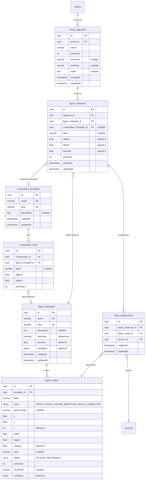

# P5 — Mòdul de Pinyes i Figures (Overview Spec)

> **Data**: 7 de maig de 2026
> **Estat**: Aprovat
> **Depèn de**: P4.4 (Docker Multi-entorn)
> **Prerequisits**: P0-P4.4 completats

---

## 1. Objectiu

Definir l'especificació tècnica i funcional del Mòdul de Pinyes (Figures Designer). Aquest mòdul permet:

1. **Dissenyar l'estructura de figures** com a templates reutilitzables.
2. **Compondre figures** en arranjaments (composicions) reutilitzables.
3. **Planificar assajos** dividint-los en segments temporals amb figures assignades.
4. **Assignar persones reals** als nodes de les figures en temps real.
5. **Projectar les figures** en pantalla completa per a assajos i actuacions.
6. **Consultar l'històric** de figures i assignacions d'events passats.

---

## 2. Glossari de Termes

| Terme | Definició |
|-------|-----------|
| **Pinya** | Base de la figura. Totes les persones amb els peus a terra. Vista en planta (des de dalt). |
| **Tronc** | Estructura vertical de la figura. Pisos apilats sobre els baixos. Vista frontal (alçat). |
| **Baixos** | Persones a la base que apareixen tant a la pinya com al tronc. |
| **Segons** | Segon pis del tronc. Mateixa quantitat que els baixos, peus tancats sobre les espatlles dels baixos. |
| **Terços** | Tercer pis. Menys persones, peus oberts sobre dues espatlles de dos segons adjacents. |
| **Alçadora** | Persona que alça la xiqueta al cim de la figura. |
| **Xiqueta** | Persona al cim de la figura (xicalla, < 16 anys). |
| **Crosses** | Posició de pinya: sota les aixelles dels baixos. |
| **Contraforts** | Posició de pinya: a l'esquena del baix, falcant l'esquena i agafant el pit. |
| **Agulles** | Posició de pinya: al centre mirant als baixos, ajuden els segons a mantenir la posició. |
| **Primeres Mans** | Primer cordó concèntric: darrere del baix, aguantant el cul del segon. |
| **Vents** | Primer cordó: aguanten laterals de les cames dels segons. |
| **Laterals** | Primer cordó: entre primeres mans i vent, trauen pes al baix del segon. |
| **Taps** | Omplen espais buits entre posicions per seguretat. |
| **Cordó Obert** | Cordó exterior de la pinya. |
| **Mans** | Persones que envolten la figura sense tocar-la, per seguretat (figures netes/remats). |
| **Figura neta** | Figura sense pinya (només tronc + mans de seguretat opcionals). |
| **Remat** | Pràctica del remat d'una figura completa (sense pinya). |
| **Composició** | Arranjament espacial de múltiples figures (ex: Altar = 1 pd4 + 2 pd3 + 2 pd2). |
| **Segment** | Unitat temporal seqüencial dins d'un event. Les figures del mateix segment no comparteixen persones. |
| **Direcció** | Persona externa que dirigeix la figura (FIGURE_DIRECTION) o la xiqueta (XICALLA_DIRECTION). |
| **ClimbPath** | Marcadors (X), (A) que indiquen per on pujen la xiqueta i l'alçadora al tronc. |

---

## 3. Decisions d'Arquitectura

### 3.1. Enfocament: Composició Explícita (2 nivells)

S'ha escollit el model de **Composició Explícita** amb dos nivells separats:

- **`FigureTemplate`**: Una sola figura individual amb els seus nodes (pd3, Morera, Torreta...).
- **`CompositionTemplate`**: Un arranjament de múltiples `FigureTemplate` amb posicions relatives.

Mai recursiu: les composicions només contenen figures, no altres composicions.

**Raons:**
- S'alinea amb la manera natural de pensar les figures: "un Altar és 5 figures individuals posicionades".
- Manté la reutilització real: si millores el template del pd3, l'Altar s'actualitza.
- Queries senzilles sense recursió.
- La instanciació s'aplana automàticament (composició → llista de figures → nodes).

### 3.2. Direcció global

Totes les figures d'una composició/segment miren cap al mateix lloc. La direcció es defineix a nivell de composició/instància, no per figura individual. Cada figura individual dins d'una composició pot tenir persones de direcció (FIGURE_DIRECTION, XICALLA_DIRECTION).

### 3.3. Segments seqüencials amb horari opcional

Els segments d'un event són seqüencials (ordenats). L'horari (startTime, endTime) és opcional i informatiu. Es poden reordenar fàcilment.

### 3.4. Canvas: Konva

Biblioteca de canvas 2D: `konva` + `ng2-konva` (wrapper Angular). Motius:
- API declarativa compatible amb Angular.
- Suport per drag-and-drop, zoom, pan, events.
- Renderitza shapes (ellipses, rectangles) amb text, colors, rotació.
- Bon rendiment amb centenars de nodes.

### 3.5. Estructura de l'editor

L'editor de templates és **visual des del principi**: el tècnic crea i posiciona nodes directament al canvas. Es pot **duplicar templates existents** per accelerar la creació.

### 3.6. Assignació: Selecció + Panel lateral

L'assignació de persones NO és per popover individual. El flux és:
1. Click al node → el node es selecciona (highlight).
2. El panel lateral mostra persones filtrades.
3. Click a una persona al panel → s'assigna al node seleccionat.
4. Auto-avança al pròxim node buit del mateix pis/zona.

Alternativa: doble-click al node per popover ràpid (assignacions puntuals).

### 3.7. Auto-save

L'editor de templates i el canvas d'assignació fan auto-save amb debounce de 2 segons. Indicador d'estat visible (Guardat/Guardant/Error).

### 3.8. Fitxers Angular separats

Tots els components del mòdul segueixen l'estructura de 3 fitxers: `.component.ts`, `.component.html`, `.component.scss`.

---

## 4. Model de Dades

### 4.1. Noves Entitats

#### `FigureTemplate`

Esquelet reutilitzable d'una figura individual.

| Camp | Tipus DB | TypeScript | Nullable | Notes |
|------|----------|------------|----------|-------|
| `id` | `uuid` | `string` | No | PK, auto-generat |
| `name` | `varchar` | `string` | No | Únic. Ex: "Pinet Doble de 4" |
| `slug` | `varchar` | `string` | No | Únic. Ex: "pd4" |
| `description` | `text` | `string \| null` | Sí | Notes del tècnic |
| `hasPinya` | `boolean` | `boolean` | No | Default `true`. `false` per figures netes/remats |
| `direction` | `float` | `number` | No | Default `0`. Angle en graus (0-360) |
| `metadata` | `jsonb` | `Record<string, unknown>` | No | Default `{}`. Extensible |
| `createdAt` | `timestamp` | `Date` | No | Auto |
| `updatedAt` | `timestamp` | `Date` | No | Auto |

#### `FigureNode`

Cada posició dins d'un template.

| Camp | Tipus DB | TypeScript | Nullable | Notes |
|------|----------|------------|----------|-------|
| `id` | `uuid` | `string` | No | PK, auto-generat |
| `template` | FK → `figure_templates` | `FigureTemplate` | No | ManyToOne, CASCADE delete |
| `label` | `varchar` | `string` | No | Ex: "Baix 1", "Cross esquerra" |
| `zone` | `enum FigureZone` | `FigureZone` | No | `PINYA`, `TRONC`, `FIGURE_DIRECTION`, `XICALLA_DIRECTION`. **Baixos**: zone=`TRONC` amb z=0. El canvas renderitza automàticament els nodes TRONC z=0 en ambdues vistes (pinya i tronc) |
| `positionType` | `varchar` | `string \| null` | Sí | Lliure: "baix", "segon", "cross", "agulla", "primeres_mans"... |
| `x` | `float` | `number` | No | Coordenada X al canvas |
| `y` | `float` | `number` | No | Coordenada Y al canvas |
| `z` | `int` | `number` | No | Default `0`. Pis (0=terra/pinya, 1=segons, 2=terços...) |
| `width` | `float` | `number` | No | Amplada del node (rectangle) o rx (el·lipse) |
| `height` | `float` | `number` | No | Alçada del node (rectangle) o ry (el·lipse) |
| `rotation` | `float` | `number` | No | Default `0`. Rotació en graus, increments de 15° |
| `color` | `varchar` | `string \| null` | Sí | Hex. Per diferenciar tipus de posicions |
| `shape` | `enum NodeShape` | `NodeShape` | No | `ELLIPSE`, `RECTANGLE` |
| `sortOrder` | `int` | `number` | No | Ordre dins del pis/zona |
| `climbPath` | `varchar` | `string \| null` | Sí | Markers "(X)", "(A)" per indicar per on puja |
| `metadata` | `jsonb` | `Record<string, unknown>` | No | Default `{}` |

#### `CompositionTemplate`

Macro-template que agrupa figures amb posicions relatives.

| Camp | Tipus DB | TypeScript | Nullable | Notes |
|------|----------|------------|----------|-------|
| `id` | `uuid` | `string` | No | PK, auto-generat |
| `name` | `varchar` | `string` | No | Únic. Ex: "Altar", "5 de Oros" |
| `slug` | `varchar` | `string` | No | Únic |
| `description` | `text` | `string \| null` | Sí | |
| `createdAt` | `timestamp` | `Date` | No | Auto |
| `updatedAt` | `timestamp` | `Date` | No | Auto |

#### `CompositionSlot`

Un slot dins d'una composició que referencia un FigureTemplate.

| Camp | Tipus DB | TypeScript | Nullable | Notes |
|------|----------|------------|----------|-------|
| `id` | `uuid` | `string` | No | PK, auto-generat |
| `composition` | FK → `composition_templates` | `CompositionTemplate` | No | ManyToOne, CASCADE |
| `figureTemplate` | FK → `figure_templates` | `FigureTemplate` | No | ManyToOne |
| `label` | `varchar` | `string \| null` | Sí | Ex: "pd4 central", "pd3 esquerra" |
| `offsetX` | `float` | `number` | No | Posició relativa X |
| `offsetY` | `float` | `number` | No | Posició relativa Y |
| `sortOrder` | `int` | `number` | No | Ordre visual |

#### `EventSegment`

Segment temporal dins d'un esdeveniment.

| Camp | Tipus DB | TypeScript | Nullable | Notes |
|------|----------|------------|----------|-------|
| `id` | `uuid` | `string` | No | PK, auto-generat |
| `event` | FK → `events` | `Event` | No | ManyToOne, CASCADE |
| `name` | `varchar` | `string` | No | Ex: "Escalfament", "Bloc 1" |
| `sortOrder` | `int` | `number` | No | Ordre seqüencial, reordenable |
| `startTime` | `varchar` | `string \| null` | Sí | Opcional, informatiu. Ex: "19:30" |
| `endTime` | `varchar` | `string \| null` | Sí | Opcional, informatiu |
| `notes` | `text` | `string \| null` | Sí | |
| `createdAt` | `timestamp` | `Date` | No | Auto |
| `updatedAt` | `timestamp` | `Date` | No | Auto |

#### `FigureInstance`

Materialització d'un template en un segment concret.

| Camp | Tipus DB | TypeScript | Nullable | Notes |
|------|----------|------------|----------|-------|
| `id` | `uuid` | `string` | No | PK, auto-generat |
| `segment` | FK → `event_segments` | `EventSegment` | No | ManyToOne, CASCADE |
| `figureTemplate` | FK → `figure_templates` | `FigureTemplate` | No | ManyToOne |
| `compositionTemplate` | FK → `composition_templates` | `CompositionTemplate \| null` | Sí | Si ve d'una composició |
| `label` | `varchar` | `string \| null` | Sí | Ex: "Morera central (5 de Oros)" |
| `offsetX` | `float` | `number` | No | Default `0`. Posició dins del canvas |
| `offsetY` | `float` | `number` | No | Default `0`. Posició dins del canvas |
| `direction` | `float` | `number` | No | Default `0`. Angle, hereta del template |
| `sortOrder` | `int` | `number` | No | Ordre dins del segment |
| `createdAt` | `timestamp` | `Date` | No | Auto |
| `updatedAt` | `timestamp` | `Date` | No | Auto |

#### `NodeAssignment`

Assignació d'una persona a un node dins d'una instància.

| Camp | Tipus DB | TypeScript | Nullable | Notes |
|------|----------|------------|----------|-------|
| `id` | `uuid` | `string` | No | PK, auto-generat |
| `figureInstance` | FK → `figure_instances` | `FigureInstance` | No | ManyToOne, CASCADE |
| `figureNode` | FK → `figure_nodes` | `FigureNode` | No | ManyToOne |
| `person` | FK → `persons` | `Person` | No | ManyToOne |
| `createdAt` | `timestamp` | `Date` | No | Auto |
| `updatedAt` | `timestamp` | `Date` | No | Auto |

**Constraint UNIQUE**: `(figureInstance, figureNode)` — un node per instància només pot tenir una persona.

**Validació a nivell de servei**: Una persona no pot aparèixer en dues `NodeAssignment` de `FigureInstance`s del **mateix** `EventSegment`.

### 4.2. Nous Enums

```typescript
// Existent, sense canvis
enum FigureZone {
  PINYA = 'PINYA',
  TRONC = 'TRONC',
  FIGURE_DIRECTION = 'FIGURE_DIRECTION',
  XICALLA_DIRECTION = 'XICALLA_DIRECTION',
}

// Nou
enum NodeShape {
  ELLIPSE = 'ELLIPSE',
  RECTANGLE = 'RECTANGLE',
}
```

### 4.3. Diagrama de Relacions

```
CompositionTemplate ──< CompositionSlot >── FigureTemplate ──< FigureNode
                                                    │
Event ──< EventSegment ──< FigureInstance ──────────┘
                                │
                                └──< NodeAssignment >── Person
                                          │
                                          └──> FigureNode
```



---

## 5. API — Endpoints per Fase

### 5.1. P5.1 — FigureTemplate + FigureNode

| Mètode | Endpoint | Descripció |
|--------|----------|------------|
| `GET` | `/api/figure-templates` | Llistat amb cerca, paginació |
| `POST` | `/api/figure-templates` | Crear template (amb nodes inline) |
| `GET` | `/api/figure-templates/:id` | Detall amb tots els nodes |
| `PUT` | `/api/figure-templates/:id` | Actualitzar template + nodes (reemplaçament complet) |
| `DELETE` | `/api/figure-templates/:id` | Eliminar (409 si té instàncies actives) |
| `POST` | `/api/figure-templates/:id/duplicate` | Duplicar template amb tots els nodes |

Nodes van **inline** amb el template (no CRUD separat). Un `PUT` envia el llistat complet de nodes i el backend fa sync (crea, actualitza, elimina).

### 5.2. P5.2 — CompositionTemplate + CompositionSlot

| Mètode | Endpoint | Descripció |
|--------|----------|------------|
| `GET` | `/api/composition-templates` | Llistat amb cerca |
| `POST` | `/api/composition-templates` | Crear composició (amb slots inline) |
| `GET` | `/api/composition-templates/:id` | Detall amb slots + templates referenciats |
| `PUT` | `/api/composition-templates/:id` | Actualitzar composició + slots |
| `DELETE` | `/api/composition-templates/:id` | Eliminar (409 si té instàncies) |
| `POST` | `/api/composition-templates/:id/duplicate` | Duplicar composició |

### 5.3. P5.3 — EventSegment + FigureInstance

| Mètode | Endpoint | Descripció |
|--------|----------|------------|
| `GET` | `/api/events/:eventId/segments` | Llistat de segments ordenats |
| `POST` | `/api/events/:eventId/segments` | Crear segment |
| `PUT` | `/api/events/:eventId/segments/:id` | Editar nom, horari, notes |
| `DELETE` | `/api/events/:eventId/segments/:id` | Eliminar (CASCADE instàncies) |
| `PATCH` | `/api/events/:eventId/segments/reorder` | Reordenar segments (array d'IDs) |
| `POST` | `/api/events/:eventId/segments/:segmentId/instances` | Afegir figura (des de template o composició) |
| `PUT` | `/api/events/:eventId/segments/:segmentId/instances/:id` | Editar posició/offset/direcció |
| `DELETE` | `/api/events/:eventId/segments/:segmentId/instances/:id` | Treure figura del segment |

### 5.4. P5.4 — NodeAssignment

| Mètode | Endpoint | Descripció |
|--------|----------|------------|
| `GET` | `/api/figure-instances/:instanceId/assignments` | Llista d'assignacions |
| `POST` | `/api/figure-instances/:instanceId/assignments` | Assignar persona a node (validació segment) |
| `PUT` | `/api/figure-instances/:instanceId/assignments/:id` | Canviar persona |
| `DELETE` | `/api/figure-instances/:instanceId/assignments/:id` | Desassignar |
| `GET` | `/api/events/:eventId/segments/:segmentId/available-persons` | Persones disponibles (filtres) |

### 5.5. P5.5 — Consulta Històrica

| Mètode | Endpoint | Descripció |
|--------|----------|------------|
| `GET` | `/api/persons/:personId/figure-history` | Historial de figures d'una persona |
| `GET` | `/api/events/:eventId/figures-summary` | Resum complet de figures d'un event |

**Permisos**: Tots protegits per `authGuard` + `rolesGuard(TECHNICAL, ADMIN)`.

---

## 6. Arquitectura del Canvas (Konva)

### 6.1. Integració

- Paquets: `konva` + `ng2-konva` (wrapper Angular oficial).
- El canvas es renderitza dins d'un component Angular standalone amb gestió d'estat via signals.

### 6.2. Layout

Dues zones visibles simultàniament:

| Zona | Proporció | Contingut |
|------|-----------|-----------|
| **Pinya** | ~65-70% de l'ample | Vista en planta (des de dalt). Nodes concèntrics. Vista principal. |
| **Tronc** | ~30-35% lateral dret | Vista frontal (alçat). Pisos apilats verticalment. Toggle per amagar/mostrar. |

La pinya ocupa la major part perquè és la vista principal. El tronc es col·loca al costat dret i es pot replegar.

### 6.3. Renderització de Nodes

| Propietat visual | Font de dades | Detall |
|------------------|---------------|--------|
| **Forma** | `node.shape` | Ellipse (estirable) o Rectangle (estirable) |
| **Dimensions** | `node.width`, `node.height` | Amplada i alçada del node |
| **Rotació** | `node.rotation` | Increments de 15° |
| **Color de fons** | `node.color` | Hex, diferent per tipus de posició |
| **Text principal** | `node.label` o `assignment.person.alias` | Buit → label del node. Assignat → àlies de la persona |
| **Text secundari** | Alçada relativa | Només al tronc i **només si hi ha persona assignada amb `shoulderHeight`**: "+3" o "-5" (cm vs 140) |
| **Borde** | Estat del node | Buit = línia discontínua. Assignat = línia sòlida. Conflicte = vermell |
| **Mida mínima** | Fixa per zona | Prou gran perquè el text sigui llegible (min ~60x40px) |

### 6.4. Interacció al Canvas

| Acció | Comportament |
|-------|-------------|
| **Click node** | El selecciona (highlight). El panel lateral mostra persones filtrades (mode assignació) |
| **Doble-click node** | Obre popover ràpid inline (assignació puntual) |
| **Click persona al panel** | S'assigna al node seleccionat. Auto-avança al pròxim node buit |
| **Click node assignat** | El selecciona. Panel mostra persona actual + opcions canviar/desassignar |
| **Drag node** (mode editor template) | Reposiciona el node. Snap-to-grid opcional |
| **Zoom** | Scroll wheel / pinch |
| **Pan** | Click + drag al fons |
| **Hover node** | Tooltip amb info completa (nom, cognoms, alçada absoluta, posició habitual) |
| **Tab / fletxes** | Navegar entre nodes amb teclat |

### 6.5. Quadrícula de Guia (Editor de Templates)

| Feature | Detall |
|---------|--------|
| **Toggle** | Botó a la toolbar |
| **Snap-to-grid** | Opcional. Nodes s'enganxen a la graella en drag |
| **Mida configurable** | Grid spacing ajustable (10px, 20px, 50px) |
| **Visual** | Línies subtils (gray-200, opacity 30%) |

### 6.6. `figure-canvas` — Component Central Reutilitzable

S'usa en 4 contextos amb inputs diferents:

| Context | Inputs | Comportament |
|---------|--------|-------------|
| **Editor template** (P5.1) | Template + nodes | Drag nodes per posicionar. Crear/eliminar nodes. Grid. |
| **Editor composició** (P5.2) | Múltiples templates amb offsets | Drag templates sencers. Nodes read-only. |
| **Assignació** (P5.4) | Instance + nodes + assignments | Click nodes per assignar. Nodes fixos. Panel lateral. |
| **Projecció** (P5.5) | Instance + assignments | Read-only. Noms grans. Sense interacció. |

---

## 7. Navegació i UX al Dashboard

### 7.1. Estructura de Rutes

```
/pinyes                              → Llistat de templates + composicions
/pinyes/templates/new                → Editor visual - crear template
/pinyes/templates/:id/edit           → Editor visual - editar template
/pinyes/compositions/new             → Editor composicions - crear
/pinyes/compositions/:id/edit        → Editor composicions - editar

/events/:eventId                     → Event detail (existent)
  └── tab "Pinyes"                   → Segment manager + figures
       └── segments/:segmentId       → Canvas amb assignació (URL compartible)
            └── ?fullscreen=true     → Mode projecció
```

Les URLs de segment són **deep-linkable**: qualsevol tècnic autenticat pot obrir la URL directament.

### 7.2. Pantalla Principal: `/pinyes`

- **Tabs**: "Figures" i "Composicions" per separar els dos tipus.
- **Cards amb miniatura**: Cada template mostra una preview en miniatura del canvas.
- **Botó "+ Crear"**: Dropdown amb "Nova Figura" o "Nova Composició".
- **Accions per card**: Editar, Duplicar, Eliminar (amb confirmació).

### 7.3. Event Detail — Tab "Pinyes"

Nou tab al component `event-detail` existent:

- Gestió de segments: crear, reordenar (drag handle), editar nom/horari, eliminar.
- Afegir figures o composicions a cada segment des de la base de dades.
- Botó "Obrir Canvas" per navegar al canvas d'assignació d'un segment.
- Resum visual de figures per segment.

### 7.4. Canvas d'Assignació

- **Navegació entre segments**: Botons ◀ ▶ per saltar al segment anterior/següent.
- **Panel lateral col·lapsable**: Persones disponibles filtrades + llista d'assignats al segment. Botó toggle per amagar/mostrar.
- **Toolbar inferior**: Zoom +/-, Grid toggle, Desfer, indicador auto-save.
- **Fullscreen**: Botó que activa `LayoutService.requestFullscreen()`.

### 7.5. Responsive

| Dispositiu | Comportament |
|------------|-------------|
| **Desktop** (≥1280px) | Layout complet: canvas + panel lateral |
| **Tablet** (768-1279px) | Panel lateral col·lapsable |
| **Mobile** (<768px) | Canvas a pantalla completa. Panel via drawer inferior. Mode consulta. |

---

## 8. Components Angular

```
features/pinyes/
├── components/
│   ├── template-list/              — Llistat de templates + composicions
│   │   ├── template-list.component.ts
│   │   ├── template-list.component.html
│   │   └── template-list.component.scss
│   ├── template-editor/            — Editor visual Konva (P5.1)
│   │   ├── template-editor.component.ts
│   │   ├── template-editor.component.html
│   │   └── template-editor.component.scss
│   ├── composition-editor/         — Editor de composicions (P5.2)
│   │   ├── composition-editor.component.ts
│   │   ├── composition-editor.component.html
│   │   └── composition-editor.component.scss
│   ├── segment-manager/            — Gestió de segments dins d'un event (P5.3)
│   │   ├── segment-manager.component.ts
│   │   ├── segment-manager.component.html
│   │   └── segment-manager.component.scss
│   ├── figure-canvas/              — Component Konva reutilitzable (pinya + tronc)
│   │   ├── figure-canvas.component.ts
│   │   ├── figure-canvas.component.html
│   │   └── figure-canvas.component.scss
│   ├── node-popover/               — Popover per assignar/veure persona (P5.4)
│   │   ├── node-popover.component.ts
│   │   ├── node-popover.component.html
│   │   └── node-popover.component.scss
│   ├── person-finder/              — Cercador amb filtres dins del panel (P5.4)
│   │   ├── person-finder.component.ts
│   │   ├── person-finder.component.html
│   │   └── person-finder.component.scss
│   └── projection-view/            — Vista fullscreen per projecció (P5.5)
│       ├── projection-view.component.ts
│       ├── projection-view.component.html
│       └── projection-view.component.scss
├── services/
│   ├── figure-template.service.ts
│   ├── composition-template.service.ts
│   ├── event-segment.service.ts
│   ├── figure-instance.service.ts
│   ├── node-assignment.service.ts
│   └── canvas-state.service.ts     — Estat del canvas (zoom, pan, selecció, grid)
├── models/
│   ├── figure-template.model.ts
│   ├── composition.model.ts
│   ├── segment.model.ts
│   └── assignment.model.ts
└── pinyes.routes.ts
```

---

## 9. Validacions i Edge Cases

### 9.1. Validacions de Negoci

| Regla | Nivell | Detall |
|-------|--------|--------|
| Persona no duplicada al segment | Backend + Frontend | 409 si persona ja assignada al segment |
| Node únic per instància | DB constraint | `UNIQUE(figureInstance, figureNode)` |
| Eliminar template protegit | Backend | 409 si té `FigureInstance`s associades |
| Eliminar composició protegida | Backend | 409 si té instàncies |
| Eliminar segment CASCADE | Backend | Elimina instàncies i assignacions. Confirmació al frontend |
| Eliminar event protegit | Backend | 409 si té segments amb assignacions |

### 9.2. Edge Cases

| Cas | Comportament |
|-----|-------------|
| Template modificat amb instàncies existents | Les instàncies referencien els nodes en viu (FK). Si un node es modifica (posició, color), les instàncies ho reflecteixen. Si un node es vol eliminar però té `NodeAssignment`s, el `PUT` del template ha de retornar 409 per aquell node concret. El frontend haurà d'avisar: "Aquest node té assignacions en X instàncies" |
| Segment buit | Permès. Pot existir sense figures |
| Composició amb template eliminat | FK constraint impedeix eliminar template si està en composició |
| Persona sense `shoulderHeight` | No mostra indicador d'alçada al tronc |
| Pèrdua de connexió durant edició | Auto-save mostra error. Es reintenta quan torna la connexió |

### 9.3. Auto-save

| Estat | Indicador visual |
|-------|-----------------|
| Guardat | "Guardat ✓" (text subtle) |
| Guardant... | "Guardant..." amb spinner |
| Error | "Error en guardar" + reintentar |
| Canvis pendents | "Canvis sense guardar" |

---

## 10. Permisos

| Acció | TECHNICAL | ADMIN | MEMBER |
|-------|:---------:|:-----:|:------:|
| Veure templates i composicions | ✅ | ✅ | P6 (read-only) |
| Crear/editar/eliminar templates | ✅ | ✅ | -- |
| Crear/editar segments | ✅ | ✅ | -- |
| Assignar persones | ✅ | ✅ | -- |
| Veure assignacions d'un event | ✅ | ✅ | P6 (read-only) |
| Mode projecció (fullscreen) | ✅ | ✅ | P6 (read-only) |
| Consulta històrica | ✅ | ✅ | P6 (propi historial) |

---

## 11. Desglossament en Fases

### P5.1 — Templates i Editor Visual

**Objectiu**: Crear i gestionar templates de figures amb editor Konva.

- Backend: Entitats `FigureTemplate` + `FigureNode`. CRUD API. Enum `NodeShape`.
- Dashboard: Llistat de templates. Editor visual Konva amb pinya + tronc. Crear, editar, duplicar, eliminar.
- **Spec dedicada**: `docs/specs/2026-XX-XX-p5-1-templates-editor-design.md`

### P5.2 — Composicions

**Objectiu**: Agrupar figures en composicions reutilitzables.

- Backend: Entitats `CompositionTemplate` + `CompositionSlot`. CRUD API.
- Dashboard: Llistat composicions. Editor: seleccionar figures i posicionar amb offsets. Duplicar.
- Depèn de: P5.1
- **Spec dedicada**: `docs/specs/2026-XX-XX-p5-2-compositions-design.md`

### P5.3 — Segments i Instàncies

**Objectiu**: Planificar assajos vinculant figures a segments.

- Backend: Entitats `EventSegment` + `FigureInstance`. CRUD API. Aplanament composicions.
- Dashboard: Tab "Pinyes" a event detail. Segments reordenables. Afegir figures/composicions.
- Depèn de: P5.1 + P5.2
- **Spec dedicada**: `docs/specs/2026-XX-XX-p5-3-segments-instances-design.md`

### P5.4 — Assignació de Persones

**Objectiu**: Assignar persones als nodes amb validació.

- Backend: Entitat `NodeAssignment`. API. Validació disponibilitat. Filtres.
- Dashboard: Canvas d'assignació amb panel lateral. Cercador amb filtres. Indicadors d'alçada. Auto-avançament.
- Depèn de: P5.3
- **Spec dedicada**: `docs/specs/2026-XX-XX-p5-4-assignment-design.md`

### P5.5 — Projecció i Consulta Històrica

**Objectiu**: Visualització optimitzada i historial.

- Backend: Endpoints de consulta històrica.
- Dashboard: Mode fullscreen. Vista optimitzada TV/projector. Consulta events passats.
- Depèn de: P5.4
- **Spec dedicada**: `docs/specs/2026-XX-XX-p5-5-projection-history-design.md`

### Diagrama de Dependències

```
P5.1 (Templates + Editor)
  └── P5.2 (Composicions)
        └── P5.3 (Segments + Instàncies)
              └── P5.4 (Assignació)
                    └── P5.5 (Projecció + Històric)
```

### Fora d'abast P5 (diferit a P6 PWA)

- Vista individual per membre ("on vaig jo?")
- Actualització en temps real via WebSocket/SSE
- Confirmació d'arribada insitu
- Notificacions push

---

## 12. Dependències Tècniques

| Paquet | Versió | Ús |
|--------|--------|-----|
| `konva` | latest | Canvas 2D rendering |
| `ng2-konva` | latest | Wrapper Angular per Konva |

S'afegiran al `package.json` arrel del monorepo Nx.

---

## 13. Impacte en Entitats Existents

| Entitat | Canvi |
|---------|-------|
| `Event` | Nova relació `OneToMany → EventSegment`. Protecció 409 ampliada: no eliminar si té segments amb assignacions |
| `Person` | Nova relació implícita via `NodeAssignment`. No cal canviar l'entitat |
| `Position` | Sense canvis. `FigureZone` ja existent s'usa als `FigureNode` |

---

## 14. Decisions Pendents per Specs de Fase

| Decisió | On es resoldrà |
|---------|----------------|
| Colors per defecte per tipus de posició (baixos, crosses, etc.) | P5.1 spec |
| Mida per defecte dels nodes per zona | P5.1 spec |
| Preview miniatura: renderització estàtica o canvas inline? | P5.1 spec |
| Comportament exacte del snap-to-grid | P5.1 spec |
| Com es genera l'aplanament de composició a instàncies | P5.3 spec |
| Filtres exactes del cercador de persones (query params) | P5.4 spec |
| Mida mínima de text per mode projecció | P5.5 spec |
