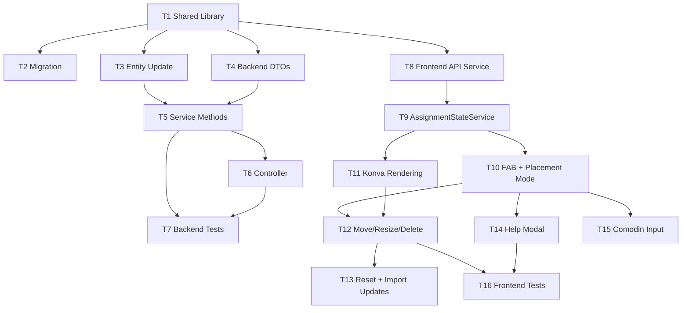

# Ad-Hoc Instance Nodes — Phase 1 Implementation Plan

> **Spec:** `[docs/specs/2026-06-10-ad-hoc-instance-nodes-design.md](../2026-06-10-ad-hoc-instance-nodes-design.md)`
> **Phase scope:** Core PINYA ad-hoc nodes + simplified cordons oberts
> **Branch:** `feat/ad-hoc-nodes-phase-1`
> **Estimated effort:** 3-4 days

---

## Task Breakdown

### T1 — Shared Library (`libs/shared`)

**T1.1 — Enum updates**

- `[libs/shared/src/enums/figure-zone.enum.ts](../../../libs/shared/src/enums/figure-zone.enum.ts)`: Add `DECORATION = 'DECORATION'`
- `[libs/shared/src/enums/node-shape.enum.ts](../../../libs/shared/src/enums/node-shape.enum.ts)`: Add `ARROW = 'ARROW'`, `CIRCLE = 'CIRCLE'`

> Enum values added now for DB migration, even though DECORATION/ARROW/CIRCLE creation is Phase 2+. This avoids a second migration later.

**T1.2 — New constants file**

- Create `libs/shared/src/constants/ad-hoc-node.constants.ts`:
  - `PINYA_POSITION_TYPES` array const (9 values incl. `'comodin'`)
  - `PinyaPositionType` type
  - `AD_HOC_ALLOWED_ZONES` (Phase 1: only `PINYA`)
  - `AdHocNodePreset` interface
  - `AD_HOC_PINYA_PRESETS` array (9 presets with zone, positionType, label, width, height, shape, color, requiresCustomLabel)
- `[libs/shared/src/index.ts](../../../libs/shared/src/index.ts)`: Add `export * from './constants/ad-hoc-node.constants'`

**T1.3 — Interface updates**

- `[libs/shared/src/interfaces/pinyes/assignment.interfaces.ts](../../../libs/shared/src/interfaces/pinyes/assignment.interfaces.ts)`:
  - `InstanceNodeItem`: Add `isAdHoc: boolean`, `createdById?: string | null`
  - `BulkImportResult`: Add `clonedAdHocNodes: number`

---

### T2 — Database Migration

- Create `apps/api/src/migrations/{timestamp}-AddAdHocInstanceNodes.ts`
- Register in `[apps/api/src/modules/database/database.module.ts](../../../apps/api/src/modules/database/database.module.ts)`

Migration SQL:

```sql
ALTER TABLE instance_nodes ADD COLUMN "isAdHoc" boolean NOT NULL DEFAULT false;
ALTER TABLE instance_nodes ADD COLUMN "createdById" uuid REFERENCES users(id) ON DELETE SET NULL;
ALTER TYPE figure_zone_enum ADD VALUE IF NOT EXISTS 'DECORATION';
ALTER TYPE node_shape_enum ADD VALUE IF NOT EXISTS 'ARROW';
ALTER TYPE node_shape_enum ADD VALUE IF NOT EXISTS 'CIRCLE';
CREATE INDEX idx_instance_nodes_instance_adhoc ON instance_nodes("figureInstanceId", "isAdHoc");
```

> `ALTER TYPE ... ADD VALUE` is non-transactional in PostgreSQL. The migration must use `queryRunner.query()` outside the default transaction, or set `transaction: false` on the migration runner.

---

### T3 — Entity Update

- `[apps/api/src/modules/event-segment/entities/instance-node.entity.ts](../../../apps/api/src/modules/event-segment/entities/instance-node.entity.ts)`:
  - Add `@Column({ type: 'boolean', default: false }) isAdHoc: boolean`
  - Add `@ManyToOne(() => User, { nullable: true, onDelete: 'SET NULL' }) createdBy: User | null`
  - Add `@Column({ type: 'uuid', nullable: true }) createdById: string | null`

---

### T4 — Backend DTOs

- Create `apps/api/src/modules/node-assignment/dto/create-ad-hoc-node.dto.ts`:
  - `zone: FigureZone` — `@IsIn([FigureZone.PINYA])` (Phase 1 whitelist)
  - `positionType?: string` — `@IsOptional() @IsIn(PINYA_POSITION_TYPES)`
  - `label: string` — `@IsString() @MaxLength(100)`
  - `x: number`, `y: number` — `@IsNumber()`
  - `width?: number`, `height?: number` — `@IsOptional() @IsNumber() @Min(10)`
  - `rotation?: number` — `@IsOptional() @IsNumber()`
  - `shape?: NodeShape` — `@IsOptional() @IsIn(Object.values(NodeShape))`
  - `color?: string` — `@IsOptional() @Matches(/^#[0-9a-fA-F]{6}$/)`
- Create `apps/api/src/modules/node-assignment/dto/update-ad-hoc-node.dto.ts`:
  - All fields optional: `label`, `x`, `y`, `width`, `height`, `rotation`, `color`, `shape`

---

### T5 — Backend Service (`node-assignment.service.ts`)

**T5.1 — Helper methods**

- Add `private assertNotComposition(instance: FigureInstance): void` — reusable guard (400 if `compositionTemplate` set)
- Modify `checkEventLock()` to accept optional custom error message, or add variant `checkEventLockForNodes(instanceId)` with Catalan message per spec

**T5.2 — Response mapper update**

- Update `instanceNodeToResponse()` to include `isAdHoc`, `createdById` in response
- Update `figureNodeToResponse()` to always return `isAdHoc: false`, `createdById: null` (pre-snapshot live nodes)

**T5.3 — CRUD methods**

```typescript
async createAdHocNode(instanceId: string, dto: CreateAdHocNodeDto, userId: string): Promise<InstanceNodeResponse>
```

- `checkEventLock(instanceId)`
- Load instance with relations
- `assertNotComposition(instance)`
- If `!instance.snapshotted` → call `snapshotInstance(instance)` in same transaction
- Apply defaults from `AD_HOC_PINYA_PRESETS` when `width`/`height`/`shape`/`color` not provided
- Calculate `sortOrder = MAX(sortOrder) + 1`
- Insert `InstanceNode` with `isAdHoc: true`, `sourceNodeId: null`, `createdById: userId`
- Return created node

```typescript
async updateAdHocNode(instanceId: string, nodeId: string, dto: UpdateAdHocNodeDto): Promise<InstanceNodeResponse>
```

- `checkEventLock(instanceId)`
- Find node WHERE `id = nodeId AND figureInstanceId = instanceId`
- 404 if not found; 403 if `isAdHoc = false`
- Partial update, return updated node

```typescript
async deleteAdHocNode(instanceId: string, nodeId: string): Promise<void>
```

- `checkEventLock(instanceId)`
- Find node, 404/403 guard
- Transaction: delete assignments on node → delete node

**T5.4 — Modify existing methods**

- `assign()`: Add guard `if (node.zone === FigureZone.DECORATION) → 400` (ready for Phase 2)
- `bulkImport()`: After template-node matching loop, add ad-hoc clone step:
  1. Load source ad-hoc nodes: `WHERE figureInstanceId = sourceId AND isAdHoc = true`
  2. For each: clone geometry into target instance, copy assignment if exists
  3. Return `clonedAdHocNodes` count in result
- `resetSnapshot()`: Before delete, count `isAdHoc = true` nodes. Return `{ removedAssignments, deletedAdHocCount }`

---

### T6 — Backend Controller

- `[apps/api/src/modules/node-assignment/node-assignment.controller.ts](../../../apps/api/src/modules/node-assignment/node-assignment.controller.ts)`:
  - Add `@CurrentUser()` import
  - Add `POST figure-instances/:instanceId/ad-hoc-nodes` → `createAdHocNode(instanceId, dto, user.sub)`
  - Add `PATCH figure-instances/:instanceId/ad-hoc-nodes/:nodeId` → `updateAdHocNode(instanceId, nodeId, dto)`
  - Add `DELETE figure-instances/:instanceId/ad-hoc-nodes/:nodeId` → `deleteAdHocNode(instanceId, nodeId)` (204)
  - Swagger decorators on all three

---

### T7 — Backend Tests

- Extend `apps/api/src/modules/node-assignment/node-assignment.service.spec.ts`:


| Test case                                   | Expected                          |
| ------------------------------------------- | --------------------------------- |
| Create ad-hoc node on snapshotted instance  | 201 + `isAdHoc: true`             |
| Create ad-hoc on unsnapshotted instance     | Auto-snapshot, then create        |
| Create ad-hoc on composition instance       | 400                               |
| Create ad-hoc on locked event               | 403                               |
| Create with missing label                   | 400 validation                    |
| Create comodin with empty label             | 400 (label required)              |
| Update ad-hoc node position                 | 200 + updated coords              |
| Update snapshot node via ad-hoc endpoint    | 403                               |
| Update non-existent node                    | 404                               |
| Delete ad-hoc without assignment            | 204                               |
| Delete ad-hoc with assignment               | 204 (cascade unassign)            |
| Delete snapshot node via ad-hoc endpoint    | 403                               |
| Assign person to DECORATION node            | 400                               |
| BulkImport clones ad-hoc nodes from source  | `clonedAdHocNodes > 0`            |
| BulkImport clones ad-hoc assignments        | Assignments exist on cloned nodes |
| Reset returns `deletedAdHocCount`           | Count matches ad-hoc nodes        |
| `getInstanceNodes` includes `isAdHoc` field | All nodes have boolean field      |


---

### T8 — Frontend API Service

- `[apps/dashboard/src/app/features/pinyes/services/node-assignment.service.ts](../../../apps/dashboard/src/app/features/pinyes/services/node-assignment.service.ts)`:
  - `createAdHocNode(instanceId, dto): Observable<InstanceNodeItem>`
  - `updateAdHocNode(instanceId, nodeId, dto): Observable<InstanceNodeItem>`
  - `deleteAdHocNode(instanceId, nodeId): Observable<void>`
- `[apps/dashboard/src/app/features/pinyes/models/assignment.model.ts](../../../apps/dashboard/src/app/features/pinyes/models/assignment.model.ts)`:
  - Extend `PendingOp.type` to include `'create-adhoc' | 'delete-adhoc' | 'update-adhoc'`
  - Add `CreateAdHocNodeDto`, `UpdateAdHocNodeDto` interfaces

---

### T9 — Frontend State (`AssignmentStateService`)

- `[apps/dashboard/src/app/features/pinyes/services/assignment-state.service.ts](../../../apps/dashboard/src/app/features/pinyes/services/assignment-state.service.ts)`:
  - Add signals: `isPlacementMode = signal(false)`, `placementPreset = signal<AdHocNodePreset | null>(null)`
  - Add computed: `adHocNodes`, `hasAdHocNodes` (filter from active tab nodes)
  - Add methods: `enterPlacementMode(preset)`, `exitPlacementMode()`
  - Extend `reset()` to clear placement state

---

### T10 — Frontend: "+" FAB + Placement Mode

- `[apps/dashboard/src/app/features/pinyes/components/assignment-canvas/assignment-canvas.component.html](../../../apps/dashboard/src/app/features/pinyes/components/assignment-canvas/assignment-canvas.component.html)`:
  - Add bottom-right FAB (DaisyUI `btn-circle btn-primary`) with `lucide:plus` icon
  - Hidden/disabled when `isLocked()` or no active tab
  - On click → DaisyUI dropdown menu with PINYA position presets
  - "?" help button next to FAB → opens `AdHocNodesHelpModalComponent`
- `[apps/dashboard/src/app/features/pinyes/components/assignment-canvas/assignment-canvas.component.ts](../../../apps/dashboard/src/app/features/pinyes/components/assignment-canvas/assignment-canvas.component.ts)`:
  - `onPresetSelected(preset: AdHocNodePreset)`: If `requiresCustomLabel` → show inline input popover; else → enter placement mode
  - `onCanvasPlacement(x, y)`: Call API `createAdHocNode`, optimistic add to `tabs[].nodes`, refresh on success
  - `onComodinLabelSubmit(label)`: Enter placement mode with custom label
  - Handle `Escape` key → `exitPlacementMode()`
  - Crosshair cursor CSS class when placement mode active

---

### T11 — Frontend: Konva Rendering for Ad-Hoc Nodes

- `[apps/dashboard/src/app/features/pinyes/components/figure-canvas/figure-canvas.component.ts](../../../apps/dashboard/src/app/features/pinyes/components/figure-canvas/figure-canvas.component.ts)`:
  - Modify `renderAssignmentNodes()`:
    - Ad-hoc nodes: `draggable: true`, **dashed stroke** (`dash: [6, 3]`)
    - Snapshot nodes: `draggable: false`, solid stroke (unchanged)
  - Add gesture discrimination for ad-hoc nodes:
    - Click (< 200ms, no movement > 5px) → `nodeSelected.emit(nodeId)`
    - Drag → move node, emit `nodeMoved` on `dragend`
    - Double-click → attach Konva `Transformer` (reuse editor pattern)
  - New outputs: `@Output() adHocNodeMoved`, `@Output() adHocNodeTransformed`
  - Handle `nodeClicked` in assignment mode for popover positioning (existing pattern)
  - Tooltip on hover for `isAdHoc` nodes: "Node creat manualment"

---

### T12 — Frontend: Ad-Hoc Node Interaction (Move, Resize, Delete)

- In `AssignmentCanvasComponent`:
  - `onAdHocNodeMoved(event: { id, x, y })`: Optimistic local update + PATCH API
  - `onAdHocNodeTransformed(event: { id, width, height, rotation })`: Optimistic + PATCH API
  - `onDeleteAdHocNode(nodeId)`:
    - If node has assignment → confirmation dialog: "El node «{label}» té la persona {name} assignada..."
    - If no assignment → immediate delete (no confirmation)
    - Optimistic remove from `tabs[].nodes` + rollback on error
  - Backspace/Delete keyboard listener when ad-hoc node selected

---

### T13 — Frontend: Reset + Import Updates

- Reset modal: When `hasAdHocNodes` → extended warning text: "Hi ha {n} node(s) creat(s) manualment que es perdran amb el reset. Vols continuar?"
- `confirmReset()`: Toast shows `deletedAdHocCount` from API response
- `onImportCompleted()`: Toast shows `clonedAdHocNodes` from `BulkImportResult`
- Template editor link: Info toast (3s): "Els canvis al template no afecten instàncies ja creades."

---

### T14 — Frontend: Help Modal Component

- Create `apps/dashboard/src/app/features/pinyes/components/ad-hoc-nodes-help-modal/`:
  - `ad-hoc-nodes-help-modal.component.ts` — standalone, OnPush, DaisyUI `modal` + `steps`
  - `ad-hoc-nodes-help-modal.component.html` — content from `[docs/internal/ad-hoc-nodes-user-guide.md](../../internal/ad-hoc-nodes-user-guide.md)`
  - Sections: Què són, Com crear-los, Com moure/redimensionar, Com eliminar-los
  - `viewChild` dialog ref, `open()`/`close()` API
  - Accessible: focus trap, Escape, `aria-labelledby`

---

### T15 — Frontend: Comodin Label Input

- Inline popover near FAB when "Comodí" selected:
  - Text input "Nom del node:" + "Afegir" button
  - Enter key submits, Escape cancels
  - Label sent as `CreateAdHocNodeDto.label`
  - DaisyUI `dropdown-content` positioned above FAB

---

### T16 — Frontend Tests


| Test case                                                    | Location                              |
| ------------------------------------------------------------ | ------------------------------------- |
| `AssignmentStateService`: placement mode signals             | `assignment-state.service.spec.ts`    |
| `AssignmentCanvasComponent`: FAB renders when not locked     | `assignment-canvas.component.spec.ts` |
| `AssignmentCanvasComponent`: FAB hidden when locked          | `assignment-canvas.component.spec.ts` |
| `AssignmentCanvasComponent`: placement mode flow             | `assignment-canvas.component.spec.ts` |
| `AssignmentCanvasComponent`: delete ad-hoc with confirmation | `assignment-canvas.component.spec.ts` |
| `AssignmentCanvasComponent`: reset warning with ad-hoc count | `assignment-canvas.component.spec.ts` |
| `AdHocNodesHelpModalComponent`: opens/closes                 | New spec file                         |


---

## Dependency Graph




---

## Execution Order (suggested)


| Day | Tasks                   | Notes                         |
| --- | ----------------------- | ----------------------------- |
| 1   | T1, T2, T3, T4          | Shared + DB foundation        |
| 2   | T5, T6, T7              | Backend CRUD + tests          |
| 3   | T8, T9, T10, T11        | Frontend state + canvas       |
| 4   | T12, T13, T14, T15, T16 | Interactions + polish + tests |


---

## Manual Testing Checklist — Phase 1


| #   | Test                                                            | Expected                                                       |
| --- | --------------------------------------------------------------- | -------------------------------------------------------------- |
| 1   | Open assignment canvas for snapshotted instance                 | Canvas loads, "+" button visible bottom-right                  |
| 2   | Open assignment canvas for **locked** event                     | "+" button disabled/hidden                                     |
| 3   | Click "+" → select "Cordó obert" → click on canvas              | New node appears with dashed border at click position          |
| 4   | Press Escape while in placement mode                            | Placement cancelled, cursor back to normal                     |
| 5   | Drag the new ad-hoc node                                        | Node moves freely, PATCH on release                            |
| 6   | Double-click ad-hoc node → resize via handles                   | Node resizes, PATCH on release                                 |
| 7   | Click (not drag) ad-hoc node → select person from panel         | Assignment created on ad-hoc node                              |
| 8   | Try to drag a snapshot node                                     | Nothing happens (not draggable)                                |
| 9   | Delete unassigned ad-hoc node (Backspace)                       | Immediate deletion, no confirmation                            |
| 10  | Delete assigned ad-hoc node                                     | Confirmation dialog with person name, then deletion            |
| 11  | Create 2 ad-hoc cordons oberts, assign both                     | Both visible, both in summary, not affected by cordon selector |
| 12  | Click "Reset pinya" on instance with ad-hoc nodes               | Warning mentions N manually created nodes                      |
| 13  | Confirm reset                                                   | All nodes removed, instance unsnapshotted                      |
| 14  | Create ad-hoc on **unsnapshotted** instance (first interaction) | Auto-snapshot triggers, then ad-hoc node created               |
| 15  | Bulk import from instance A (with 2 ad-hoc nodes) to B          | Template nodes matched + ad-hoc nodes cloned with assignments  |
| 16  | Reload page after creating ad-hoc nodes                         | Nodes persist (server-confirmed)                               |
| 17  | Click "Editar template" link                                    | Info toast about snapshot isolation                            |
| 18  | Swap assignment between snapshot node and ad-hoc node           | Swap works normally                                            |
| 19  | Try creating ad-hoc on a composition instance                   | Error message, creation blocked                                |
| 20  | Click "+" → "Comodí" → type "Lateral-agulla" → Enter → place    | Node created with custom label and neutral color (#B0BEC5)     |
| 21  | Double-click ad-hoc node → rotate using rotation anchor         | Node rotates, snaps to 15deg with Shift, PATCH on release      |
| 22  | Double-click ad-hoc node → resize using corner handles          | Node resizes (min 10x10), PATCH on release                     |
| 23  | Click "?" help button next to "+" FAB                           | Help modal opens with user guide content                       |
| 24  | Verify ad-hoc node colors match template editor palette         | Same: agulla=#0d9488, mans=#FFE082, etc.                       |


---

## Definition of Done

- [ ] All 24 manual tests pass
- [ ] Backend unit tests cover CRUD + edge cases (lock, validation, cascade, auto-snapshot, composition guard)
- [ ] Frontend unit tests cover signals + interactions + placement mode
- [ ] No lint errors introduced
- [ ] Migration runs cleanly on fresh DB and existing DB with data
- [ ] Bulk import backwards compatible (instances without ad-hoc import normally)
- [ ] Shared enum change doesn't break other consumers (dashboard, PWA scaffold)
- [ ] Swagger decorators on all new endpoints